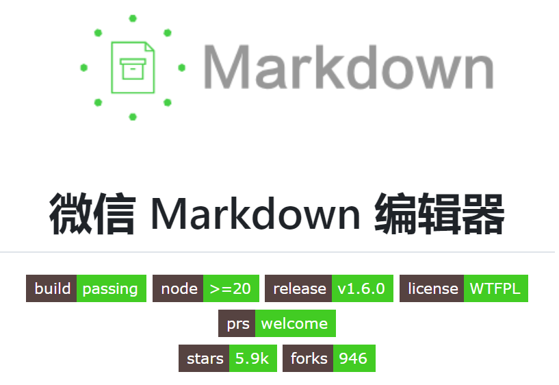
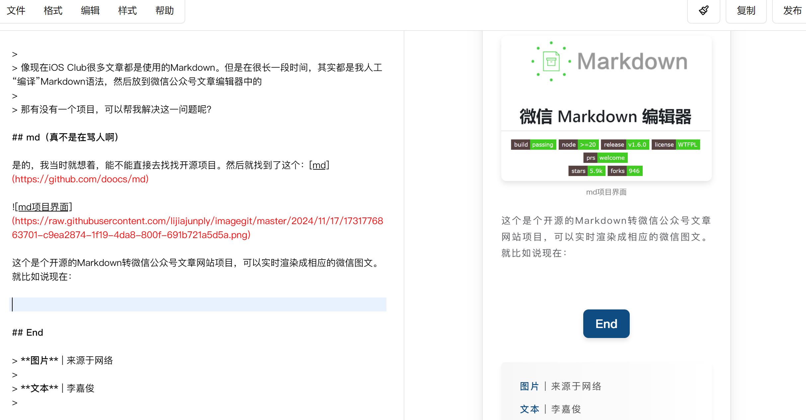
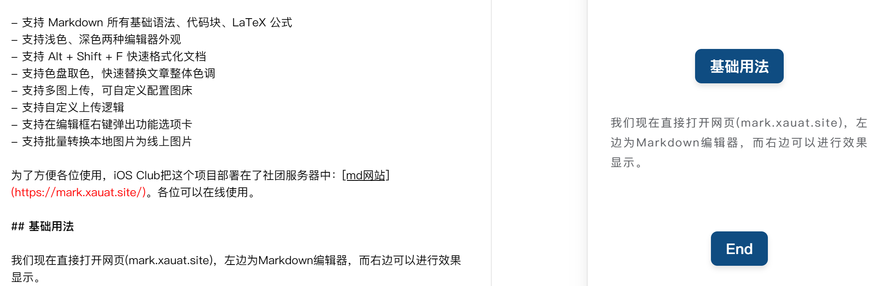
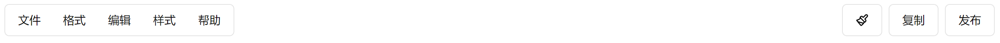
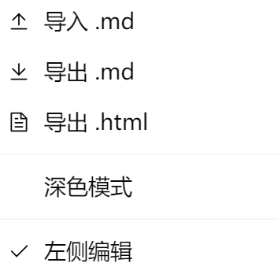
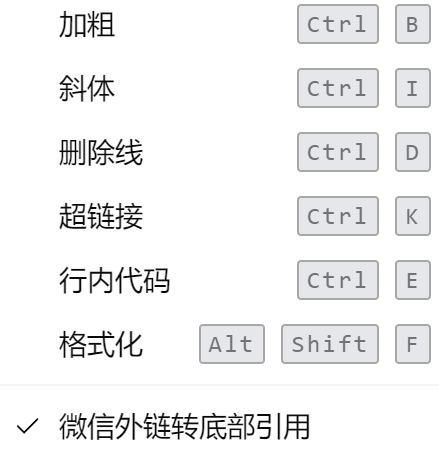
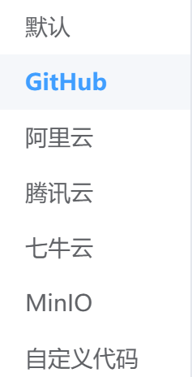
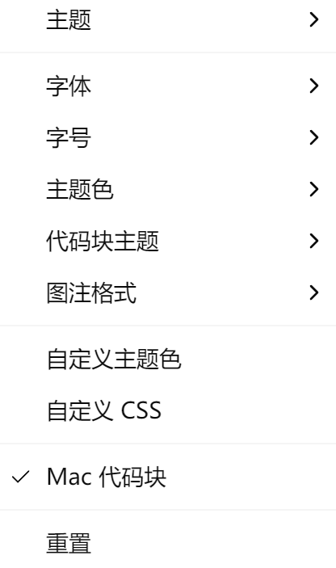
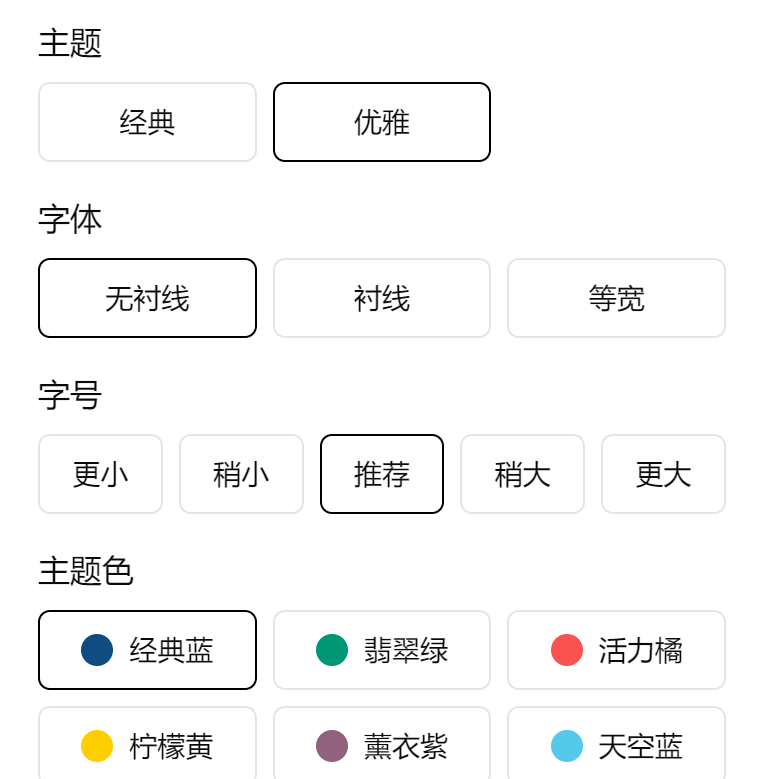

# 社团在线编辑器使用

## 前言

> 在前面的文章中，我们提过Markdown这个语言。
> 

> 像现在iOS Club很多文章都是使用的Markdown。但是在很长一段时间，其实都是我人工“编译”Markdown语法，然后放到微信公众号文章编辑器中的
> 

> 那有没有一个项目，可以帮我解决这一问题呢？
> 

## md（真不是在骂人啊）

是的，我当时就想着，能不能直接去找找开源项目。然后就找到了这个：[md](https://github.com/doocs/md)



md项目界面

这个是个开源的Markdown转微信公众号文章网站项目，可以实时渲染成相应的微信图文。就比如说现在：



md网站 - 页面

是的，现在iOS Club Markdown排版就用的这个。

md现在功能很多：

- 支持自定义 CSS 样式
- 支持 Markdown 所有基础语法、代码块、LaTeX 公式
- 支持浅色、深色两种编辑器外观
- 支持 Alt + Shift + F 快速格式化文档
- 支持色盘取色，快速替换文章整体色调
- 支持多图上传，可自定义配置图床
- 支持自定义上传逻辑
- 支持在编辑框右键弹出功能选项卡
- 支持批量转换本地图片为线上图片

为了方便各位使用，iOS Club把这个项目部署在了社团服务器中：[md网站](https://mark.xauat.site/)。各位可以在线使用。

## 基础用法

我们现在直接打开网页(mark.xauat.site)，左边为Markdown编辑器，而右边可以进行效果显示。就像这样：



基础样式

而上方则有一堆菜单/按钮，现在我们来一一介绍：



## 文件 & 格式

左边的文件主要就是用来进行导入导出文件：



文件菜单

在这里我们可以使用**深色模式**，而如果将左侧编辑的✔给勾掉，就会进行左右互换。

格式则是使用进行一些傻瓜式操作：



格式菜单

我们在这里可以快捷键。而这里的微信外链转底部引用，主要功能就是将一部分的（除微信公众号链接的）超链接转化成引用。

## 编辑

编辑菜单主要有两个功能：**上传图片** 和 **插入表格**


编辑菜单

上传图片这里，主要是将图片传到图床。这里md支持以下图床：



支持图床

> 如果你直接复制图片在Markdown编辑器上面，也会让编辑器上传到图床中
> 

## 样式

样式这里功能很多，我这里只讲一个：**自定义CSS**



样式菜单

当你点击自定义CSS时，就会给你蹦出来一个新的页面：

[](image/gif.gif)

这里用md官方的GIF

在这里你可以直接写css类，就比如说我挺喜欢优雅主题，但是这个主题的引用块，我不是很喜欢，于是我就改了一下：

```css
/* 三级标题样式 */
h3 {
  border-bottom: none;
}
/* 引用样式 */
blockquote {
  border : none;
  font-style: initial;
}
/* 引用段落样式 */
blockquote_p {
  font-style: initial;
  margin-top: 10px;
  margin-bottom: 10px;
}

```

而且这些都是实时更改的，就很舒服。

## 主题（在右边）

点击右边的第一个按钮，就会出来一个菜单：



菜单

这里可以改页面的样式。所以其实我基本上用这个会多点。

> 主要是以前不知道样式菜单也能改。
> 

## 复制

当你写完稿子的时候，点击一下复制，就会将右边的图文复制到剪贴板中，这时去微信公众号编辑器页面粘贴即可。