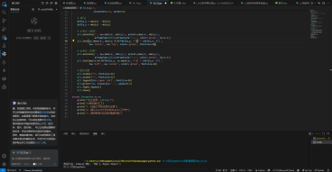
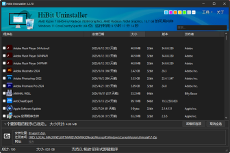
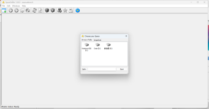

# 实用软件分享

> [!tip]
> 主讲人：张帅
> 
> 日期：2025 年 10 月 30 日

## 1. Visual Studio Code (Vscode)

-   **下载链接：** [Visual Studio Code - Code Editing. Redefined](https://code.visualstudio.com/)
-   **特点：**
    -   扩展丰富
    -   通义灵码帮助改写代码
    -   适合对较多的文件进行编辑。

## 2. Bandzip

-   直接在微软商店中进行下载即可
-   **特点：**
    -   压缩率高
    -   支持多线程压缩
    -   界面简洁易用

## 3. HiBit Uninstaller

-   **下载链接：** [HiBit Uninstaller 中文版下载 v3.2.40.100 - HiBit Uninstaller 最新版 2025 下载安装\_3DM 软件](https://www.3dmgame.com/down/176985.html)
-   **使用方法：**
    1.  选中我们想要卸载的软件，点击“卸载所选项”就能将对应的软件卸载。
    2.  然后点击“扫描文件”，扫描完成后，就可以将我们选中的文件彻底清除。

## 4. Space sniffer

-   **下载链接：** [SpaceSniffer 最新版 2025 下载安装\_3DM 软件](https://soft.3dmgame.com/down/200352.html)
-   **特点：**
    -   可以查看硬盘空间占用情况
    -   可以找到占用空间最大的文件和文件夹
    -   界面简洁易用

## 5. PDF gear

-   **下载链接：** [https://www.pdfgear.com/](https://www.pdfgear.com/)
-   **功能：** PDF gear 是一款免费阅读 PDF 文件的软件。
-   **使用方法：** 当我们想要打开 PDF 文件时，选择用 PDFgear 打开即可。

## 6. Everything

利用系统自带的文件资源管理器，会出现搜索耗时长甚至搜索不到的问题。而使用everything进行搜索则不会出现相应问题。

-   **下载链接：** [Everything](https://www.voidtools.com/zh-cn/downloads/)
-   **特点：**
    -   可以快速搜索硬盘中的文件
    -   支持正则表达式搜索
    -   界面简洁易用

## 7. Xmind

-   **下载链接：** [Xmind 思维导图 | Xmind 中文官方网站](https://www.xmind.cn/)
-   **用途：** Xmind 用于制作思维导图。
-   **介绍：** Xmind 是一款跨平台的思维导图软件，用于可视化思考、知识整理、项目管理等。它支持多种思维结构（如树形图、鱼骨图、矩阵图），并提供丰富的模板和协作功能。

## 8. Draw.io

Draw.io是一款 免费、开源、跨平台 的在线图表工具，支持流程图、UML图、组织结构图、网络拓扑图等多种可视化设计。

-   **在线使用** [Draw.io - free online diagram software](https://www.draw.io/)

## 9. OBS Studio

-   **下载链接：** [Open Broadcaster Software | OBS](https://obsproject.com/zh-cn/)
-   **用途：** OBS Studio 用于视频录制和直播。
-   **设置：** OBS 的设置中有很多参数，跟随网上视频进行配置就可以正常使用。
-   **使用方法：** 当我们想要录屏时，先新建场景和来源，然后开始录制即可。