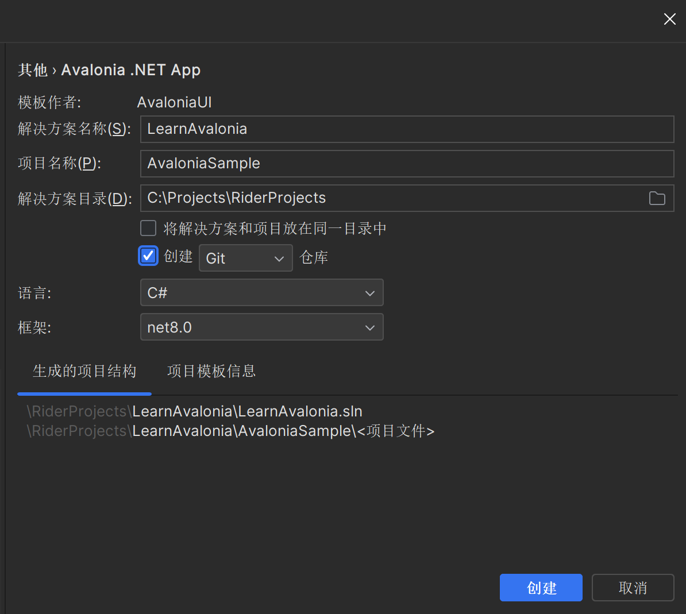

# Avalonia（二）简单介绍一下项目

**作者：[LuckyFish](https://gitee.com/luckyfishisdashen)**

# 前言

在上一章中我们主要讲了一下安装与配置，我们这节来简单了解一下Avalonia项目的基本骨架。

# 普通项目(非MVVM)

首先我们在IDE或者Dotnet上进行项目初始化



（这里使用Rider进行演示，也建议使用Rider来进行Avalonia开发）

打开项目之后我们可以在Rider左侧的解决方案面板


这里，app.manifest主要是配置上的，Program.cs是程序启动的地方

我们这里主要讲解App.axaml(.cs)跟MainWindow.axaml(.cs)。

## App.axaml(.cs)

在App这个文件中，我们主要定义应用程序的资源、风格、应用颜色主题等等，当然在App.axmal.cs中，也规定了我们一个要调用哪个窗口作为我们的主窗口：

```csharp
public override void OnFrameworkInitializationCompleted()
{
    if (ApplicationLifetime is IClassicDesktopStyleApplicationLifetime desktop)
    {
       desktop.MainWindow = new MainWindow();
    }

    base.OnFrameworkInitializationCompleted();
}
```

这里我们规定了MainWindow(主窗口)为MainWindow类，而这个主窗口只能是Window类的派生类。

这里可以来看一下App.axaml的内容:

```xml
<Application xmlns="https://github.com/avaloniaui"
             xmlns:x="http://schemas.microsoft.com/winfx/2006/xaml"
             x:Class="AvaloniaSample.App"
             RequestedThemeVariant="Default">
             <!-- "Default" ThemeVariant follows system theme variant. "Dark" or "Light" are other available options. -->

    <Application.Styles>
        <FluentTheme />
    </Application.Styles>
</Application>
```

这里规定了Application的属性，比如说RequestedThemeVariant，这个属性规定了应用的默认颜色主题，这里的Default是指跟随系统。

## MainWindow.axaml(.cs)

这里是整个程序的主窗口，它继承自Window类，可以进行窗口的显示隐藏与关闭。

整个分为两个部分,axaml文件跟cs文件。axaml文件可以类比WPF的xaml文件，是用来描述该组件UI内容的。

就比如说我们这个项目的axaml文件，现在是长这样：

```xml
<Window xmlns="https://github.com/avaloniaui"
        xmlns:x="http://schemas.microsoft.com/winfx/2006/xaml"
        xmlns:d="http://schemas.microsoft.com/expression/blend/2008"
        xmlns:mc="http://schemas.openxmlformats.org/markup-compatibility/2006"
        mc:Ignorable="d" d:DesignWidth="800" d:DesignHeight="450"
        x:Class="AvaloniaSample.MainWindow"
        Title="AvaloniaSample">
    Welcome to Avalonia!
</Window>
```

正好也简单讲一下axaml的一些小规范：

1. 像`<Window>`这种叫做标签，必须要有开始结尾才行，就比如说像上面这种`<Window></Window>`，还有一种是`<Window/>`
2. 标签是大小写敏感的。也就是说，在XML中，Window跟window不是一个东西
3. 在`<Window></Window>`中间（也就是开头跟结尾中间）是可以嵌套内容的，但是在Avalonia中得看类的性质，有些类是没有Context这个属性的(默认将且套内容放在Context中).这个内容可以是像MainWindow.axaml里头的 Welcome to Avalonia! 这种文字内容，也可以是标签内容。
4. 在开头标记中(`<Window>`)，可以在这里写一些属性，就比如说这样：`<TextBlock Text=”Avalonia Learn”>`，形如属性名=”内容”。
5. 还有一种写法就是像这样：`<TextBlock><TextBlock.Text>Context</TextBlock.Text></TextBlock>`
6. <!— —>是注释

而整个项目是以事件驱动的，这个事件就比方说当按了这个按钮的时候会发生什么呀这种。一般会写在.axaml.cs文件上

## MVVM项目

我们先在Rider创建项目：


现在让我们看一下项目的结构：


这里App.axaml跟Program,cs跟上面的是一样的。

然后这个Assets是资产文件夹，我们后面会介绍这里的内容，不过跟现在要将的内容没有什么关系。

## MVVM结构

MVVM是一种用于构建用户界面的软件架构模式，它的名称代表着三个组成部分：Model（模型）、View（视图）和ViewModel（视图模型）。MVVM的主要目标是将应用程序的UI与其底层数据模型分离，通过数据绑定实现数据和UI的自动同步，从而降低代码的耦合度，提高应用程序的可维护性和可测试性。


在这里，View是前端界面，ViewModel是交互层，用来连接底层数据跟上层界面，Model是数据抽象，将数据包装起来。

在Avalonia中也是支持这个结构的。在App.axaml.cs中也能体现出来：

```csharp
    public override void OnFrameworkInitializationCompleted()
    {
        if (ApplicationLifetime is IClassicDesktopStyleApplicationLifetime desktop)
        {
            desktop.MainWindow = new MainWindow
            {
                DataContext = new MainWindowViewModel(),
            };
        }

        base.OnFrameworkInitializationCompleted();
    }
```

在这里，MainWindowViewModel就是我们所说的ViewModel。我们在这里通过赋值到MainWindow类的DataContext属性来实现VM跟View的交互。

其实我们在Avalonia生成的代码中也能看得出来，Avalonia给我们生成了Models,ViewModels和Views文件夹。

## ViewModels文件夹

在ViewModels文件夹中，我们发现有一个类叫做ViewModelBase。这个类主要是用来写绑定的代码的。

```csharp
using ReactiveUI;

namespace AvaloniaMVVMSample.ViewModels;

public class ViewModelBase : ReactiveObject
{
}
```

在这里，我们使用了Avalonia的ReactiveObject类，而我们绑定也不是白绑定，在后端我们得这么写:

```csharp
private string _text = "";
    public string Text
    {
        get => _text;
        set => this.RaiseAndSetIfChanged(ref _text, value);
    }
```

我们这里使用ReactiveObject的RaiseAndSetIfChanged方法，从而广播到前端界面。

记得，这里必须要用公开属性才行，要不然捕捉不到。

## Views文件夹

MainWindow类之前我们就已经讲过了，所以我们重点在绑定上。

上面我们说过，ViewModel跟View的交互主要依靠绑定，我们刚才讲了后端的部分，现在来讲讲前端的部分。

在这个模板的MainWindow.axaml中是长这个样子的：

```xml
<Window xmlns="https://github.com/avaloniaui"
        xmlns:x="http://schemas.microsoft.com/winfx/2006/xaml"
        xmlns:vm="using:AvaloniaMVVMSample.ViewModels"
        xmlns:d="http://schemas.microsoft.com/expression/blend/2008"
        xmlns:mc="http://schemas.openxmlformats.org/markup-compatibility/2006"
        mc:Ignorable="d" d:DesignWidth="800" d:DesignHeight="450"
        x:Class="AvaloniaMVVMSample.Views.MainWindow"
        x:DataType="vm:MainWindowViewModel"
        Icon="/Assets/avalonia-logo.ico"
        Title="AvaloniaMVVMSample">
    <Design.DataContext>
        <!-- This only sets the DataContext for the previewer in an IDE,
             to set the actual DataContext for runtime, set the DataContext property in code (look at App.axaml.cs) -->
        <vm:MainWindowViewModel/>
    </Design.DataContext>
    <TextBlock Text="{Binding Greeting}" HorizontalAlignment="Center" VerticalAlignment="Center"/>
</Window>
```

这里就给我们了一个模板。绑定必须要这样：

1. 在根标题上写上x:DataType，并且填写你要使用到的ViewModel。这样主要是让IDE方便识别，方便你进行书写。
2. 要记得给control们实例化的时候，记得给DataContext赋值，这里要使用到ViewModel
3. 在目标标签的对应属性上进行绑定操作，常用的一种形式是形如属性名=”{Binding ViewModel属性名}”

就比如说这个，当我们运行的时候，我们就会看到这样：


我这里因为Window主题是深色主题，所以Avalonia上也是深色主题了。

我们现在可以简单试一下，就使用我们刚才定义的Text属性（在MainWindowView中）

```xml
<StackPanel VerticalAlignment="Center" HorizontalAlignment="Center">
        <TextBox Text="{Binding Text}"/>
        <TextBlock Text="{Binding Text}"/>
    </StackPanel>
```

这里StackPanel是一个堆栈面板，对根据内容来进行从上至下的渲染。

TextBox是文本输入框，TextBlock是文本显示框。

我们现在运行一下，看看效果：


成功了！

## 数据模板跟`ViewLocator` 类

如果你去看一下App.axaml文件，你会惊讶的发现有一个新的内容:

```xml
<Application.DataTemplates>
        <local:ViewLocator/>
    </Application.DataTemplates>
```

这规定的是应用程序的标准数据模板，通常来说，标签里头的内容都得是Control才行，这样的话才可以被Avalonia渲染。但是有时候我们需要的内容太多了，要是使用传统的这种方式的话，会让开发变得很累。

所以Avalonia贴心的为我们弄了一个数据模板的功能，这样的话我们就可以通过普通的数据类型来快速创造出我们想要呈现的内容了。

在本项目中，我们设定了ViewLocator这个模板类为我们应用程序的一个数据模板，当然这个东西可以有很多。

我们现在来看一下ViewLocator这个类。首先这个类是由`IDataTemplate` 继承而来的，其中有两个方法：`Build` 和`Match` 。Match方法主要用来判断是否要进行解析渲染，Build方法则是将数据内容转换为相应的Control类型，从而达到渲染的目的。

ViewLocator类的Build方法如下:

```csharp
    public Control? Build(object? data)
    {
        if (data is null)
            return null;

        var name = data.GetType().FullName!.Replace("ViewModel", "View", StringComparison.Ordinal);
        var type = Type.GetType(name);

        if (type != null)
        {
            var control = (Control)Activator.CreateInstance(type)!;
            control.DataContext = data;
            return control;
        }

        return new TextBlock { Text = "Not Found: " + name };
    }
```

这里使用到反射的机制，将ViewModels命名空间下的ViewModel类给转化到Views命名空间的View类上去，同时把数据放到DateContext中。这样就可以达到想要的目的了。

# 结尾

这次我们简单的学习了一下Avalonia的项目结构，并且简单讲解了一下MVVM结构，下一章我们就要开始我们的实战了（也没什么理论的这东西）