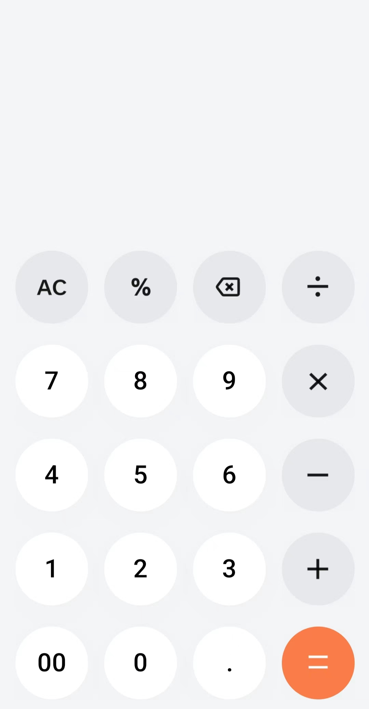
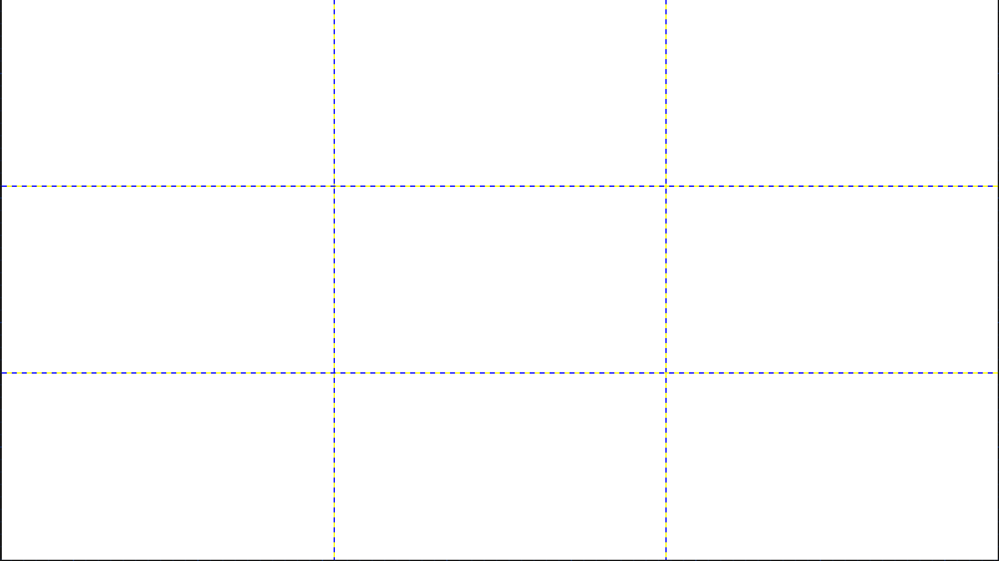

# Avalonia（三）普通架构实战——计算器

**作者：[LuckyFish](https://gitee.com/luckyfishisdashen)**

# 前言

在上一章中，我们简单的介绍了一下Avalonia的基本架构，那我们这次就用Avalonia的普通结构来进行开发。

# 写个计算器

首先我们得知道我们应该要写成什么样子。

一般来说一个计算器的结构是这样的：



我们可以按照这个来写。

## 分析一下结构

我们再写一个软件的前端UI布局的时候，首先就要剖析UI结构，那么接下来就让我们简单的来剖析一下：

首先是上面的文本部分，这个文本部分也分为两个小部分——历史计算跟现在的计算。

然后就是下方的5*4的按钮。

好，那我们开始写布局！

## 计算器前端界面

首先我们先写一个总体框架将这两部分框起来，我们这里使用的是Grid。这个是网格布局容器，通过设置网格行数跟列数来布局，就比如说：

```xml
<Grid ShowGridLines="True" RowDefinitions="*,*,*" ColumnDefinitions="*,*,*">
        
</Grid>
```



在Grid类中，设置行数跟列数的是RowDefinitions跟ColumnDefinitions。参数为若干个Star(*)跟Auto的集合，中间用逗号隔开。而Star代表平均分配，Auto代表按照子控件的大小来分配。

所以我们可以这么写：

```xml
<Grid RowDefinitions="*,2*">
        <StackPanel Grid.Row="0" VerticalAlignment="Bottom">
            <TextBlock Text="0" HorizontalAlignment="Right" FontSize="20" />
            <TextBlock Text="0" HorizontalAlignment="Right" FontSize="52" />
        </StackPanel>
        <Grid Grid.Row="1" ShowGridLines="True" RowDefinitions="*,*,*,*,*" ColumnDefinitions="*,*,*,*">
            <Button HorizontalContentAlignment="Center" VerticalContentAlignment="Center" Height="68" Width="68" Grid.Row="0" Grid.Column="0" CornerRadius="34" Background="Gray"></Button>
            <Button HorizontalContentAlignment="Center" VerticalContentAlignment="Center" Height="68" Width="68" Grid.Row="1" Grid.Column="0" CornerRadius="34"></Button>
            <Button HorizontalContentAlignment="Center" VerticalContentAlignment="Center" Height="68" Width="68" Grid.Row="2" Grid.Column="0" CornerRadius="34"></Button>
            <Button HorizontalContentAlignment="Center" VerticalContentAlignment="Center" Height="68" Width="68" Grid.Row="3" Grid.Column="0" CornerRadius="34"></Button>
            <Button HorizontalContentAlignment="Center" VerticalContentAlignment="Center" Height="68" Width="68" Grid.Row="4" Grid.Column="0" CornerRadius="34"></Button>
            <Button HorizontalContentAlignment="Center" VerticalContentAlignment="Center" Height="68" Width="68" Grid.Row="0" Grid.Column="1" CornerRadius="34" Background="Gray"></Button>
            <Button HorizontalContentAlignment="Center" VerticalContentAlignment="Center" Height="68" Width="68" Grid.Row="1" Grid.Column="1" CornerRadius="34"></Button>
            <Button HorizontalContentAlignment="Center" VerticalContentAlignment="Center" Height="68" Width="68" Grid.Row="2" Grid.Column="1" CornerRadius="34"></Button>
            <Button HorizontalContentAlignment="Center" VerticalContentAlignment="Center" Height="68" Width="68" Grid.Row="3" Grid.Column="1" CornerRadius="34"></Button>
            <Button HorizontalContentAlignment="Center" VerticalContentAlignment="Center" Height="68" Width="68" Grid.Row="4" Grid.Column="1" CornerRadius="34"></Button>
            <Button HorizontalContentAlignment="Center" VerticalContentAlignment="Center" Height="68" Width="68" Grid.Row="0" Grid.Column="2" CornerRadius="34" Background="Gray"></Button>
            <Button HorizontalContentAlignment="Center" VerticalContentAlignment="Center" Height="68" Width="68" Grid.Row="1" Grid.Column="2" CornerRadius="34"></Button>
            <Button HorizontalContentAlignment="Center" VerticalContentAlignment="Center" Height="68" Width="68" Grid.Row="2" Grid.Column="2" CornerRadius="34"></Button>
            <Button HorizontalContentAlignment="Center" VerticalContentAlignment="Center" Height="68" Width="68" Grid.Row="3" Grid.Column="2" CornerRadius="34"></Button>
            <Button HorizontalContentAlignment="Center" VerticalContentAlignment="Center" Height="68" Width="68" Grid.Row="4" Grid.Column="2" CornerRadius="34"></Button>
            <Button HorizontalContentAlignment="Center" VerticalContentAlignment="Center" Height="68" Width="68" Grid.Row="0" Grid.Column="3" CornerRadius="34" Background="Gray"></Button>
            <Button HorizontalContentAlignment="Center" VerticalContentAlignment="Center" Height="68" Width="68" Grid.Row="1" Grid.Column="3" CornerRadius="34" Background="Gray"></Button>
            <Button HorizontalContentAlignment="Center" VerticalContentAlignment="Center" Height="68" Width="68" Grid.Row="2" Grid.Column="3" CornerRadius="34" Background="Gray"></Button>
            <Button HorizontalContentAlignment="Center" VerticalContentAlignment="Center" Height="68" Width="68" Grid.Row="3" Grid.Column="3" CornerRadius="34" Background="Gray"></Button>
            <Button HorizontalContentAlignment="Center" VerticalContentAlignment="Center" Height="68" Width="68" Grid.Row="4" Grid.Column="3" CornerRadius="34" Background="Gray"></Button>
        </Grid>
    </Grid>
```

效果是这样的：


这里没有截完，不过无伤大雅。

简单讲一下这里用到的属性：

- TextBlock的`FontSize` 属性：设置字体大小
- Button的`HorizontalContentAlignment` `VerticalContentAlignment` 属性：用来规范内容的位置，我们这里设置两者都为Center，就是中心位置
- Button的 `Grid.Row  Grid.Column` 属性：用来设置在Grid的行位置跟列位置。
- Button的 `CornerRadius` 属性：用来设置圆角大小，有两种方式
    - “10”：这个的意思是四个角都为10
    - “10,10,10,10”：分别设置四个角

至于像什么长宽，背景什么的这里就不讲了。

不过这里还有一点需要说明的是，因为我们这里有特殊的需求，所有我们是需要自己再另外设置窗口的长宽的，在Window标签里头，我们设置：

```xml
mc:Ignorable="d" d:DesignWidth="280" d:DesignHeight="560"
Width="280" Height="560"
```

第一行是用来设置在设计器上的长宽，第二行是设置实际的长宽的

不过我们这里可以发现，我们的20个按钮是有很多的相同属性的，就比如说长宽，内容布局和圆角属性。我们为了把代码写的更简洁一点，可以使用到Style（风格）这一方式，就是我们设计一个统一的风格，然后运用到应用中，就比如我们这个项目，可以这么写：

```xml
<Grid Grid.Row="1" ShowGridLines="True" RowDefinitions="*,*,*,*,*" ColumnDefinitions="*,*,*,*">
            <Grid.Styles>
                <Style Selector="Button">
                    <Setter Property="HorizontalContentAlignment" Value="Center" />
                    <Setter Property="VerticalContentAlignment" Value="Center" />
                    <Setter Property="Height" Value="68" />
                    <Setter Property="Width" Value="68" />
                    <Setter Property="CornerRadius" Value="34" />
                </Style>
            </Grid.Styles>
            <Button Grid.Row="0" Grid.Column="0" Background="Gray"></Button>
            <Button Grid.Row="1" Grid.Column="0"></Button>
            <Button Grid.Row="2" Grid.Column="0"></Button>
            <Button Grid.Row="3" Grid.Column="0"></Button>
            <Button Grid.Row="4" Grid.Column="0"></Button>
            <Button Grid.Row="0" Grid.Column="1" Background="Gray"></Button>
            <Button Grid.Row="1" Grid.Column="1"></Button>
            <Button Grid.Row="2" Grid.Column="1"></Button>
            <Button Grid.Row="3" Grid.Column="1"></Button>
            <Button Grid.Row="4" Grid.Column="1"></Button>
            <Button Grid.Row="0" Grid.Column="2" Background="Gray"></Button>
            <Button Grid.Row="1" Grid.Column="2"></Button>
            <Button Grid.Row="2" Grid.Column="2"></Button>
            <Button Grid.Row="3" Grid.Column="2"></Button>
            <Button Grid.Row="4" Grid.Column="2"></Button>
            <Button Grid.Row="0" Grid.Column="3" Background="Gray"></Button>
            <Button Grid.Row="1" Grid.Column="3" Background="Gray"></Button>
            <Button Grid.Row="2" Grid.Column="3" Background="Gray"></Button>
            <Button Grid.Row="3" Grid.Column="3" Background="Gray"></Button>
            <Button Grid.Row="4" Grid.Column="3" Background="Gray"></Button>
        </Grid>
```

这样就简化了很多了，而且很之前是一样的。

现在再在Button中添加内容：

```xml
<Button Grid.Row="0" Grid.Column="0" Background="Gray">AC</Button>
            <Button Grid.Row="1" Grid.Column="0">7</Button>
            <Button Grid.Row="2" Grid.Column="0">4</Button>
            <Button Grid.Row="3" Grid.Column="0">1</Button>
            <Button Grid.Row="4" Grid.Column="0">00</Button>
            <Button Grid.Row="0" Grid.Column="1" Background="Gray">%</Button>
            <Button Grid.Row="1" Grid.Column="1">8</Button>
            <Button Grid.Row="2" Grid.Column="1">5</Button>
            <Button Grid.Row="3" Grid.Column="1">6</Button>
            <Button Grid.Row="4" Grid.Column="1">0</Button>
            <Button Grid.Row="0" Grid.Column="2" Background="Gray">X</Button>
            <Button Grid.Row="1" Grid.Column="2">9</Button>
            <Button Grid.Row="2" Grid.Column="2">6</Button>
            <Button Grid.Row="3" Grid.Column="2">3</Button>
            <Button Grid.Row="4" Grid.Column="2">.</Button>
            <Button Grid.Row="0" Grid.Column="3" Background="Gray">/</Button>
            <Button Grid.Row="1" Grid.Column="3" Background="Gray">*</Button>
            <Button Grid.Row="2" Grid.Column="3" Background="Gray">-</Button>
            <Button Grid.Row="3" Grid.Column="3" Background="Gray">+</Button>
            <Button Grid.Row="4" Grid.Column="3" Background="Coral">=</Button>
```

现在的样子就变得好看了点：


记得把Grid的`ShowGridLines` 属性去掉。

## 事件部分

在前面我们已经把前端的界面给写好了，那么现在我们可以正式写应用逻辑了。

首先我们给两个文本框设置一个名字，方便我们之后使用到：

```xml
<TextBlock Text="0" FontSize="20" Name="HistoryBlock" />
<TextBlock Text="0" FontSize="52" Name="NowBlock"/>
```

对于一个控件来说，用户的每一个举动都会被捕捉到，然后就会出发一个事件，而我们要做的就是描述当用户进行这个操作的时候，一个要发生些什么。

在这个应用中，当用户点击按钮时，我们就要做出相应的举动。

按照这个逻辑，我们要给每一个按钮都绑定一个委托才行，但是事实上我们只需要使用一个函数就可以了。因为我们只需要通过Button里头的Context（内容）就可以知道它是什么按钮。

所有我们可以这么写：

```xml
            <Button Grid.Row="0" Grid.Column="0" Background="Gray" Click="ButtonClick">AC</Button>
            <Button Grid.Row="1" Grid.Column="0" Click="ButtonClick">7</Button>
            <Button Grid.Row="2" Grid.Column="0" Click="ButtonClick">4</Button>
            <Button Grid.Row="3" Grid.Column="0" Click="ButtonClick">1</Button>
            <Button Grid.Row="4" Grid.Column="0" Click="ButtonClick">00</Button>
            <Button Grid.Row="0" Grid.Column="1" Click="ButtonClick" Background="Gray">%</Button>
            <Button Grid.Row="1" Grid.Column="1" Click="ButtonClick">8</Button>
            <Button Grid.Row="2" Grid.Column="1" Click="ButtonClick">5</Button>
            <Button Grid.Row="3" Grid.Column="1" Click="ButtonClick">6</Button>
            <Button Grid.Row="4" Grid.Column="1" Click="ButtonClick">0</Button>
            <Button Grid.Row="0" Grid.Column="2" Click="ButtonClick" Background="Gray">X</Button>
            <Button Grid.Row="1" Grid.Column="2" Click="ButtonClick">9</Button>
            <Button Grid.Row="2" Grid.Column="2" Click="ButtonClick">6</Button>
            <Button Grid.Row="3" Grid.Column="2" Click="ButtonClick">3</Button>
            <Button Grid.Row="4" Grid.Column="2" Click="ButtonClick">.</Button>
            <Button Grid.Row="0" Grid.Column="3" Click="ButtonClick" Background="Gray">/</Button>
            <Button Grid.Row="1" Grid.Column="3" Click="ButtonClick" Background="Gray">*</Button>
            <Button Grid.Row="2" Grid.Column="3" Click="ButtonClick" Background="Gray">-</Button>
            <Button Grid.Row="3" Grid.Column="3" Click="ButtonClick" Background="Gray">+</Button>
            <Button Grid.Row="4" Grid.Column="3" Click="ButtonClick" Background="Coral">=</Button>
```

与此同时：

```csharp
private void ButtonClick(object? sender, RoutedEventArgs e)
    {
        if(sender is not Button control)return;
        if(control.Content is not string s)return;
    }
```

这里函数的两个参数分别是调用事件的按钮本身跟事件参数，我们这里只是用本身就行。我们在这里直接获取到内容s。

所以我们就可以通过这个方法减少代码量，现在可以写成这个样子：

```csharp
switch (s)
        {
            case "AC":
                NowBlock.Text = "0";
                break;
            case "X":
                NowBlock.Text = NowBlock.Text!.Length <= 1 ? "0" : NowBlock.Text?.Remove(NowBlock.Text.Length - 1);
                break;
            case "=":
                break;
            default:
                if (NowBlock.Text == "0") NowBlock.Text = "";
                NowBlock.Text += s;
                break;
        }
```

至于具体的运算，我们这里使用逆波兰表达式。不过这里我们就不多讲，关于逆波兰的内容，我们放到另外一篇文章细讲。

最后的代码是这种的：

MainWindow.axaml:

```xml
<Window xmlns="https://github.com/avaloniaui"
        xmlns:x="http://schemas.microsoft.com/winfx/2006/xaml"
        xmlns:d="http://schemas.microsoft.com/expression/blend/2008"
        xmlns:mc="http://schemas.openxmlformats.org/markup-compatibility/2006"
        mc:Ignorable="d" d:DesignWidth="280" d:DesignHeight="560"
        Width="280" Height="560"
        x:Class="AvaloniaSample.MainWindow"
        Title="AvaloniaSample">
    <Grid RowDefinitions="*,2*">
        <StackPanel Grid.Row="0" VerticalAlignment="Bottom">
            <TextBlock Text="0" HorizontalAlignment="Right" FontSize="20" Name="HistoryBlock" />
            <TextBlock Text="0" HorizontalAlignment="Right" FontSize="52" Name="NowBlock" />
        </StackPanel>
        <Grid Grid.Row="1" RowDefinitions="*,*,*,*,*" ColumnDefinitions="*,*,*,*">
            <Grid.Styles>
                <Style Selector="Button">
                    <Setter Property="HorizontalContentAlignment" Value="Center" />
                    <Setter Property="VerticalContentAlignment" Value="Center" />
                    <Setter Property="Height" Value="68" />
                    <Setter Property="Width" Value="68" />
                    <Setter Property="CornerRadius" Value="34" />
                </Style>
            </Grid.Styles>
            <Button Grid.Row="0" Grid.Column="0" Background="Gray" Click="ButtonClick">AC</Button>
            <Button Grid.Row="1" Grid.Column="0" Click="ButtonClick">7</Button>
            <Button Grid.Row="2" Grid.Column="0" Click="ButtonClick">4</Button>
            <Button Grid.Row="3" Grid.Column="0" Click="ButtonClick">1</Button>
            <Button Grid.Row="4" Grid.Column="0" Click="ButtonClick">00</Button>
            <Button Grid.Row="0" Grid.Column="1" Click="ButtonClick" Background="Gray">%</Button>
            <Button Grid.Row="1" Grid.Column="1" Click="ButtonClick">8</Button>
            <Button Grid.Row="2" Grid.Column="1" Click="ButtonClick">5</Button>
            <Button Grid.Row="3" Grid.Column="1" Click="ButtonClick">6</Button>
            <Button Grid.Row="4" Grid.Column="1" Click="ButtonClick">0</Button>
            <Button Grid.Row="0" Grid.Column="2" Click="ButtonClick" Background="Gray">X</Button>
            <Button Grid.Row="1" Grid.Column="2" Click="ButtonClick">9</Button>
            <Button Grid.Row="2" Grid.Column="2" Click="ButtonClick">6</Button>
            <Button Grid.Row="3" Grid.Column="2" Click="ButtonClick">3</Button>
            <Button Grid.Row="4" Grid.Column="2" Click="ButtonClick">.</Button>
            <Button Grid.Row="0" Grid.Column="3" Click="ButtonClick" Background="Gray">/</Button>
            <Button Grid.Row="1" Grid.Column="3" Click="ButtonClick" Background="Gray">*</Button>
            <Button Grid.Row="2" Grid.Column="3" Click="ButtonClick" Background="Gray">-</Button>
            <Button Grid.Row="3" Grid.Column="3" Click="ButtonClick" Background="Gray">+</Button>
            <Button Grid.Row="4" Grid.Column="3" Click="ButtonClick" Background="Coral">=</Button>
        </Grid>
    </Grid>
</Window>
```

MainWindow.axaml.cs:

```csharp
using System.Globalization;
using Avalonia.Controls;
using Avalonia.Interactivity;

namespace AvaloniaSample;

public partial class MainWindow : Window
{
    public MainWindow()
    {
        InitializeComponent();
    }

    private void ButtonClick(object? sender, RoutedEventArgs e)
    {
        if (sender is not Button control) return;
        if (control.Content is not string s) return;
        switch (s)
        {
            case "AC":
                NowBlock.Text = "0";
                break;
            case "X":
                NowBlock.Text = NowBlock.Text!.Length <= 1 ? "0" : NowBlock.Text?.Remove(NowBlock.Text.Length - 1);
                break;
            case "=":
                var str = "有误";
                try
                {
                    var re = ReversePolishCalculator.Calculator(NowBlock.Text);
                    str = re.ToString(CultureInfo.InvariantCulture);
                }
                catch
                {
                    //
                }

                (NowBlock.Text, HistoryBlock.Text) = (str, NowBlock.Text);
                break;
            default:
                if (NowBlock.Text == "0") NowBlock.Text = "";
                NowBlock.Text += s;
                break;
        }
    }
}
```

# 结尾

我们这次使用了普通模板来写了一个计算器项目，下一届我们将使用MVVM架构写一个文件浏览器，甚至要写一个文件管理器。