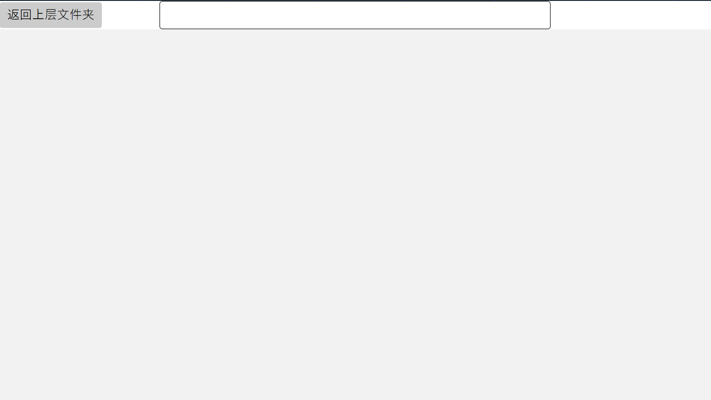

# Avalonia（四）MVVM架构实战——文件浏览器

## 前言

在前面，我们介绍了Avalonia基本的结构，以及对普通架构进行了实战练习，那么我们今天就简单对MVVM进行实战。

### 文件浏览器

这次我们要写的文件浏览器，其实也只有浏览这一功能。

大概就像这样：

- 初始时会显示出C盘根路径，会显示里头的文件跟文件夹内容
- 点击文件夹时就会跳转到下一层文件夹
- 点击文件就可以打开文件
- 上方有按钮可以退回到上一级
- 上方中间有一个显示当前路径的文本框

 

## 前端

那么既然我们已经把内容都写出来了，我们现在就可以简单的来描述一下我们的前端界面了。

### View

在界面上整体是一个上下结构，上面是按钮跟文本框。下面是一个文件列表。

简单写一下：

```xml
   <Grid RowDefinitions="Auto,*">
        <Button Grid.Row="0" HorizontalAlignment="Left">返回上层文件夹</Button>
        <TextBox Grid.Row="0" HorizontalAlignment="Center" Width="440" />
        <ListBox Grid.Row="1">

        </ListBox>
    </Grid>
```

界面长这个样：



那么我们现在基本上把界面给写好了，接下来就是接入数据了。

这次我们为了给大家做个演示，打算自己写一个

## Model

对于文件系统来说，主要需要这两个类:FileModel 跟 FolderModel，即文件类跟文件夹类。

考虑到要使用到列表，他们两个都得继承自同一个类，我们在这里就叫SystemModel。不过也是，如果我们不自己写Model的话使用FileInfo跟DirectoryInfo，会发现他们也使用了一个父类：FileSystemInfo。

那么我们现在写一下：

### SystemModel(这里按照惯例应该在前面加一个I的，但是也无所谓了)

```csharp
public interface SystemModel
{
    public string Name { get; set; }
    public string Path { get; set; }
    public string Size { get; set; }
}

public static class SystemModelStatic
{
    public static string GetSize(this long l)
    {
        string[] label = ["B","KB","MB","GB","TB"];
        int i = 0;
        while (l > 1024)
        {
            l /= 1024;
            i++;
        }

        return $"{l}{label[i]}";
    }

    public static SystemModel GetSys(this FileSystemInfo info)
    {
        if (info is FileInfo fileInfo)
            return new FileModel(fileInfo);
        if (info is DirectoryInfo)
            return new FolderModel(info);
        throw new Exception("没有找到该文件");
    }
}
```

### FileModel

```csharp
public class FileModel : SystemModel
{
    public string Name { get; set; } = "";
    public string Path { get; set; } = "";
    public string Size { get; set; } = "";
    public string Extension { get; set; } = "";

    public FileModel(FileInfo file)
    {
        Name = file.Name;
        Path = file.FullName;
        Extension = file.Extension;
        Size = file.Length.GetSize();
    }

    public FileModel(string path)
    {
        if(!File.Exists(path))return;
        var file = new FileInfo(path);
        Path = path;
        Name = file.Name;
        Extension = file.Extension;
        Size = file.Length.GetSize();
    }

    public void Open()
    {
        Process.Start(new ProcessStartInfo() { FileName = Path, UseShellExecute = true });
    }
}
```

### FolderModel

```csharp
public class FolderModel : SystemModel
{
    public string Name { get; set; } = "";
    public string Path { get; set; } = "";
    public string Size { get; set; } = "";
    public string Extension { get; set; } = "";

    public FolderModel(FileSystemInfo file)
    {
        Name = file.Name;
        Path = file.FullName;
    }

    public FolderModel(string path)
    {
        if (!Directory.Exists(path)) return;
        var info = new DirectoryInfo(path);
        Path = path;
        Name = info.Name;
    }
}
```

差不多就先这样。

## ViewModel

接下来就要写ViewModel了。

对于这个界面来说，主要需要的是文件列表跟文本框内容。

那么对于这两项就比较好说了：

```csharp
public class MainWindowViewModel : ViewModelBase
{
    private string _text = "";

    public string Text
    {
        get => _text;
        set
        {
            if (string.IsNullOrEmpty(value)) return;
            if (!Directory.Exists(value))
            {
                if (!File.Exists(value)) return;
                var file = new FileModel(value);
                file.Open();
                return;
            }
            this.RaiseAndSetIfChanged(ref _text, value);
            var folder = new DirectoryInfo(value);
            List.Clear();
            List.Add(folder.GetFileSystemInfos().Where(x =>
                (x.Attributes & FileAttributes.System) != FileAttributes.System &&
                (x.Attributes & FileAttributes.Hidden) != FileAttributes.Hidden).Select(x =>
                x.GetSys()));
        }
    }

    public ObservableCollection<SystemModel> List { get; set; } = [];

    public MainWindowViewModel()
    {
        Text = DriveInfo.GetDrives()[0].Name;
    }
}
```

这里就简单的解析了一下。

## 将数据绑定到View中

我们现在已经写好了Model跟ViewModel，现在可以绑定一下数据了：

```xml
   <Grid RowDefinitions="Auto,*">
        <Button Grid.Row="0" HorizontalAlignment="Left">返回上层文件夹</Button>
        <TextBox Grid.Row="0" Text="{Binding Text,Mode=OneWay}" HorizontalAlignment="Center" Width="440" />
        <ListBox Grid.Row="1" ItemsSource="{Binding List}">
            <ListBox.ItemTemplate>
                <DataTemplate DataType="models:SystemModel">
                    <Grid ColumnDefinitions="*,*,*">
                        <TextBlock Grid.Column="0" Text="{Binding Name}"/>
                        <TextBlock Grid.Column="1" Text="{Binding Size}"/>
                        <TextBlock Grid.Column="2" Text="{Binding Extension}"/>
                    </Grid>
                </DataTemplate>
            </ListBox.ItemTemplate>
        </ListBox>
    </Grid>
```

这里我们对Text使用单向绑定，正好简单的讲一下绑定的模式：

| `OneWay` | 数据源的更改会自动传播到绑定目标 |
| --- | --- |
| `TwoWay` | 数据源的更改会自动传播到绑定目标，反之亦然。 |
| `OneTime` | 从数据源传播的值在初始化时传播到绑定目标，但后续更改将被忽略 |
| `OneWayToSource` | 绑定目标的更改会传播到数据源，但反之不会。 |
| `Default` | 绑定模式基于代码中属性的默认模式。见下文。 |

如上表，我们这里要当ViewModel的内容更改时就会传递到TextBlock上（因为如果我们使用双向绑定的话，就会打不了字）

而ListBox是需要传入数据模板的，这样才能将SystemModel转换成我们所需要的内容。

## 事件书写

我们现在已经可以使用了，但是也只能看看，真就只有浏览的功能。

那怎么能行？

所以我们需要添加点交互什么的。

### 返回上级

我们在Button上订阅Click事件，方法就叫`BackToParentClick` :

```csharp
    private void BackToParentClick(object? sender, RoutedEventArgs e)
    {
        if(DataContext is not MainWindowViewModel model)return;
        var folder = new DirectoryInfo(model.Text);
        if(folder.Parent == null)return;
        model.Text = folder.Parent.FullName;
    }
```

### 文本框回车键跳转

我们这里使用KeyUp事件，当键盘按键上升的时触发事件:

```csharp
    private void InputEnterKeyUp(object? sender, KeyEventArgs e)
    {
        if(e.Key != Key.Enter)return;
        if(sender is not TextBox box)return;
        if(DataContext is not MainWindowViewModel model)return;
        if(string.IsNullOrEmpty(box.Text))return;
        model.Text = box.Text;
    }
```

### 选择列表元素

这里我们打算使用到绑定语法:

```csharp
    private SystemModel? _model;
    public SystemModel? Model
    {
        get => _model;
        set
        {
            this.RaiseAndSetIfChanged(ref _model, value);
            if(value == null)return;
            Text = value.Path;
        }
    }
```

然后在ListBox进行绑定:

```xml
<ListBox SelectedItem="{Binding Model}" Grid.Row="1" ItemsSource="{Binding List}">
```

搞定！

## 结尾

这一节我们使用了MVVM架构来写了一个文件浏览器，那下节打算混合一下，我们真正的写一个项目。