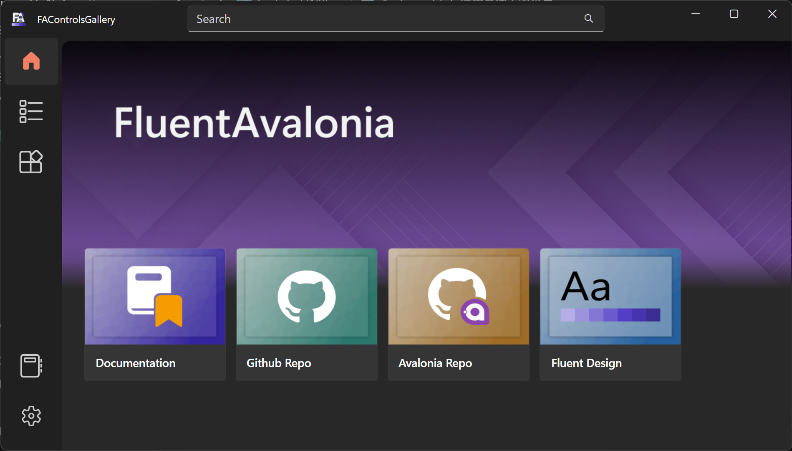

# Avalonia（五）使用其他主题来写一个待办事项软件

## 前言

我们之前都是使用Avalonia自带的主题去写，感觉对于新手来说有点难（因为要好看的话得自己去写大量的风格跟自定义主题）。不过Avalonia的社区也有大量优秀的控件主题库。这次我们使用的是FluentAvalonia。

[https://github.com/amwx/FluentAvalonia](https://github.com/amwx/FluentAvalonia)



我个人还是比较喜欢这个控件主题库的。不过有个缺点就是图库资料有点少。

## 添加FluentAvalonia到项目中

我们需要将FluentAvalonia引用到项目中才可以使用:

### 从Nuget上下载

在终端上输入:

```bash
dotnet add package FluentAvaloniaUI --version 2.0.4
```

或者在Rider跟VS上搜索：FluentAvaloniaUI


### 在App.axaml中引用主题

在App.axaml上删除Avalonia自带的主题，添加FluentAvalonia的主题：

```xml
<Application xmlns="https://github.com/avaloniaui"
             xmlns:x="http://schemas.microsoft.com/winfx/2006/xaml"
             x:Class="LearnTodo.App"
             xmlns:local="using:LearnTodo"
             xmlns:styling="clr-namespace:FluentAvalonia.Styling;assembly=FluentAvalonia"
             RequestedThemeVariant="Default">
             <!-- "Default" ThemeVariant follows system theme variant. "Dark" or "Light" are other available options. -->

    <Application.DataTemplates>
        <local:ViewLocator/>
    </Application.DataTemplates>
  
    <Application.Styles>
+       <styling:FluentAvaloniaTheme />
    </Application.Styles>
</Application>
```

现在我们可以简单尝试一下：

```xml
<Window xmlns="https://github.com/avaloniaui"
        xmlns:x="http://schemas.microsoft.com/winfx/2006/xaml"
        xmlns:vm="using:LearnTodo.ViewModels"
        xmlns:d="http://schemas.microsoft.com/expression/blend/2008"
        xmlns:mc="http://schemas.openxmlformats.org/markup-compatibility/2006"
        mc:Ignorable="d" d:DesignWidth="800" d:DesignHeight="450"
        x:Class="LearnTodo.Views.MainWindow"
        x:DataType="vm:MainWindowViewModel"
        Icon="/Assets/avalonia-logo.ico"
        Title="LearnTodo">

    <Design.DataContext>
        <vm:MainWindowViewModel/>
    </Design.DataContext>

    <TextBox HorizontalAlignment="Center" VerticalAlignment="Center" Text="1234"/>

</Window>
```


## 我们尝试写一个Todo应用

这次我们不打算写什么EF什么的，就只是单纯的写个软件。毕竟这是Avalonia教程，不是数据库教程。

不妨让我们先想想这个应用应该长什么样子：

- 有一个主页用来介绍软件
- 左边为待办列表，右边为待办详情
- 左边待办列表分为上中下：上层为返回框，中间是数据列表，下面是添加按钮
- 右边详情从上至下分别为：待办名称，时间，详情说明

那基本上就先这样

### Model

这次因为只需要写一个TodoModel，所以代码非常简单:

```csharp
public class TodoModel
{
    public string Name { get; set; }
    public DateTime End { get; set; }
    public string? Description { get; set; }
}
```

### ViewModel

```csharp
public class MainWindowViewModel : ViewModelBase
{
    public ObservableCollection<TodoModel> Todos { get; set; } = [];
}
```

### View

我们按照上面的来的话，那么我们的代码就应该是这样的：

```xml
    <Grid ColumnDefinitions="Auto,*" Margin="10">
        <Grid Grid.Column="0" Width="100" RowDefinitions="Auto,*,Auto">
            <Button Grid.Row="0">
                <ui:SymbolIcon Symbol="Back"/>
            </Button>
            <ListBox Grid.Row="1" ItemsSource="{Binding Todos}">
                <ListBox.ItemTemplate>
                    <DataTemplate DataType="models:TodoModel">
                        <TextBlock Text="{Binding Name}"/>
                    </DataTemplate>
                </ListBox.ItemTemplate>
            </ListBox>
            <Button Grid.Row="2" Click="AddTodoClick" HorizontalAlignment="Stretch">
                <ui:SymbolIcon Symbol="Add"/>
            </Button>
        </Grid>
        <ui:Frame Grid.Column="1" Name="Frame"/>
    </Grid>
```

我们这里使用Frame来作为我们显示详情的控件。

### 使用TaskDialog来添加待办

我们这里使用TaskDialog这个对话框容器来进行添加操作。

不过既然是容器，就得有相应的内容控件，这个是要我们自己写的。所以我们创建一个控件AddTodoDialog，代码如下:

```xml
    <StackPanel Spacing="8">
        <ui:SettingsExpander Header="待办名称"
                             IconSource="Accept">
            <ui:SettingsExpander.Footer>
                <TextBox Name="NameBox" Width="100"/>
            </ui:SettingsExpander.Footer>
        </ui:SettingsExpander>
        <ui:SettingsExpander Header="截止时间"
                             IconSource="CalendarDay">
            <ui:SettingsExpander.Footer>
                <CalendarDatePicker Name="Picker"/>
            </ui:SettingsExpander.Footer>
        </ui:SettingsExpander>
        <ui:SettingsExpander Header="详情"
                             IconSource="ColorLine">
            <ui:SettingsExpander.Footer>
                <TextBox Name="DescriptionBox" Width="100"/>
            </ui:SettingsExpander.Footer>
        </ui:SettingsExpander>
    </StackPanel>
```

然后在axaml.cs中添加一个方法:

```csharp
    public TodoModel? Done()
    {
        if (string.IsNullOrEmpty(NameBox.Text) || Picker.SelectedDate == null) return default;
        return new TodoModel()
            { Name = NameBox.Text, End = Picker.SelectedDate.Value, Description = DescriptionBox.Text };
    }
```

同时在MainWindow中的按钮添加点击事件：

```csharp
    private async void AddTodoClick(object? sender, RoutedEventArgs e)
    {
        var td = new TaskDialog
        {
            Title = "LearnTodo",
            Header = "添加待办",
            IconSource = new SymbolIconSource(){Symbol = Symbol.Add},
            Content = new AddTodoDialog(),
            FooterVisibility = TaskDialogFooterVisibility.Never,
            Buttons =
            {
                TaskDialogButton.OKButton,
                TaskDialogButton.CancelButton
            },
            XamlRoot = (Visual)VisualRoot!
        };
        td.Closing += (dialog, args) =>
        {
            if ((TaskDialogStandardResult)args.Result != TaskDialogStandardResult.OK) return;
            if (dialog.Content is not AddTodoDialog d) return;
            var result = d.Done();
            if (result == null)
            {
                args.Cancel = false;
                return;
            }

            if (DataContext is not MainWindowViewModel model) return;
            model.Todos.Add(result);
        };
        await td.ShowAsync();
    }
```

现在可以看看效果：


### 使用Frame面板

要使用Frame，就得先写相关的控件：HomePage跟TodoPage:

#### HomePage

```xml
    <StackPanel Spacing="8" Margin="10">
        <TextBlock Theme="{DynamicResource TitleLargeTextBlockStyle}" Text="LearnTodo"/>
        <TextBlock Text="本应用旨在帮助用户管理自己的日常任务，提高效率和生活质量"/>
        <StackPanel.Styles>
            <Style Selector="WrapPanel:pointerover">
                <Setter Property="Background" Value="{DynamicResource CardBackgroundFillColorDefaultBrush}"/>
            </Style>
        </StackPanel.Styles>
        <WrapPanel Margin="10">
            <ui:SymbolIcon Margin="10,0" Symbol="CommentAddFilled" FontSize="18"/>
            <TextBlock Text="现在就创建一个" FontSize="18"/>
        </WrapPanel>
        <WrapPanel Margin="10">
            <ui:SymbolIcon Margin="10,0" Symbol="ColorLineFilled" FontSize="18"/>
            <TextBlock Text="去看看你的待办事项" FontSize="18"/>
        </WrapPanel>
    </StackPanel>
```

#### TodoPage

```xml
    <StackPanel Margin="10" Spacing="10">
        <TextBlock Theme="{DynamicResource TitleLargeTextBlockStyle}" Name="NameBlock"/>
        <CalendarDatePicker Name="Picker"/>
        <TextBlock Name="Block"/>
    </StackPanel>
```

对数据进行初始化:

```csharp
public partial class TodoPage : UserControl
{
    public TodoPage(TodoModel model)
    {
        InitializeComponent();
        NameBlock.Text = model.Name;
        Picker.SelectedDate = model.End;
        Block.Text = model.Description;
    }
}
```

#### 将数据接上Frame

我们现在已经把Page的内容写好了，那么现在我们就要去书写Frame的NavigationFactory:

这个`NavigationFactory` 就类似于数据模板

```csharp
public class NavigationFactory : INavigationPageFactory
{
    public Control GetPage(Type srcType)
    {
        return new Border();
    }

    public Control GetPageFromObject(object target)
    {
        if (target.ToString() == "Home")
        {
            return new HomePage();
        }

        if (target is TodoModel model)
        {
            return new TodoPage(model);
        }
        throw new NotImplementedException();
    }
}
```

现在让我们把数据接上：

```csharp
    public MainWindow()
    {
        InitializeComponent();
        Frame.IsNavigationStackEnabled = true;
        Frame.NavigationPageFactory = new NavigationFactory();
        Frame.NavigateFromObject("Home");
    }

    private void BackClick(object? sender, RoutedEventArgs e)
    {
        Frame.GoBack();
    }

    private void SelectionChanged(object? sender, SelectionChangedEventArgs e)
    {
        if(sender is not ListBox box)return;
        Frame.NavigateFromObject(box.SelectedValue);
    }
```

现在基本上已经搞定了，来看一下：


## 结尾

现在我们学会了使用主题写应用。

这个系列也先就到这里了，这篇文章主要是Avalonia入门教程，不过也基本上能写一些基本应用了。