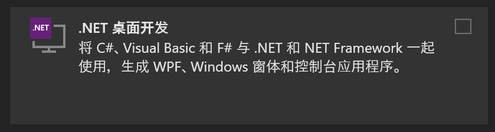
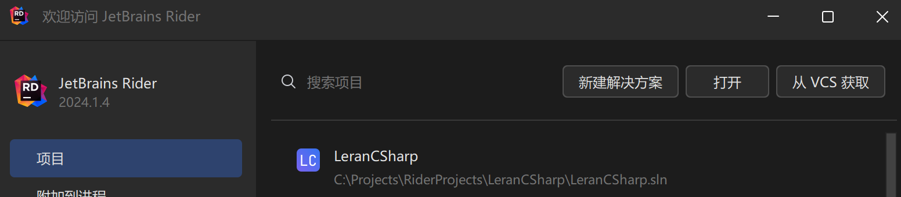

# 导论

> 当 LuckyFish 6年前——也就是2018年的时候，他绝对不会想到6年后的今天，自己的身份居然也会转变成一位教别人学C#的人。这是他六年前想都不敢想的。
>
> 他当时只知道去学一门编程语言，听说这个可以开发游戏，还可以开发APP，于是他便开始接触学习这门语言，谁能知道，接下来的六年他的大部分编程生活会跟这个语言打交道......

## 什么是C#

在学习这门语言之前，我们必须要了解最基础的问题——什么是C#？

总的来说，C#是一种由微软开发的现代化、通用、面向对象的编程语言。它在2000年开发.NET框架期间创建。

C#结合了C和C++的强大功能，同时去掉了一些复杂特性，使其更易于使用。它主要用于开发运行在.NET平台上的应用程序，包括桌面应用、Web应用、移动应用和游戏等。

C#的特点包括：

- **面向对象** 支持封装、继承和多态
- **类型安全** ：提供强类型检查，减少运行时错误。
- **跨平台** ：可以在Windows、Linux和macOS上运行。
- **高效开发** ：与Visual Studio等开发工具集成，提升开发效率。

> 省流版：C#是 **微软** 开发的 **面对对象** ，**跨平台**，**强类型**的语言，他的平台是 **.NET**。

## 怎样才能开发C#呢？

对于C#这样一门跨平台的语言，我们可以分为两种情况：

1. **Windows**：可以使用Visual Studio，Visual Studio Code，或者使用 JetBrains Rider。
2. **Linux和MacOS**：可以使用Visual Studio Code，或者使用 JetBrains Rider。

其中除了VS 以外，其他都要单独下载 **.Net Core SDK** 。

### VS安装

先进入VS 官网，下载社区版：
[https://visualstudio.microsoft.com/zh-hans/vs/community/](https://visualstudio.microsoft.com/zh-hans/vs/community/)

然后下载完成之后，选择这些组件：



然后等待即可。

### VS Code安装

1. 下载 .Net Core SDK：[https://dotnet.microsoft.com/zh-cn/download/dotnet/8.0](https://dotnet.microsoft.com/zh-cn/download/dotnet/8.0)
2. 下载VS Code：[https://code.visualstudio.com/](https://code.visualstudio.com/)
3. 下载插件：
   1. 中文插件： 搜索 Chinese (Simplified) Language Pack for Visual Studio Code
   2. C#插件：搜索 C# Dev Kit

然后就可以开始使用了

### Rider安装

1. 下载 .Net Core SDK：[https://dotnet.microsoft.com/zh-cn/download/dotnet/8.0](https://dotnet.microsoft.com/zh-cn/download/dotnet/8.0)
2. 下载Rider：[https://www.jetbrains.com/rider/download/](https://www.jetbrains.com/rider/download/)
3. 下载插件：在插件(Plugins)中搜索 Chinese (Simplified) ，找到安装即可

## 新建一个项目

> 这里以 Rider为例

1. 打开Rider，点击新建解决方案：

   

2. 选择控制台，然后输入解决方案的名称和项目名称（懒得改就算了）
3. 点击确定，然后等待就创建好项目了

## C#的Hello World

当我们创建好项目之后，映入眼帘的是这个代码：

```csharp
Console.WriteLine("Hello World!");
```

我们可以直接运行这个程序，然后就可以看到输出了。

> Hello World!

我们也可以改一下，改成:

```csharp
Console.WriteLine("Hello iOS Club!");
```

输出之后就会发现变成了 **Hello iOS Club!**.

那也就是说明，当我们改变括号里头的内容的时候，我们的输出结果也会发生变化。

因此我们可以试着翻译这句话：

> 控制台.写一行("Hello,iOS Club!");

今天已经学了这么多了，那就先这样吧！