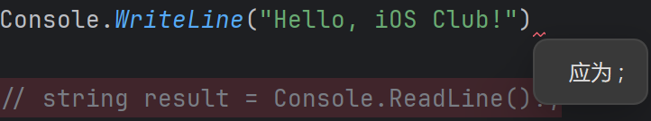

# C# 基础

> 我们在上一节简单的介绍了C#语言，还安装了开发软件，最后我们还简单的看了一下C#的程序
>
> 那么这节课我们又要去学习新的内容了

## 一个C#语句的修养

我们在上节的最后看到了这样一句话:

```csharp
Console.WriteLine("Hello,World");
```

我们最后发现这句话的涵义就是 **在控制台中打印出Hello,World**

那么我们可以把最后的分号去掉，看看会发生什么



我们发现直接进行报错了，这就说明分号是必须要打的。

> 小贴士:
>
> 在C#中，分号是语句的结束符，用于告诉编译器一个语句已经结束，可以开始执行下一个语句。
>
> 也就是说，在C#中，无论是什么样的语句，都需要以分号结尾。

## 变量

当我们在运算一个式子的时候，我们是不是会先列式。当我们心算的时候，也会先将我们需要的数据记到大脑中之后才能进行计算。

而计算机程序的本质就是：将数据进行搬运，处理计算和显示。

而我们要做到的第一步就是将数据存储到计算机中，存储到计算机的东西就是 **变量** 。

在C#中，变量的声明格式是：

```csharp
// 数据类型 变量名 = 初始值(可以是 一个值，运算表达式，函数结果);
int a = 10; // 例如这样
```

我们需要声明 他的数据类型，变量名还有初始值。就比如说这里的数据类型就是 **int** ，变量名就是 **a** ，初始值就是 **10**

当我们想要更改变量的时候，我们只需要这样就可以了：

```csharp
a = 20;
```

像这种创建或改变值的语句，我们就叫它 **赋值语句** 。

不过需要注意的是，在使用这个变量前，我们必须要初始化变量才行。

我们来试试：

```csharp
int a;
Console.WriteLine(a);

// error:
// [CS0165] 使用了未赋值的局部变量“a”

// 我们只需要初始化一下就可以使用了
a = 10
Console.WriteLine(a);
// OK!
```

### 常见的数据类型

现在让我们来看一下常见的数据类型：

| 数据类型 | 描述                               |
| -------- | ---------------------------------- |
| bool     | 布尔型，用于表示真或假。           |
| char     | 字符型，用于表示单个字符。         |
| decimal  | 十进制浮点型，用于表示精确的小数。 |
| double   | 双精度浮点型，用于表示精确的小数。 |
| float    | 单精度浮点型，用于表示精确的小数。 |
| int      | 整型，用于表示整数。               |
| long     | 长整型，用于表示整数。             |
| string   | 字符串型，用于表示字符串。         |
| char     | 字符型，用于表示单个字符。         |

我们现在来依次创建：

```csharp
int i = 1; // 整数类型
double d = 1.0; // 双精度浮点型
float f = 1.0f; //单精度
decimal m = 1.0m; // 浮点型
char c = ' '; // 字符类型
string s = ""; // 字符串类型 双引号
bool b = false; // 布尔类型 真/假
```

我们这里需要注意的是：

1. 在使用float类型时，需要使用f结尾。相应的在使用decimal类型时，需要使用m结尾
2. 字符类型使用单引号，字符串类型使用双引号
3. 字符只能存储一个字符，而字符串可以存储0到无数个字符
4. 布尔类型只有两个值，true和false，代表 真和假

还有一个非常重要的是，还记得我们上一篇文章讲到的C#的一个特点吗？这个特点就是:

> C#是**强类型语言**，也就是说，变量的类型必须明确。

我们来试试：

```csharp
int a = 1;
a = "1";
// error:
// [CS0029] 无法将类型“string”转换为类型“int”
```

在创建变量的时候，我们就已经声明好了这个变量的数据类型，而这个数据类型是不能发生改变的。


### 运算符和表达式

前面我们有讲到，计算机程序的本质就是将数据进行搬运，处理计算和显示。

那我们已经将第一步给搞定了，我们接下来就要进行第二步，将数据进行运算，这些运算式统统统都是**表达式**。

> 如果你是语言的设计者，你会添加什么样的运算呢？

那肯定要有一些基本的运算对吧。现在就来看看C#支持哪些运算符：

| 运算符 | 描述 | 示例  |
| :----- | :--- | :---- |
| +      | 加法 | 2 + 3 |
| -      | 减法 | 3 - 2 |
| *      | 乘法 | 2 * 3 |
| /      | 除法 | 3 / 2 |
| %      | 取余 | 3 % 2 |

这里像加减乘除我们都知道，那这个**求余**是什么？

求余求余，就是求出余数。例如3 / 2 = 1 ...... 1(余1)。而我们想要知道余数，但是我们又没有求余的话，那就只能写成这样：

```csharp
int a = 3 / 2;
int result = 3 - 2*a; // 这个就是余数
```

现在我们就可以直接通过 % 来进行求余了。

除此外，因为C#有bool这个类型，因此我们可以把运算符扩展到bool类型，从而实现逻辑运算：

| 比较运算符 | 描述     | 示例   |
| :--------- | :------- | :----- |
| ==         | 等于     | 2 == 2 |
| !=         | 不等于   | 2 != 3 |
| >          | 大于     | 3 > 2  |
| <          | 小于     | 2 < 3  |
| >=         | 大于等于 | 3 >= 2 |
| <=         | 小于等于 | 2 <= 3 |

这些运算符最后的结果都是bool类型。

我们来试一下:

```csharp
bool a = 2 == 2;
bool b = 2 != 3;
bool c = 2 > 2;
bool d = 2 < 3;
Console.WriteLine(a);
Console.WriteLine(b);
Console.WriteLine(c);
Console.WriteLine(d);
```

但事实上我们还需要考虑到很多的复杂的场景，就比如说 当 x 大于 60 小于 70 的时候 ，我们就必须要对这些复杂的情况进行处理。因此C#提供了更多的运算符：

| 布尔运算符 | 描述 | 示例                 |
| :--------- | :--- | :------------------- |
| !          | 取反 | !(2 == 2)            |
| &&         | 与   | (2 == 2) && (3 > 2)  |
| \|\|       | 或   | (2 == 2)\|\| (3 > 2) |

我们来试一下：

```csharp
bool a = !(2 == 2);
bool b = (2 == 2) && (3 > 2);
bool c = (2 == 2) || (3 > 2);
Console.WriteLine(a);
Console.WriteLine(b);
Console.WriteLine(c);
// false true true
```

我们现在已经把基本的运算符给讲完了，但是我们有的时候会写一些这样的代码：

```csharp
int a = 1;
a = a + 1;
```

像这种代码，其实我们只会用到一个"未知量"，也就是 1 。那么像这种情况我们可以省一些代码吗？

答案是当然可以，我们现在来看一下这些运算符：

| 运算符 | 描述     | 示例               |
| :----- | :------- | :----------------- |
| ++     | 自增     | int a = 1; a++;    |
| --     | 自减     | int a = 1; a--;    |
| +=     | 加法赋值 | int a = 1; a += 2; |
| -=     | 减法赋值 | int a = 1; a -= 2; |
| *=     | 乘法赋值 | int a = 1; a *= 2; |
| /=     | 除法赋值 | int a = 1; a /= 2; |
| %=     | 取余赋值 | int a = 1; a %= 2; |

像这种的话都可以翻译成 a = a () 值 的形式。


### 字符串的粘合

我们在前面讲到了许多类型的运算，那么有没有针对于字符串的运算符呢？是有的。

但是只有一个，也就是 **"+"** 。这个运算符只负责进行字符串的粘合。

我们来试一下：

```csharp
string a = "Hello";
string b = "World";
Console.WriteLine(a + "" + b);
// Hello World
```

当然我们前面讲到的 **+=** 也可以进行字符串的粘合。

```csharp
string a = "Hello";
string b = "World";
a += " " + b;
Console.WriteLine(a);
// Hello World
```

除了这种粘合，C#还有两种比较高级的粘合方式：

1. 使用 string.Format 方法

    ```csharp
    string fullName = string.Format("{0} {1}", firstName, lastName);
    ```

2. 使用字符串插值 ($ 前缀)

    ```csharp
    string a = "Hello";
    string b = "World";
    Console.WriteLine($"{a} {b}");
    // Hello World
    ```


  
### 算法的优先级

在C#中，运算符的优先级和数学运算一样，从高到低依次是：

1. 括号
2. 乘除
3. 加减

这里跟我们学到的数学是一样的。

## 结束

我们今天讲到了语句，变量，运算符和表达式，还有算法的优先级。

我们现在可以开始正式进入到下一篇文章了。
