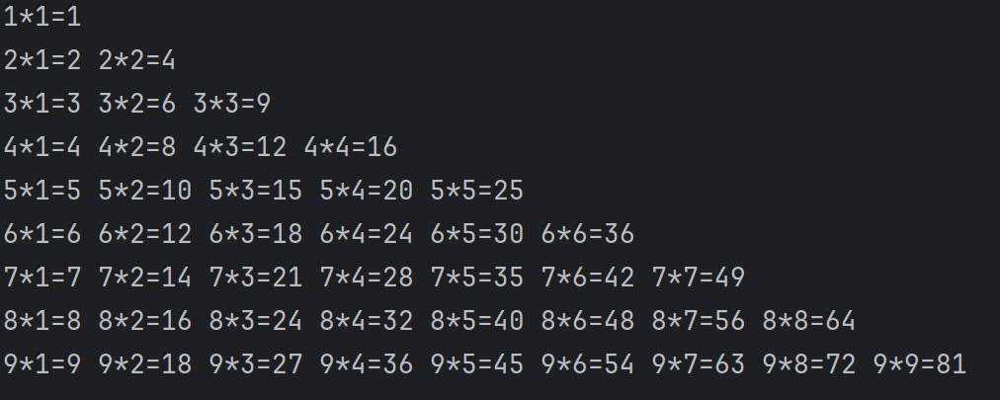

# 分支与循环

> 在上一节中，我们学习了语句，变量，运算符和表达式，还有算法的优先级
>
> 这一节我们继续学习

## 更复杂的需求

我们在上一节已经可以写一些简单的程序了，但是在很多时候却很犯难。例如我们遇到了下面这个情况：

> 输入一个数，要你判断是不是正数

还有一种也很犯难：

> 请逐个输入考试成绩，并计算出平均值

的确，我们在上节已经学会了该怎么进行计算和赋值，但是遇到这种情况，很显然是搞不定的。

这也是我们这篇文章的内容，我们要解决掉更复杂的问题。

## 分支语句

分支语句，就是根据某一个条件，执行不同的语句。

在C#中，分支语句有：

- if语句
- switch语句

### if语句

所谓if语句，就是根据某一个条件，执行不同的语句。

就比如说我们现在有这样一个情况：

> 输入一个数，要你判断是不是正数

那么使用if语句，可以这样写：

```csharp
int a = int.Parse(Console.ReadLine());
if (a > 0)
{
    Console.WriteLine("正数");
}
```

这句话的意思就是，如果 a 大于 0，那么就输出 "正数"。这里小括号里头的需要给一个bool值，即真假。当条件为真时，就会执行if语句中的语句。当条件为假时，就不会执行if语句中的语句。

那如果我们想让他也能输出“非整数”呢？或者说当这个情况为假的时候，我们能执行其他的语句。

很简单，我们只需要这样写：

```csharp
int a = int.Parse(Console.ReadLine());
if (a > 0)
{
    Console.WriteLine("正数");
}
else
{
    Console.WriteLine("非正数");
}
```

这里我们使用else语句，当条件为假时，就会执行else语句中的语句。

那我现在有了一个新的需求，就是我还想讨论一下当x等于0的情况，这该怎么写？

这里C#同样给了我们很多的便利：

```csharp
int a = int.Parse(Console.ReadLine());
if (a > 0)
{
    Console.WriteLine("正数");
}
else if (a == 0)
{
    Console.WriteLine("零");
}
else
{
    Console.WriteLine("非正数");
}
```

这里我们使用else if语句，当if的条件为假时，就会执行else if语句中的语句。

这里其实更像是一个顺序的if语句，当第一个if的条件为假时，就会执行第二个if语句中的语句，依次类推，要是所有的if - else if条件都为假时，就会执行else语句中的语句（如果没有就直接退出）。

我们现在可以总结一下，if语句的格式如下：

```csharp
if (条件)
{
    语句1;
}
else if (条件)
{
    语句2;
}
else if (条件){} ... // 可以有多个else if语句
else{
    语句n; // 可以有零个或者一个else语句
}
```

### switch语句

switch语句，就是根据某一个条件，执行不同的语句。

我们这里举个例子，例如在我们在学校有不同的人，这些人又有不同的身份，就比如老师，校长，同学等等等等。那我们现在就有一个需求，希望可以根据身份的不同，输出不同的信息。

我们前面学习到了if语句，我们先使用if语句来写一下:

```csharp
string name = Console.ReadLine();
if (name == "老师")
{
    Console.WriteLine("我是老师");
}
else if (name == "校长")
{
    Console.WriteLine("我是校长");
}
else if (name == "同学")
{
    Console.WriteLine("我是同学");
}
else
{
    Console.WriteLine("我不认识你");
}
```

但是我们这里是对同一个变量进行各种各样的等于操作，就相当于我们在对不同的选项进行不同的选择。那么有没有一种语句可以简化这一操作，毕竟我们只需要对同一个变量进行不同的选择，而不是对不同的变量进行不同的选择。

我们现在来介绍一下switch语句，这个语句就是根据某一个条件，执行不同的语句。

我们来看一下:

```csharp
string name = Console.ReadLine();
switch (name)
{
    case "老师":
        Console.WriteLine("我是老师");
        break;
    case "校长":
        Console.WriteLine("我是校长");
        break;
    case "同学":
        Console.WriteLine("我是同学");
        break;
    default:
        Console.WriteLine("我不认识你");
        break;
}
```

我们这里可以看到，switch语句和if的样子很像，但是他是给定了一个变量，然后根据这个变量的值，执行不同的语句。

现在我们可以总结一下，switch语句的格式如下：

```csharp
switch (变量)
{
    case 值1:
        语句1;
        break; // 如果break没有写，那么就会执行后面的语句
    case 值2:
        语句2;
        break; //后面的我就省略了，可以写很多个case语句
    default:
        语句n;
        break; // 如果没有default语句，那么就会直接退出switch语句
}
```

## 循环语句

前面我们讲到了分支语句，解决了分段函数和分情况导论的需求。但是还有这样一个需求：

> 请逐个输入考试成绩，并计算出平均值

那么对于这个需求吗，我们就得需要不断的运行我们的程序，然后知道我们输入了一个给定的退出值，蔡可以退出这个循环。

那我们应该怎么样去做呢？

### while语句

我们先使用while语句来进行书写:

```csharp
int sum = 0;
int count = 0;
while (true)
{
    string input = Console.ReadLine();
    if (input == "exit")
    {
        break;
    }
    int score = int.Parse(input);
    sum += score;
    count++;
}
Console.WriteLine("平均值为：" + sum / count);
```

我们这里使用到了while语句，这个语句的意思就是，当条件为真时，就会执行while语句中的语句，当条件为假时，就会退出while语句。当然如果你给定了一个常数，也就是一个不变的值，那么这个循环就成为了一个死循环（也就是无法退出的循环），就比如说我们上面的这个例子。那么这该怎么办呢？

在while语句中还有一种退出循环的方法，也就是break。让程序运行到break语句时，就会直接退出while语句。我们一般在写一些不确定什么时候会结束的循环的时候，就会使用break语句，当然我们也可以这么写:

```csharp
int sum = 0;
int count = 0;
bool flag = true;
while (flag)
{
    string input = Console.ReadLine();
    if (input == "exit")
    {
        flag = false;
    }else
    {
        int score = int.Parse(input);
        sum += score;
        count++;
    }
}
Console.WriteLine("平均值为：" + sum / count);
```

这个时候我们通过控制变量flag的值，也可以直接控制循环的结束。但是这种方法的问题就是不能实时退出：当flag的值为false时，程序不会立马退出，必须要等到语句内部的语句全部运行完成之后才可以退出。

这也就意味着，在while语句中，是这样运行的：

1. 对条件进行判断，如果条件为真，就执行while语句中的语句，否则就退出while语句。
2. 对while语句中的语句进行运行。如果运行到了break语句，就直接退出while语句。
3. 运行完之后再回到1中

我们这里可以总结一下，while语句的格式如下：

```csharp
while (条件)
{
    语句;
}
```

那有没有先执行语句再进行条件判断的语句呢？有的，C#总能给你整出一些花活。

### do...while语句

do...while语句，就是先执行语句，然后再进行条件判断。

我们来把上面的代码用do...while语句来写一下：

```csharp
int sum = 0;
int count = 0;
do
{
    string input = Console.ReadLine();
    if (input == "exit")
    {
        break;
    }
    int score = int.Parse(input);
    sum += score;
    count++;
}while (true);
Console.WriteLine("平均值为：" + sum / count);
```

我们这里使用到了do...while语句，这个语句的意思就是，先执行do语句中的语句，然后再进行条件判断，如果条件为真，就继续执行do语句中的语句，否则就退出do语句。

### for语句

前面两种都是针对不定循环的，那么如果我们想就只想要语数英三科成绩，多了就直接退出循环，或者有的时候我们想写一个99乘法表，如果是使用while语句的话，就会有点麻烦，这时候我们就可以使用for语句了。

我们现在可以来试一下，使用for语句来写一个99乘法表：

```csharp
for (int i = 1; i <= 9; i++)
{
    for (int j = 1; j <= i; j++)
    {
        Console.Write(i + "*" + j + "=" + i * j + " ");
    }
    Console.WriteLine();
}
```

我们现在来运行一下:



我们这里可以简单的解释一下，因为使用了多层的for循环:

1. 第一层for循环，i从1开始，到9结束，每次i加1
2. 第二层for循环，j从1开始，到i结束，每次j加1
3. 总体是当i = n的时候, 运行j = 1到n的循环，然后i加1，然后重复这个过程，直到i = 10，然后退出循环。

总的来说for循环可以支持一个**赋值操作**，一个**条件判断**，一个**其他语句**。

当然这些都可以省略，例如我们可以这样写：
```csharp
int i = 0;
for(;i < 9;){
    i++;
}
```

甚至我们可以把中间的 `i < 9` 给去掉，这样就形成了一个死循环。不过同样的，我们可以通过break语句来退出循环。

## 练习

1. 请使用while语句，输入一个数字，然后输出这个数字的阶乘。
2. 请使用for语句，输入一个数字，然后输出这个数字的阶乘。

这些我们下节课再来公布答案。

## 结束

本节内容到此结束，我们今天讲了分支语句和循环语句。

下节课我们将讲到一种新型的数据类型。
