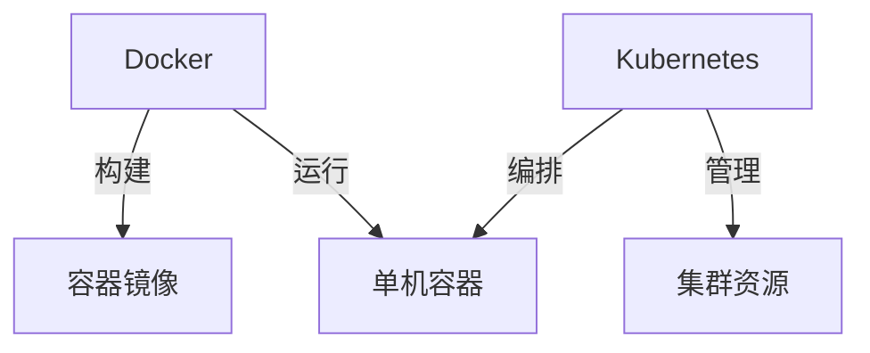
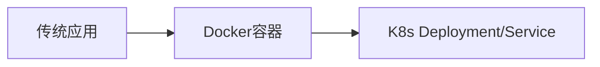

# 进阶话题：容器编排与云原生部署

## Kubernetes 简介（与 Docker 的关系）

### **Docker 与 Kubernetes 的定位**

|   | Docker | Kubernetes | 
| -- | -- | -- |
| 核心功能 | 容器运行时和构建工具 | 容器编排系统 | 
| 管理规模 | 单机/小规模 | 大规模集群 | 
| 关系说明 | Kubernetes 底层使用 Docker（或其他运行时如 containerd）作为容器引擎 |   | 


### **关键概念对比**



### **典型工作流**

1. 用 Docker 构建镜像并推送到 Registry

1. 通过 Kubernetes 部署镜像到集群

```yaml
# deployment.yaml 示例
apiVersion: apps/v1
kind: Deployment
metadata:
  name: nginx
spec:
  replicas: 3
  template:
    spec:
      containers:
      - name: nginx
        image: nginx:1.23
        ports:
        - containerPort: 80
```

## Docker Swarm vs Kubernetes

### 功能对比

| 特性 | Docker Swarm | Kubernetes | 
| -- | -- | -- |
| 学习曲线 | 简单 | 陡峭 | 
| 安装复杂度 | 一键初始化 | 需要专业工具（kubeadm/kops） | 
| 集群规模 | 适合中小规模（≤50节点） | 支持万级节点 | 
| 自动扩展 | 需第三方工具 | 原生支持（HPA） | 
| 服务发现 | 内置DNS | CoreDNS+Service | 
| 滚动更新 | 支持 | 更精细控制 | 


### 选择建议

- 选择 Swarm 当：

	- 已有 Docker 环境，需要快速搭建

	- 小团队/简单应用场景

	- 维护成本要求低

- 选择 Kubernetes 当：

	- 需要自动化扩展和修复

	- 多云/混合云部署

	- 微服务架构复杂

### **Swarm 部署示例**

```
# 初始化Swarm集群
docker swarm init --advertise-addr <IP>

# 部署服务
docker service create --name web --replicas 3 -p 80:80 nginx
```

## 云原生部署方案

### AWS ECS (Elastic Container Service)

**核心特点**：

- 完全托管服务

- 兼容 Docker 镜像

- 深度集成 AWS 网络/存储服务

**部署流程**：

1. 推送镜像到 ECR

```bash
aws ecr create-repository --repository-name myapp
docker tag myapp:latest 123456789.dkr.ecr.us-east-1.amazonaws.com/myapp:latest
aws ecr get-login-password | docker login --username AWS --password-stdin 123456789.dkr.ecr.us-east-1.amazonaws.com
docker push 123456789.dkr.ecr.us-east-1.amazonaws.com/myapp:latest
```

1. 创建 ECS 任务定义（JSON 配置）

1. 部署服务到 Fargate 或 EC2

### Azure ACI (Container Instances)

**核心特点**：

- 无需管理底层设施

- 按秒计费

- 快速启动（＜30秒）

**部署示例**：

```bash
az group create --name mygroup --location eastus
az container create \
  --resource-group mygroup \
  --name myapp \
  --image mcr.microsoft.com/azuredocs/aci-helloworld \
  --ports 80 \
  --dns-name-label myapp-dns
```

### 其他云方案对比

| 服务 | 厂商 | 典型用途 | 
| -- | -- | -- |
| EKS | AWS | 企业级K8s托管 | 
| GKE | Google Cloud | 数据分析和AI工作负载 | 
| AKS | Azure | Windows容器混合云 | 


## 🔹 技术选型指南

### **自建 vs 托管服务**

|   | 自建K8s | 托管服务(如EKS) | 
| -- | -- | -- |
| 成本 | 低（仅资源费用） | 有服务溢价 | 
| 运维复杂度 | 高（需专业团队） | 低（厂商管理控制面） | 
| 灵活性 | 完全可控 | 受限于平台功能 | 


### **迁移到云原生的关键步骤**

1. 容器化改造

	- 将应用拆分为微服务

	- 编写 Dockerfile 和 compose 文件

1. 编排系统适配



1. CI/CD 流水线重构

	- 镜像构建 → 安全扫描 → 部署到云平台