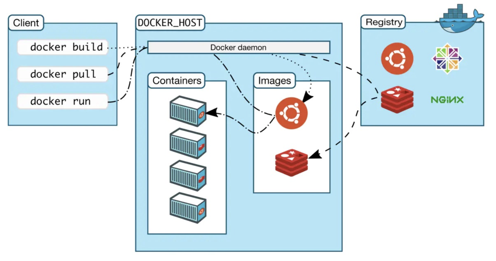

# Docker 基础概念

## **1.1 什么是 Docker？与虚拟机的区别**

### **Docker 是什么？**

Docker 是一个 容器化平台，允许开发者将应用程序及其依赖打包到一个轻量级、可移植的容器中，并在任何支持 Docker 的环境中运行。

### **Docker vs 虚拟机（VM）**

| 特性 | Docker（容器） | 虚拟机（VM） | 
| -- | -- | -- |
| 虚拟化级别 | 操作系统级虚拟化（共享宿主机内核） | 硬件级虚拟化（Hypervisor 模拟硬件） | 
| 启动速度 | 秒级启动（轻量级） | 分钟级启动（需启动完整 OS） | 
| 资源占用 | 低（共享内核，无额外 OS 开销） | 高（每个 VM 需独立 OS 和资源） | 
| 隔离性 | 进程级隔离（较弱，共享内核） | 完全隔离（独立内核，安全性更高） | 
| 适用场景 | 微服务、CI/CD、快速部署 | 传统应用、强隔离需求（如不同 OS 环境） | 


总结：

- Docker 更轻量、更快，适合现代云原生应用。

- VM 隔离性更强，适合传统虚拟化需求。

## **1.2 Docker 架构（Docker Engine、Images、Containers、Registry）**



### **Docker 核心组件**

1. Docker Engine

	- Docker 守护进程（dockerd）：管理容器生命周期。

	- REST API：提供接口与 Docker 交互。

	- CLI（docker 命令）：用户操作入口（如 docker run）。

1. Images（镜像）

	- 只读模板，包含运行应用所需的代码、库、环境配置。

	- 例如：mysql:8.0、nginx:alpine。

1. Containers（容器）

	- 镜像的运行实例，具有可写层（存储运行时数据）。

	- 例如：docker run -d nginx 会从 nginx 镜像创建一个容器。

1. Registry（镜像仓库）

	- 存储和分发镜像的服务：


		- Docker Hub（默认公共仓库，如 docker pull ubuntu）。

		- 私有仓库（如 Harbor、AWS ECR）。

### **Docker 工作流程**

1. 用户通过 docker pull 从 Registry 下载镜像。

1. 使用 docker run 基于镜像创建容器。

1. 容器运行时，Docker Engine 管理其资源。

## **1.3 Docker 核心概念：镜像、容器、数据卷、网络**

### **1. 镜像（Image）**

- 特点：


	- 分层存储（Layer），每一层是只读的（如 Ubuntu 基础层 + Nginx 安装层）。

	- 通过 Dockerfile 构建（docker build -t my-image .）。

### **2. 容器（Container）**

- 特点：


	- 基于镜像创建，添加一个可写层（存储运行时数据）。

	- 生命周期：创建 → 启动 → 停止 → 删除。

	- 示例：

```bash
docker run -d --name my-nginx nginx  # 创建并运行容器
docker exec -it my-nginx bash       # 进入容器

```

### **3. 数据卷（Volume）**

- 作用：持久化容器数据（避免容器删除后数据丢失）。

- 两种方式：


	- Bind Mount（直接挂载主机目录）：

```bash
docker run -v /host/path:/container/path mysql

```

	- Named Volume（Docker 管理的数据卷）：

```bash
docker volume create my-vol
docker run -v my-vol:/container/path mysql

```

### **4. 网络（Network）**

- 作用：管理容器间通信（如 Web 服务连接 MySQL）。

- 常见模式：


	- bridge（默认）：容器通过虚拟网络通信。

	- host：容器直接使用主机网络（高性能，低隔离）。

	- none：无网络（仅用于特殊场景）。

- 示例：

```bash
docker network create my-net
docker run --network my-net my-app

```

## **🔹 总结**

- Docker 是轻量级容器技术，比 VM 更高效。

- 镜像是模板，容器是运行实例，数据卷持久化存储，网络管理通信。

- 核心命令：docker pull、docker run、docker build、docker network。

接下来可以讨论：

- Docker 安装与配置（如何在不同系统安装 Docker）。

- 基础命令实战（拉取镜像、运行容器、查看日志）。