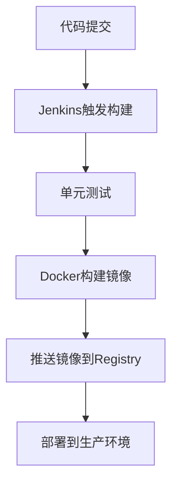

# 实战案例：Jenkins + Docker-in-Docker（DinD）

## **✅ 核心内容**

### **1. 为什么需要 DinD？**

#### **典型场景**

- 在 Jenkins 容器中执行 docker build

- 在 CI/CD 流水线中构建和推送镜像

- Kubernetes 集群中的容器需要操作 Docker

#### **传统方案问题**

| 方案 | 问题 | 
| -- | -- |
| 挂载主机 Docker Socket (/var/run/docker.sock) | 安全风险（容器获得主机root权限） | 
| 外部 Docker 服务器 | 网络复杂，依赖外部服务 | 


#### **DinD 优势**


### **2. Jenkins DinD 环境搭建**

#### **docker-compose.yml**

```yaml
version: '3.8'

services:
  jenkins:
    image: jenkins/jenkins:lts-jdk17
    container_name: jenkins
    ports:
      - "8080:8080"
      - "50000:50000"
    volumes:
      - jenkins_home:/var/jenkins_home
      - /var/run/docker.sock:/var/run/docker.sock  # 方法1：简单但不安全
    networks:
      - dind-net

  dind:
    image: docker:dind
    container_name: dind
    privileged: true  # DinD 必须特权模式
    environment:
      - DOCKER_TLS_CERTDIR=/certs
    volumes:
      - dind_certs:/certs
    networks:
      - dind-net

volumes:
  jenkins_home:
  dind_certs:

networks:
  dind-net:

```

#### **安全增强方案（推荐）**

```yaml
# 替换挂载socket的方式
jenkins:
  environment:
    - DOCKER_HOST=tcp://dind:2376
    - DOCKER_TLS_VERIFY=1
    - DOCKER_CERT_PATH=/certs/client

```

### **3. Jenkins Pipeline 集成 Docker**

#### **安装必备插件**

1. Docker Pipeline

1. Docker API Plugin

1. Blue Ocean (可选)

#### **声明式Pipeline示例**

```groovy
pipeline {
    agent any
    environment {
        REGISTRY = "registry.example.com"
        IMAGE = "myapp"
        TAG = "latest"
    }
    stages {
        stage('Build') {
            steps {
                script {
                    docker.withRegistry("https://${REGISTRY}", 'docker-creds') {
                        def customImage = docker.build("${IMAGE}:${TAG}", "./docker")
                        customImage.push()
                    }
                }
            }
        }
    }
}

```

#### **脚本式Pipeline示例**

```groovy
node {
    checkout scm
    def image = docker.build("myapp:${env.BUILD_ID}", "./docker")
    image.withRegistry('
        image.push()
    }
}

```

### **4. 完整 CI/CD 示例**

#### **场景流程**



#### **完整 Jenkinsfile**

```groovy 
pipeline {
    agent {
        docker {
            image 'docker:latest'
            args '-v /var/run/docker.sock:/var/run/docker.sock'
        }
    }
    stages {
        stage('Build') {
            steps {
                sh 'docker build -t myapp:${GIT_COMMIT} .'
            }
        }
        stage('Test') {
            steps {
                sh 'docker run myapp:${GIT_COMMIT} npm test'
            }
        }
        stage('Push') {
            steps {
                withCredentials([usernamePassword(
                    credentialsId: 'dockerhub-creds',
                    usernameVariable: 'USER',
                    passwordVariable: 'PASS'
                )]) {
                    sh '''
                        docker login -u $USER -p $PASS
                        docker tag myapp:${GIT_COMMIT} myorg/myapp:${GIT_COMMIT}
                        docker push myorg/myapp:${GIT_COMMIT}
                    '''
                }
            }
        }
        stage('Deploy') {
            steps {
                sshagent(['prod-server-creds']) {
                    sh '''
                        ssh user@prod-server \
                        "docker pull myorg/myapp:${GIT_COMMIT} && \
                         docker-compose up -d"
                    '''
                }
            }
        }
    }
}

```

### **🔹 最佳实践与安全建议**

1. 安全方案选择

| 方案 | 安全等级 | 复杂度 | 
| -- | -- | -- |
| 挂载socket | ⚠️ 低 | 简单 | 
| DinD + TLS | 🔒 高 | 中等 | 
| Kubernetes Pod | 🔒🔒 最高 | 复杂 | 


1. 资源限制

```yaml
dind:
  deploy:
    resources:
      limits:
        memory: 4G

```

1. 镜像清理策略

```
post {
  always {
    sh 'docker system prune -f || true'
  }
}

```

1. 企业级方案建议

	- 使用 Harbor 作为镜像仓库

	- 集成 SonarQube 进行代码扫描

	- 添加 K8s 部署阶段