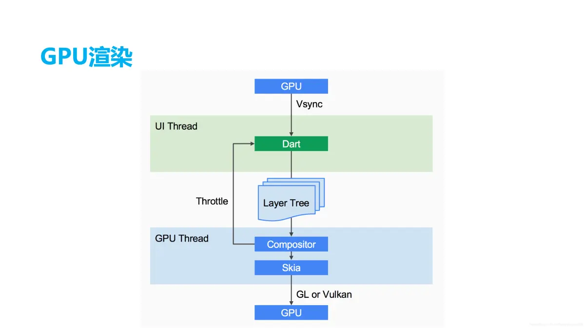
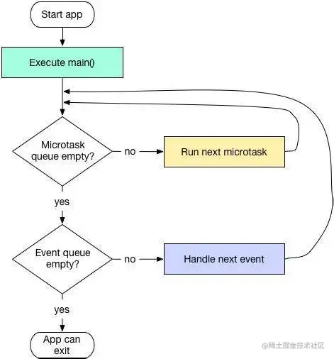

# 一些基本概念

## 关于 Widget 的一点小知识

Widget 翻译过来就是 **组件** 。在 Flutter 中，这也是个类。所有组件都继承自 Widget 类。

从有无状态上，分为这两种：

- `StatelessWidget`：无状态Widget，属性不可变
- `StatefulWidget`：有状态Widget，可通过setState()更新

这也是上一节讲过的。

如果从功能分类：

- **布局类 Widget**：用于构建界面布局
  - `Row`/`Column`：线性布局
  - `Stack`：层叠布局
  - `ListView`/`GridView`：滚动列表
  - `Flex`/`Expanded`：弹性布局
  - `Container`/`Padding`/`Center` 等容器类

- **基础 Widget**：
  - `Text`：文本显示
  - `Image`：图片显示
  - `Icon`：图标显示
  - `Button` 系列：各种按钮

- **交互类 Widget**：
  - `TextField`：文本输入
  - `Checkbox`/`Radio`/`Switch`：选择控件
  - `Slider`：滑块
  - `GestureDetector`：手势检测

当然这些在后面会一一介绍，这里就不赘叙了。

## 关于 Flutter 的写法

Flutter 的写法和 HTML这一类的写法不太一样。我们现在来对比一下。例如有这样一个场景：

> 一个容器，上面显示文本，下面是个按钮。点击按钮时，上面文本数字 +1

对于 Vue 是这么写的：

```vue
<template>
    <div>
        <div>{{ count }}</div>
        <button @click="count++">+1</button>
    </div>
</template>
<script>
    export default {
        data() {
            return { count: 0 }
        }
    }
</script>
```

对于 Flutter 是这么写的：

```dart
class MyPage extends StatefulWidget {
    @override
    _MyPageState createState() => _MyPageState();
}

class _MyPageState extends State<MyPage> {
    int count = 0;
    @override
    Widget build(BuildContext context) {
        return Scaffold(
            body: Column(
                children: [
                    Text('$count'),
                    ElevatedButton(
                        onPressed: () {
                            setState(() {
                                count++;
                            })
                        },
                        child: Text('+1'),
                    )
                ]
            )
        )
    }
}
```

两者的效果是一样的。

其实可以明显感受到 Flutter 的架构特点：不同于 Web 开发中 HTML/CSS/JS 的分离模式，Flutter 直接通过 Dart 类的继承体系（如 `StatelessWidget`/`StatefulWidget`）和 Widget 树嵌套来实现界面描述。这种声明式 UI 的构建方式与传统 GUI 框架（如 MFC、WinForms）直接操作界面元素的做法有相似之处，省去了 HTML 这类标记语言作为中间抽象层的转换过程。

## 更细致的一些概念

> [!NOTE]
> 这一部分基本上都是面试时候会问到的一些概念，但是对于现在的初学阶段来说，并不需要了解。不过后面肯定会 Callback 的。

### Widget、Element、RenderObject、State、Context

- **Widget**：轻量级配置描述，不可变，仅存储布局/样式信息。

- **Element**：Widget的实例化对象，负责管理Widget树与RenderObject树的映射，处理生命周期（如`mount`、`update`）。

- **RenderObject**：实际布局和渲染的实体，计算尺寸、位置并绘制到屏幕。

这三者的关系总的来说就是：Widget生成Element，Element创建/更新RenderObject。

- **Context**: 仅仅是已创建的所有Widget树结构中的某个Widget的位置引用。简而言之，将context作为widget树的一部分，其中context所对应的widget被添加到此树中。一个context只从属于一个widget，它和widget一样是链接在一起的，并且会形成一个context树。

- **State**: 定义了StatefulWidget实例的行为，它包含了用于”交互/干预“Widget信息的行为和布局。应用于State的任何更改都会强制重建Widget。

### Flutter 渲染流程

Flutter 只关心向 GPU 提供视图数据，GPU的 VSync 信号同步到 UI线程，UI线程使用 Dart 来构建抽象的视图结构(LayerTree)，这份数据结构在 GPU 线程进行图层合成，视图数据提供给 Skia 引擎渲染为 GPU 数据，这些数据通过 OpenGL 或者 Vulkan 提供给 GPU。



### StatefulWidget 状态更新

在 使用 setState() 更新 Widget 状态时，Flutter 会再运行一次 build() 方法，触发 Widget 的重新构建。

> 所以 StatefulWidget 更新数据时开销是比较大的，因为每次更新都会重新构建 Widget 树。

### Widget 的 唯一标识Key

在 Flutter 中，每个 Widget 都是被唯一标识的。这个唯一标识在build或rendering阶段由框架定义。该标识对应于可选的Key参数，如果省略，Flutter将会自动生成一个。

主要有4种类型的Key：GlobalKey（确保生成的Key在整个应用中唯一，是很昂贵的，允许element在树周围移动或变更父节点而不会丢失状态）、LocalKey、UniqueKey、ObjectKey。

### 与原生进行通信

Flutter 通过 `PlatformChannel` 来与原生进行通信，而`PlatformChannel` 分为这三类：

- BasicMessageChannel ：用于传递字符串和半结构化的信息。
- MethodChannel ：用于传递方法调用（method invocation）。
- EventChannel : 用于数据流（event streams）的通信。

### Dart 的单线程运行模式

在 Dart 中，所有代码会运行在一个 `isolate` 中。在 `isolate` 中，会先运行 微任务队列(Microtask Queue)，然后运行事件队列(Event Queue)



这里正好也讲一下 `isolate` ，`Stream` 、`Future` ：

- `isolate`：并发编程，可以说是开了个线程，所有的Dart代码都在isolate中运行
- `Stream`：数据流，返回多次值。例如点击事件(onClick)，用户可能会多次点击，这种就是数据流。
- `Future`：异步编程，调用本身立即返回，并在稍后的某个时候执行完成时再获得返回结果。

对于Stream，有单订阅(single) 和 多订阅（broadcast）这两种订阅模式。


