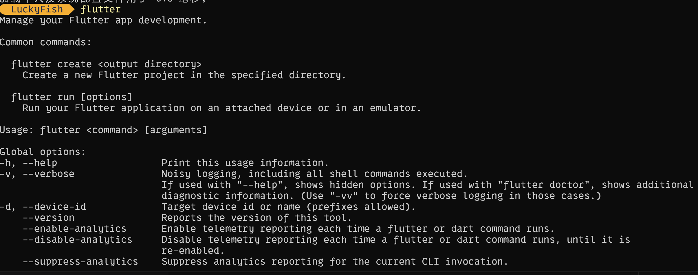
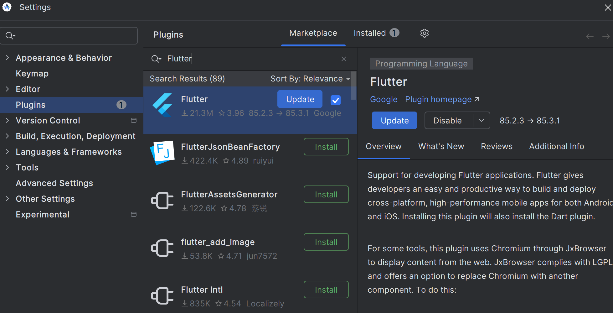
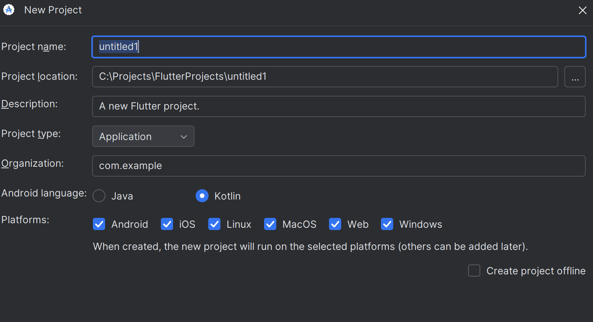
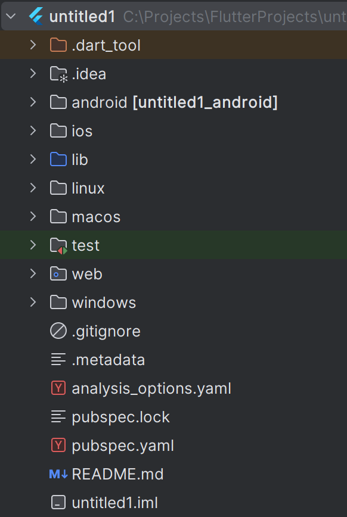
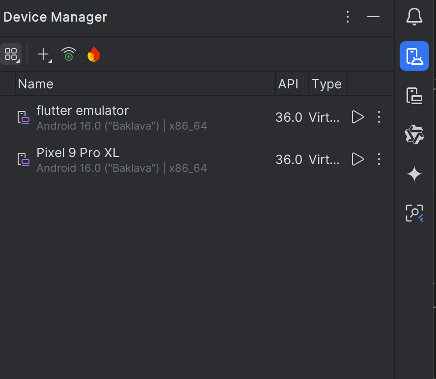
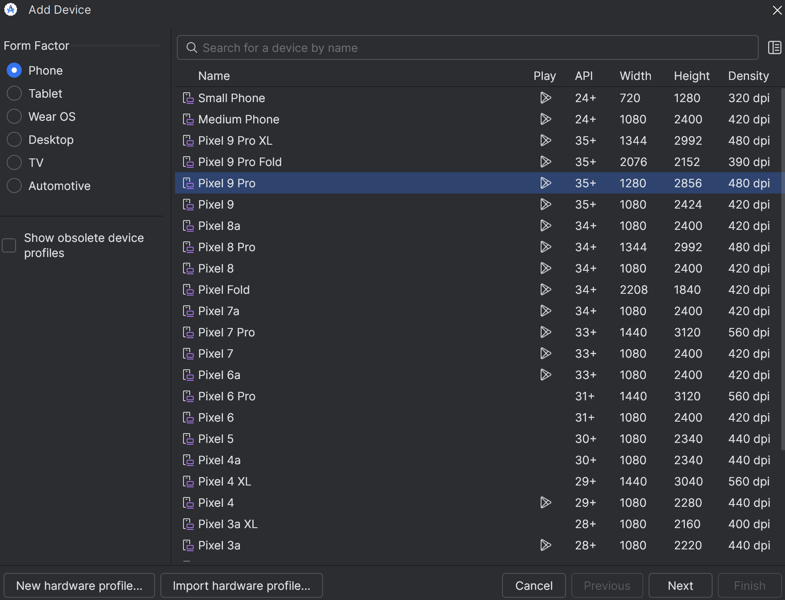
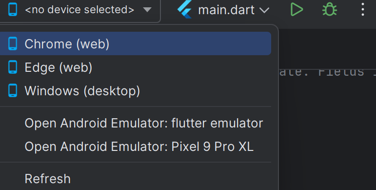
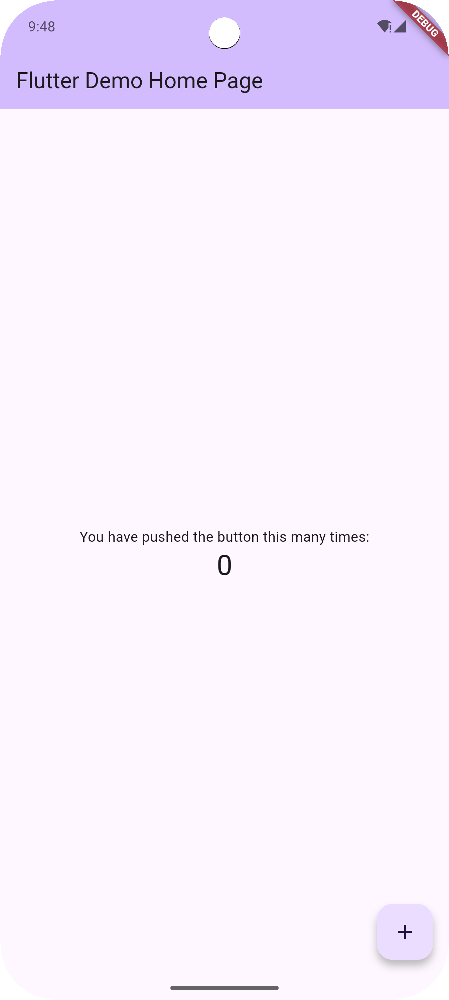

# Flutter 安装与初体验

Flutter 是 Google 官方开发的移动开发框架，用于构建跨平台移动应用。其使用Skip进行自绘，因此对于Flutter应用来说，我们只需要写一个Dart代码，就可以生成多个平台（Android、iOS、Web、Windows、MacOS）的App。

> [!NOTE]
> 什么是自绘框架？
> 
> 自绘框架是指，使用自己编写的代码来绘制UI界面，而不是使用系统提供的UI控件来绘制。相当于自己重头绘制。

对于 Flutter 来说，他的侧重点是**移动端**。当然你也可以拿Flutter来开发桌面端。

接下来的，主要根据官方文档进行了提纯。对于一些步骤进行了简化。

> 我下面只讲Windows用户，其他用户请自行去看官方文档：[安装Flutter](https://docs.flutter.dev/get-started/install)
>
> 对于Windows用户，如果没看懂步骤的话，可查看官方文档：[在Windows平台安装Flutter](https://docs.flutter.dev/get-started/install/windows/mobile)

## 安装

### 先下载这些软件

1. [Git](https://gitforwindows.org/)。可用来管理 Flutter 版本。
2. [Android Studio](https://developer.android.com/studio/install#windows)，用于调试和编译适用于 Android 的 Java 或 Kotlin 代码。当然最主要还是为了方便安装模拟器。

### 请检查

> 用户名是否使用了非英文符号。在编译 Flutter 项目时，会用到一些用户文件夹下的文件。为了能正确编译，建议使用英文用户名。

### 使用 VS Code Flutter 扩展 安装Flutter SDK

> 其实官方写了两种方案，但是这一种最简单

提示 VS Code 安装 Flutter
1. 启动 VS Code。

2. 打开命令面板，请按 Ctrl + Shift + P。或者直接按 F1.

3. 在命令面板中，输入flutter。在这里选择 `Flutter： New Project`

5. VS Code 会提示您在计算机上找到 Flutter SDK。

    如果您已安装 Flutter SDK，请单击 Locate SDK。

    如果您尚未安装 Flutter SDK，请单击 Download SDK。

    如果你还没有按照开发工具先决条件中的指示安装适用于 Windows 的 Git，此选项会向你发送 Flutter 安装页面。

6. 当提示 Which Flutter template？时，按`ESC` 。

7. 当 `Select Folder for Flutter SDK` 对话框显示时，选择要安装 Flutter 的位置。

    > 你可以选择放在用户文件夹下，或者自己找个位置。但是这两个位置都必须要满足这两个条件:
    > 1. 路径包含特殊字符或空格。
    > 2. 不能是有权限的文件夹，例如 C:\Program Files

8. 点击 Clone Flutter。下载和安装需要几分钟时间。要是等了很久，直接取消，再来一次。

9. 安装成功之后，点击 `Add SDK to PATH`。然后就OK了。

之后打开系统终端，输入 `flutter` 命令，查看有没有问题。



## 安装 Android 相关组件

在开发中，要是不想插USB线进行实机测试，可以使用模拟器进行测试。

这里我们使用 `Android Studio` 来安装模拟器。

### 如果是第一次打开 `Android Studio`

此时需要按照 `Android Studio 安装向导` 进行相应组件的安装即可。确保根据提示安装了这些：

- Android SDK 平台，API 35

- Android SDK 命令行工具

- Android SDK 构建工具

- Android SDK 平台工具

## 在 `Android Studio` 中创建项目

### 安装插件

在`Android Studio`中，点击`File`->`Settings`->`Plugins`，搜索`Flutter`，安装`Flutter`插件之后重启IDE。



### 创建项目

重启IDE之后，上面会直接写个 `New Flutter Project`，直接点击即可。

然后就会蹦出个 `Flutter SDK Path`的页面，这里看一下SDK是不是配置正确了。要是正确直接点击OK，来到下一个页面：



这里第一个是项目名称，第二个是储存的路径，第三个是简介，最后是选择跨哪些平台。改好名称和简介之后，直接下一步，就会直接创建项目了。

## 简单介绍一下项目结构

现在我们可以看到这个项目的文件结构：



这里我们只需要知道几个文件夹：

```
android - Android项目设置
ios - iOS项目设置
linux - Linux项目设置
macos - macOS项目设置
windows - Windows项目设置
web - Web项目设置
lib - 项目的核心代码，写页面这些都在这个文件夹里面
pubspec.yaml - 项目的配置文件
```

这里我们先打开 `lib/main.dart` 。这是项目的入口，现在来看看内容：

```dart
import 'package:flutter/material.dart';

void main() {
  runApp(const MyApp());
}

class MyApp extends StatelessWidget {
  const MyApp({super.key});

  @override
  Widget build(BuildContext context) {
    return MaterialApp(
      title: 'Flutter Demo',
      theme: ThemeData(
        colorScheme: ColorScheme.fromSeed(seedColor: Colors.deepPurple),
      ),
      home: const MyHomePage(title: 'Flutter Demo Home Page'),
    );
  }
}

class MyHomePage extends StatefulWidget {
  const MyHomePage({super.key, required this.title});

  final String title;

  @override
  State<MyHomePage> createState() => _MyHomePageState();
}

class _MyHomePageState extends State<MyHomePage> {
  int _counter = 0;

  void _incrementCounter() {
    setState(() {
      _counter++;
    });
  }

  @override
  Widget build(BuildContext context) {
    return Scaffold(
      appBar: AppBar(
        backgroundColor: Theme.of(context).colorScheme.inversePrimary,
        title: Text(widget.title),
      ),
      body: Center(
        child: Column(
          mainAxisAlignment: MainAxisAlignment.center,
          children: <Widget>[
            const Text('You have pushed the button this many times:'),
            Text(
              '$_counter',
              style: Theme.of(context).textTheme.headlineMedium,
            ),
          ],
        ),
      ),
      floatingActionButton: FloatingActionButton(
        onPressed: _incrementCounter,
        tooltip: 'Increment',
        child: const Icon(Icons.add),
      ), 
    );
  }
}
```

main函数是入口函数，在`Android Studio`中会直接标个 `Run` 的图标，点击即可运行。然后使用了这句话:

```dart
runApp(const MyApp());
```

使用了 `runApp` 函数。而 `MyApp` 是一个类，继承自 `StatelessWidget`。翻译过来就是 “无状态组件”。也可以说是只负责展示，不更新的组件。

每个 `StatelessWidget` 都需要实现一个 `build` 方法。这个方法规定了这个组件的布局和样式。

> 更准确来说，当要进行渲染的时候，直接调用 `build` 方法，然后把返回的 `Widget` 渲染到屏幕上。

在 `MyApp`中，使用了一个 `MaterialApp` 组件，这个组件会提供 Material Design 的样式和布局。

`MaterialApp` 组件的 `home` 属性是一个 `Widget`，这个 `Widget` 会作为应用的首页。这里设置的是 `MyHomePage` 组件。

然后就是 `MyHomePage` ，他继承自 `StatefulWidget`，翻译过来就是 `有状态的组件`，可以根据数据来重新更新界面。

在  `MyHomePage` 中，我们定义了一个 `_MyHomePageState` 类，继承自 `State`，这个类会处理 `MyHomePage` 的状态。因此我们需要实现一个 `createState()` 来返回一个 `_MyHomePageState` 对象。

在 `State` 中，我们通常会使用 `setState()` 方法来更新组件。例如上面写的：

```dart
setState(() {
    _counter++;
})
```

剩下的就后面再讲。

## 安装模拟器并运行

在 `Android Studio` 中，点击右边的 `Device Manager`：



现在应该是没有设备的，点击 `Add Device`：



直接跟着安装就行。安装好了之后在这里选择你刚才安装好的模拟器：



运行!

## 运行项目

选择好模拟器后，点击 `Run`。最后，你将得到这个：



你可以点击右下角的 `+` 按钮，就会发现数字在变。