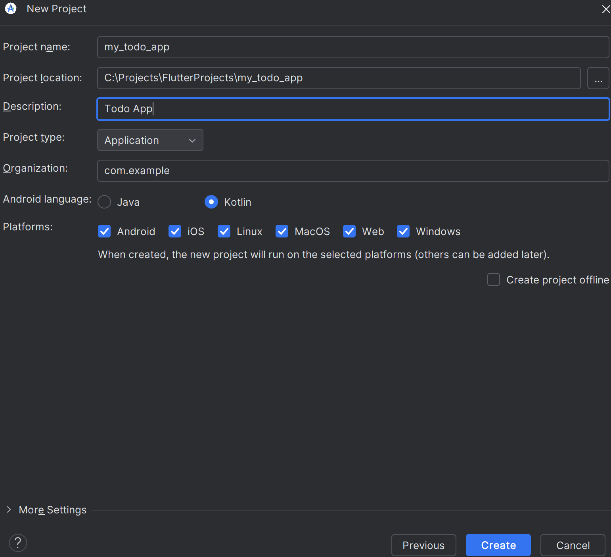
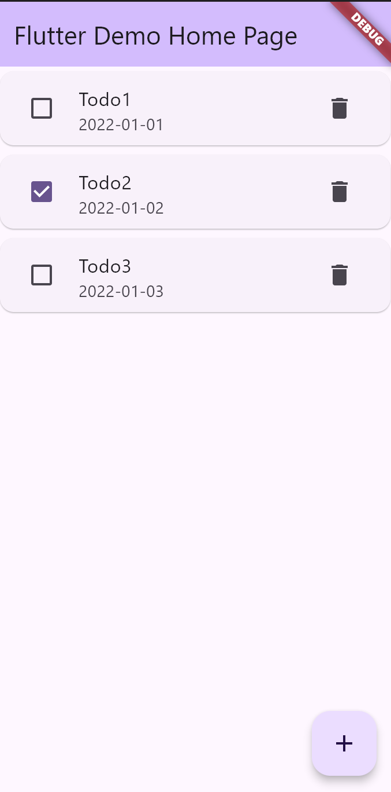

# 项目一 写一个 Todo 应用

> 又是一个经典的 Todo 应用。但我实在是不知道该怎么教。
> 
> 所以不如就一起来写点App，这样好歹还能看到效果。

## 简单讲讲这个应用的内容

1. 对 Todo 进行 添加、删除、修改
2. 主页展示 Todo 列表

## 创建项目

还是跟第一讲一样，创建个项目：



## 简单想一想，应该怎么写

现在的想法就是，写一个页面，使用列表来展示 todo，每个元素里 显示 todo 的内容，以及一个按钮进行删除 。最后通过一个按钮进行添加。

### 先规定 Todo 数据是什么样子的

对于 Todo 来说，它应该包含：

1. 内容
2. 是否完成
3. 结束时间

那么，一个 Todo类应该是这样的：

 ```dart
class TodoModel {
  String content;
  bool isDone;
  String endTime;

  TodoModel({
    required this.content,
    required this.isDone,
    required this.endTime,
  });

  factory TodoModel.fromJson(Map<String, dynamic> json) {
    return TodoModel(
      content: json['content'],
      isDone: json['isDone'],
      endTime: json['endTime'],
    );
  }

  Map<String, dynamic> toJson() {
    final Map<String, dynamic> data = <String, dynamic>{};
    data['content'] = content;
    data['isDone'] = isDone;
    data['endTime'] = endTime;

    return data;
  }
}
```

然后我们先来写 Todo 列表，我们在 Scaffold 类 的 body 参数上写上我们的列表，代表页面的主体：

 ```dart
 ListView.builder(
    itemCount: todoList.length,
    itemBuilder: (context, index) {
        final todo = todoList[index];
          return Card(
            child: ListTile(
                leading: Checkbox(
                value: todo.isDone,
                onChanged: (value) {
                        setState(() {
                            todo.isDone = value!;
                        });
                    },
                ),
                title: Text(todo.content),
                subtitle: Text(todo.endTime),
                trailing: IconButton(
                    icon: Icon(Icons.delete),
                    onPressed: () {
                        setState(() {
                        todoList.removeAt(index);
                    });
                },
              ),
            ),
        );
    },
),
```

这里我们使用了 `ListView.builder` 方法，直接构建了列表。这个方法关键的参数是 `itemBuilder` 和 `itemCount`。`itemBuilder` 是一个回调函数，用于构建列表项。`itemCount` 是列表项的数量。

在 `itemBuilder` 中，我们使用了 `ListTile` 来构建列表项。`ListTile` 是 Flutter 中的一个组件，用于构建列表项。

这时我们可以接入一个给定好的数据：

```dart
List<TodoModel> todoList = [
    TodoModel(content: 'Todo1', isDone: false, endTime: '2022-01-01'),
    TodoModel(content: 'Todo2', isDone: true, endTime: '2022-01-02'),
    TodoModel(content: 'Todo3', isDone: false, endTime: '2022-01-03'),
];
```

现在我们可以运行一下：



## 加上添加按钮

对于 Scaffold 类，有一个参数是 floatingActionButton 。翻译过来就是 浮动动作按钮。如果用过谷歌的产品或者见过 谷歌的 Material Design 样式，应该知道，浮动动作按钮一般都是放在屏幕右下角。

所以我们可以利用这个来添加一个添加按钮。

```dart
floatingActionButton: FloatingActionButton(
    onPressed: () {
          
    },
    tooltip: '添加Todo',
    child: const Icon(Icons.add),
),
```

现在，右下角就有一个添加按钮了（虽然事实上，最开始生成出来的代码里就有这个按钮）。

## 给添加按钮添加功能

我们现在需要在点击添加按钮时，打开一个弹窗。在那个弹窗里填写相关的数据。当点击确认按钮时，加入到列表中。

弹窗的实现，我们使用`showDialog`方法。

```dart
showDialog(
            context: context,
            builder: (context) {
              final titleController = TextEditingController();
              final deadlineController = TextEditingController();

              titleController.text = '';
              deadlineController.text = '';

              return AlertDialog(
                title: Text('添加Todo'),
                content: Column(
                  mainAxisSize: MainAxisSize.min,
                  children: [
                    TextFormField(
                      controller: titleController,
                      decoration: const InputDecoration(
                        labelText: '标题',
                        labelStyle: TextStyle(fontWeight: FontWeight.bold),
                      ),
                      validator: (value) {
                        if (value == null || value.isEmpty) {
                          return '标题是必须项';
                        }
                        return null;
                      },
                    ),
                    const SizedBox(height: 16),
                    TextFormField(
                      controller: deadlineController,
                      decoration: InputDecoration(
                        labelText: '截止日期',
                        labelStyle: const TextStyle(
                          fontWeight: FontWeight.bold,
                        ),
                        suffixIcon: IconButton(
                          icon: const Icon(Icons.calendar_today),
                          onPressed: () async {
                            final picked = await showDatePicker(
                              context: context,
                              initialDate: DateTime.now(),
                              firstDate: DateTime.now(),
                              lastDate: DateTime(2100),
                            );
                            if (picked != null) {
                              deadlineController.text = DateFormat(
                                'yyyy-M-d',
                              ).format(picked);
                            }
                          },
                        ),
                      ),
                      validator: (value) {
                        if (value == null || value.isEmpty) {
                          return '截至日期是必须项';
                        }
                        return null;
                      },
                    ),
                  ],
                ),
                actions: [
                  TextButton(
                    onPressed: () {
                      Navigator.of(context).pop();
                    },
                    child: Text('取消'),
                  ),
                  TextButton(
                    onPressed: () {
                      setState(() {
                        todoList.add(
                          TodoModel(
                            content: titleController.text,
                            isDone: false,
                            endTime: deadlineController.text,
                          ),
                        );
                      });
                      Navigator.of(context).pop();
                    },
                    child: Text('添加'),
                  ),
                ],
              );
            },
          );

```

这段代码很长，我们来分析一下：

1. `showDialog` 方法接收两个参数：`context` 和 `builder`。`context` 是当前页面的 context，`builder` 是一个回调函数，返回一个 Widget。
  ```dart
   showDialog(
     context: context,
     builder: (context) {}
  )
  ```

2. 在 `builder` 回调函数中，我们创建了一个 AlertDialog，它有标题、内容、和两个按钮。

  ```dart
  return AlertDialog(
     title: Text('添加Todo'),
     content: Column(),
      actions: [
        TextButton(
          onPressed: () {},
          child: Text('取消'),
        ),
        TextButton(
           onPressed: () {},
          child: Text('添加'),
        ),
      ]
  )
  ```

3. 内容是一个 Column，里面有两个 TextFormField，分别用于输入标题和截止日期。同时使用控制器来获取输入的值。
  ```dart
    final titleController = TextEditingController();
    final deadlineController = TextEditingController();

    titleController.text = '';
    deadlineController.text = '';

    Column(
      children: [
        TextFormField(
                      controller: titleController,
                      decoration: const InputDecoration(
                        labelText: '标题',
                        labelStyle: TextStyle(fontWeight: FontWeight.bold),
                      ),
                      validator: (value) {
                        if (value == null || value.isEmpty) {
                          return '标题是必须项';
                        }
                        return null;
                      },
                    ),
                    const SizedBox(height: 16),
                    TextFormField(
                      controller: deadlineController,
                      decoration: InputDecoration(
                        labelText: '截止日期',
                        labelStyle: const TextStyle(
                          fontWeight: FontWeight.bold,
                        ),
                        suffixIcon: IconButton(
                          icon: const Icon(Icons.calendar_today),
                          onPressed: () async {
                            final picked = await showDatePicker(
                              context: context,
                              initialDate: DateTime.now(),
                              firstDate: DateTime.now(),
                              lastDate: DateTime(2100),
                            );
                            if (picked != null) {
                              deadlineController.text = DateFormat(
                                'yyyy-M-d',
                              ).format(picked);
                            }
                          },
                        ),
                      ),
                      validator: (value) {
                        if (value == null || value.isEmpty) {
                          return '截至日期是必须项';
                        }
                        return null;
                      },
                    ),
      ]
    );
  ```

  这里使用了 `showDatePicker` 方法。调用这个方法时，会出现一个日期选择器。用户直接选择即可。

4. 两个按钮，一个是取消按钮，一个是确认按钮。

5. 当点击确认按钮时，我们调用`setState`方法，将新的 TodoModel 添加到 todoList 中。

   ```dart
    TextButton(
        onPressed: () {
          Navigator.of(context).pop();
        },
        child: Text('取消'),
    ),
    TextButton(
        onPressed: () {
          setState(() {
            todoList.add(
              TodoModel(
                content: titleController.text,
                isDone: false,
                endTime: deadlineController.text,
              ),
            );
          });
          Navigator.of(context).pop();
        },
        child: Text('添加'),
    ),
    ```

6. 然后，我们调用`Navigator.of(context).pop()`方法，关闭弹窗。


现在我们的 Todo 应用已经可以添加新的 Todo 了。

## 最后

下一节，教怎么对 Todo 数据 进行储存。
