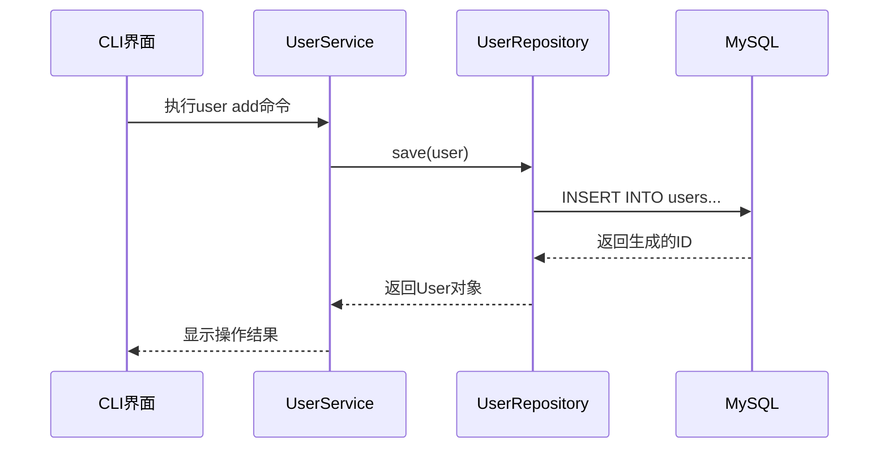

# 综合项目: 基于命令行的用户管理系统（操作手册）

## 第一阶段：基础功能实现（内存存储）​​

### ​**​项目结构​**​

```
user-management/
├── src/
│   └── main/
│       └── java/io/codescience
│           ├── model/
│           │   └── User.java
│           ├── service/
│           │   └── UserService.java
│           └── ui/
│               └── CliUI.java
└── pom.xml
```

### ​**​核心代码​**​

01. **领域模型层​**​

```java
// User.java
package io.codescience.model;


public class User {
    private int id;
    private String name;
    private String gender;
    private int age;
    private String email;
    private String phone;

    public User(String name, String gender, int age, String email, String phone) {
        validateInput(name, "姓名");
        validateInput(gender, "性别");
        validateAge(age);
        this.name = name;
        this.gender = gender;
        this.age = age;
        this.email = email;
        this.phone = phone;
    }

    private void validateInput(String value, String field) {
        if (value == null || value.trim().isEmpty()) {
            throw new IllegalArgumentException(field + "不能为空");
        }
    }

    private void validateAge(int age) {
        if (age < 0) {
            throw new IllegalArgumentException("年龄不能为负数");
        }
    }
    // Getter/Setter methods...
}
```

**02. 业务逻辑层​**​

```java
// UserService.java
package io.codescience.service;

import io.codescience.model.User;
import java.util.ArrayList;
import java.util.HashMap;
import java.util.List;
import java.util.Map;

public class UserService {
    private Map<Integer, User> users = new HashMap<>();
    private int idCounter = 1;

    public User addUser(User user) {
        user.setId(idCounter++);
        users.put(user.getId(), user);
        return user;
    }

    public User deleteUser(int id) {
        return users.remove(id);
    }

    public User updateUser(int id, User newData) {
        User existing = users.get(id);
        if (existing != null) {
            existing.setName(newData.getName());
            existing.setGender(newData.getGender());
            existing.setAge(newData.getAge());
            existing.setEmail(newData.getEmail());
            existing.setPhone(newData.getPhone());
        }
        return existing;
    }

    public User getUser(int id) {
        return users.get(id);
    }

    public List<User> listUsers() {
        return new ArrayList<>(users.values());
    }
}
```

**03. 命令行界面（CLI）​**​

```java
// CliUI.java
import io.codescience.model.User;
import io.codescience.service.UserService;

import java.util.HashMap;
import java.util.Map;
import java.util.Scanner;

public class CliUI {
    private final UserService service = new UserService();

    public CliUI() {
        initSampleData();
    }

    private void initSampleData() {
        // 添加示例用户数据
        User user1 = new User("张三", "男", 25, "zhangsan@example.com", "13800138001");
        User user2 = new User("李四", "女", 28, "lisi@example.com", "13800138002");
        User user3 = new User("王五", "男", 30, "wangwu@example.com", "13800138003");

        service.addUser(user1);
        service.addUser(user2);
        service.addUser(user3);

        System.out.println("示例数据初始化完成");
    }

    public void start() {
        System.out.println("用户管理系统启动（输入help查看命令帮助）");
        Scanner scanner = new Scanner(System.in);

        while (true) {
            System.out.print("\n> ");
            String input = scanner.nextLine().trim();
            if (input.isEmpty())
                continue;

            String[] args = input.split(" ");
            try {
                switch (args[0]) {
                    case "user":
                        handleUserCommand(args);
                        break;
                    case "exit":
                        System.out.println("系统退出");
                        return;
                    case "help":
                        printHelp();
                        break;
                    default:
                        System.out.println("未知命令");
                }
            } catch (Exception e) {
                System.out.println("错误: " + e.getMessage());
            }
        }
    }

    private void handleUserCommand(String[] args) {
        if (args.length < 2) {
            throw new IllegalArgumentException("命令不完整");
        }

        switch (args[1]) {
            case "add":
                addUserFlow(args);
                break;
            case "delete":
                deleteUserFlow(args);
                break;
            case "list":
                listUsersFlow(args);
                break;
            case "update":
                updateUserFlow(args);
                break;
            default:
                throw new IllegalArgumentException("未知命令: " + args[1]);
        }
    }

    private void addUserFlow(String[] args) {
        Map<String, String> params = parseParams(args);
        User user = new User(
                params.get("name"),
                params.get("gender"),
                Integer.parseInt(params.get("age")),
                params.get("email"),
                params.get("phone"));
        service.addUser(user);
        System.out.println("用户添加成功，ID: " + user.getId());
    }

    private Map<String, String> parseParams(String[] args) {
        Map<String, String> params = new HashMap<>();
        for (int i = 2; i < args.length; i++) {
            if (args[i].startsWith("--")) {
                String key = args[i].substring(2);
                params.put(key, args[++i]);
            }
        }
        return params;
    }

    private void printHelp() {
        System.out.println("可用命令：");
        System.out.println("user list");
        System.out.println("user add --name <姓名> --gender <性别> --age <年龄> --email <邮箱> --phone <电话>");
        System.out.println("user delete --id <用户ID>");
        System.out.println("user update --id <用户ID> [--name <姓名>] [--gender <性别>] [--age <年龄>] [--email <邮箱>] [--phone <电话>]");
        System.out.println("exit");
    }

    private void deleteUserFlow(String[] args) {
        Map<String, String> params = parseParams(args);
        String userId = params.get("id");
        if (userId == null) {
            throw new IllegalArgumentException("缺少用户ID参数");
        }
        try {
            int id = Integer.parseInt(userId);
            service.deleteUser(id);
            System.out.println("用户删除成功");
        } catch (NumberFormatException e) {
            throw new IllegalArgumentException("用户ID必须是数字");
        }
    }

    private void listUsersFlow(String[] args) {
        var users = service.listUsers();
        if (users.isEmpty()) {
            System.out.println("当前没有用户");
            return;
        }
        System.out.println("用户列表：");
        for (User user : users) {
            System.out.printf("ID: %d, 姓名: %s, 性别: %s, 年龄: %d, 邮箱: %s, 电话: %s%n",
                    user.getId(),
                    user.getName(),
                    user.getGender(),
                    user.getAge(),
                    user.getEmail(),
                    user.getPhone());
        }
    }

    private void updateUserFlow(String[] args) {
        Map<String, String> params = parseParams(args);
        String userId = params.get("id");
        if (userId == null) {
            throw new IllegalArgumentException("缺少用户ID参数");
        }

        try {
            int id = Integer.parseInt(userId);
            User user = service.getUser(id);
            if (user == null) {
                throw new IllegalArgumentException("用户不存在");
            }

            // 更新用户信息
            if (params.containsKey("name"))
                user.setName(params.get("name"));
            if (params.containsKey("gender"))
                user.setGender(params.get("gender"));
            if (params.containsKey("age"))
                user.setAge(Integer.parseInt(params.get("age")));
            if (params.containsKey("email"))
                user.setEmail(params.get("email"));
            if (params.containsKey("phone"))
                user.setPhone(params.get("phone"));

            service.updateUser(id, user);
            System.out.println("用户信息更新成功");
        } catch (NumberFormatException e) {
            throw new IllegalArgumentException("用户ID必须是数字");
        }
    }
}
```

**​04. 程序入口**

```java
package io.codescience;

import io.codescience.ui.CliUI;

public class Application {
    public static void main(String[] args) {
        CliUI cli = new CliUI();
        cli.start();
    }
}
```

### **运行示例​**​

```bash
> user add --name "张三" --gender Male --age 30 --email z@example.com --phone 13800138000
用户添加成功，ID: 1

> user list
1 | 张三 | Male | 30 | z@example.com | 13800138000
```

## ​**​第二阶段：数据库存储（Repository模式）​​**

### ​**​新增结构​**​

```
├── repository/
│   │── UserRepository.java
│   └── UserRepositoryImpl.java
└── config/
    └── DatabaseConfig.java
```

### ​**​核心代码​**​

**01. 数据库配置​**​

```java
package io.codescience.config;

public class DatabaseConfig {
    public static final String URL = "jdbc:mysql://localhost:3306/user_management?useSSL=false&serverTimezone=UTC";
    public static final String USER = "root";
    public static final String PASSWORD = "Craftsman@2025";

    static {
        try {
            Class.forName("com.mysql.cj.jdbc.Driver");
        } catch (ClassNotFoundException e) {
            throw new RuntimeException("MySQL JDBC Driver not found", e);
        }
    }
}

```

**02. 数据访问层​**​

添加POM引用

```xml
<dependencies>
    <!-- MySQL JDBC Driver -->
    <dependency>
        <groupId>mysql</groupId>
        <artifactId>mysql-connector-java</artifactId>
        <version>8.0.33</version>
    </dependency>
</dependencies>
```

UserRepository.java

```java
// UserRepository.java
package io.codescience.repository;

import io.codescience.model.User;
import java.util.List;
import java.util.Optional;

public interface UserRepository {
    User save(User user);

    Optional<User> findById(int id);

    List<User> findAll();

    void deleteById(int id);

    void update(User user);
}
```

UserRepositoryImpl

```java
package io.codescience.repository;

import io.codescience.config.DatabaseConfig;
import io.codescience.model.User;
import java.sql.*;
import java.util.ArrayList;
import java.util.List;
import java.util.Optional;

public class UserRepositoryImpl implements UserRepository {

    @Override
    public User save(User user) {
        String sql = "INSERT INTO users(name, gender, age, email, phone) VALUES (?,?,?,?,?)";

        try (Connection conn = DriverManager.getConnection(
                DatabaseConfig.URL,
                DatabaseConfig.USER,
                DatabaseConfig.PASSWORD);
                PreparedStatement stmt = conn.prepareStatement(sql, Statement.RETURN_GENERATED_KEYS)) {

            stmt.setString(1, user.getName());
            stmt.setString(2, user.getGender());
            stmt.setInt(3, user.getAge());
            stmt.setString(4, user.getEmail());
            stmt.setString(5, user.getPhone());

            stmt.executeUpdate();

            try (ResultSet rs = stmt.getGeneratedKeys()) {
                if (rs.next()) {
                    user.setId(rs.getInt(1));
                }
            }
            return user;
        } catch (SQLException e) {
            throw new RuntimeException("保存用户失败", e);
        }
    }

    @Override
    public Optional<User> findById(int id) {
        String sql = "SELECT * FROM users WHERE id = ?";

        try (Connection conn = DriverManager.getConnection(
                DatabaseConfig.URL,
                DatabaseConfig.USER,
                DatabaseConfig.PASSWORD);
                PreparedStatement stmt = conn.prepareStatement(sql)) {

            stmt.setInt(1, id);

            try (ResultSet rs = stmt.executeQuery()) {
                if (rs.next()) {
                    return Optional.of(mapResultSetToUser(rs));
                }
            }
            return Optional.empty();
        } catch (SQLException e) {
            throw new RuntimeException("查询用户失败", e);
        }
    }

    @Override
    public List<User> findAll() {
        String sql = "SELECT * FROM users";
        List<User> users = new ArrayList<>();

        try (Connection conn = DriverManager.getConnection(
                DatabaseConfig.URL,
                DatabaseConfig.USER,
                DatabaseConfig.PASSWORD);
                PreparedStatement stmt = conn.prepareStatement(sql);
                ResultSet rs = stmt.executeQuery()) {

            while (rs.next()) {
                users.add(mapResultSetToUser(rs));
            }
            return users;
        } catch (SQLException e) {
            throw new RuntimeException("查询用户列表失败", e);
        }
    }

    @Override
    public void deleteById(int id) {
        String sql = "DELETE FROM users WHERE id = ?";

        try (Connection conn = DriverManager.getConnection(
                DatabaseConfig.URL,
                DatabaseConfig.USER,
                DatabaseConfig.PASSWORD);
                PreparedStatement stmt = conn.prepareStatement(sql)) {

            stmt.setInt(1, id);
            stmt.executeUpdate();
        } catch (SQLException e) {
            throw new RuntimeException("删除用户失败", e);
        }
    }

    @Override
    public void update(User user) {
        String sql = "UPDATE users SET name = ?, gender = ?, age = ?, email = ?, phone = ? WHERE id = ?";

        try (Connection conn = DriverManager.getConnection(
                DatabaseConfig.URL,
                DatabaseConfig.USER,
                DatabaseConfig.PASSWORD);
                PreparedStatement stmt = conn.prepareStatement(sql)) {

            stmt.setString(1, user.getName());
            stmt.setString(2, user.getGender());
            stmt.setInt(3, user.getAge());
            stmt.setString(4, user.getEmail());
            stmt.setString(5, user.getPhone());
            stmt.setInt(6, user.getId());

            int affectedRows = stmt.executeUpdate();
            if (affectedRows == 0) {
                throw new IllegalArgumentException("用户不存在");
            }
        } catch (SQLException e) {
            throw new RuntimeException("更新用户失败", e);
        }
    }

    private User mapResultSetToUser(ResultSet rs) throws SQLException {
        User user = new User();
        user.setId(rs.getInt("id"));
        user.setName(rs.getString("name"));
        user.setGender(rs.getString("gender"));
        user.setAge(rs.getInt("age"));
        user.setEmail(rs.getString("email"));
        user.setPhone(rs.getString("phone"));
        return user;
    }
}
```

**服务层改造​**​

```java
// UserService.java
package io.codescience.service;

import io.codescience.model.User;
import io.codescience.repository.UserRepository;
import io.codescience.repository.UserRepositoryImpl;

import java.util.List;

public class UserService {
    private final UserRepository repository;

    public UserService() {
        this.repository = new UserRepositoryImpl();
    }

    public User addUser(User user) {
        return repository.save(user);
    }

    public User getUser(int id) {
        return repository.findById(id)
                .orElseThrow(() -> new IllegalArgumentException("用户不存在"));
    }

    public List<User> listUsers() {
        return repository.findAll();
    }

    public void deleteUser(int id) {
        if (!repository.findById(id).isPresent()) {
            throw new IllegalArgumentException("用户不存在");
        }
        repository.deleteById(id);
    }

    public void updateUser(int id, User user) {
        if (!repository.findById(id).isPresent()) {
            throw new IllegalArgumentException("用户不存在");
        }
        user.setId(id);
        repository.update(user);
    }
}
```

### ​**​数据库初始化脚本​**​

[#04. Docker 数据管理（Volumes）](note://WEB36d6822b9694b5cafb8a14c250f63765)（可选）

```sql
CREATE DATABASE IF NOT EXISTS user_management;
USE user_management;

CREATE TABLE users (
    id INT AUTO_INCREMENT PRIMARY KEY,
    name VARCHAR(100) NOT NULL,
    gender ENUM('Male','Female','Other') NOT NULL,
    age INT,
    email VARCHAR(100) UNIQUE,
    phone VARCHAR(15)
);
```

## 第三阶段：**换底层数据库访问逻辑**

### **一、MyBatis Repository的实现**

#### 1. 添加依赖

首先在 pom.xml 中添加必要的依赖：

```xml
<dependencies>
    <!-- MySQL JDBC Driver -->
    <dependency>
        <groupId>mysql</groupId>
        <artifactId>mysql-connector-java</artifactId>
        <version>8.0.33</version>
    </dependency>
    
    <!-- MyBatis -->
    <dependency>
        <groupId>org.mybatis</groupId>
        <artifactId>mybatis</artifactId>
        <version>3.5.13</version>
    </dependency>
</dependencies>

```

#### 2. 创建数据库配置

创建 DatabaseConfig.java：

```java
package io.codescience.config;

public class DatabaseConfig {
    public static final String URL = "jdbc:mysql://localhost:3306/user_management?useSSL=false&serverTimezone=UTC";
    public static final String USER = "root";
    public static final String PASSWORD = "your_password";
    
    static {
        try {
            Class.forName("com.mysql.cj.jdbc.Driver");
        } catch (ClassNotFoundException e) {
            throw new RuntimeException("MySQL JDBC Driver not found", e);
        }
    }
}

```

#### 3. 创建 MyBatis 配置文件

创建 src/main/resources/mybatis-config.xml：

```xml
<?xml version="1.0" encoding="UTF-8" ?>
<!DOCTYPE configuration
        PUBLIC "-//mybatis.org//DTD Config 3.0//EN"
        "http://mybatis.org/dtd/mybatis-3-config.dtd">
<configuration>
    <environments default="development">
        <environment id="development">
            <transactionManager type="JDBC"/>
            <dataSource type="POOLED">
                <property name="driver" value="com.mysql.cj.jdbc.Driver"/>
                <property name="url" value="jdbc:mysql://localhost:3306/user_management?useSSL=false&amp;serverTimezone=UTC"/>
                <property name="username" value="root"/>
                <property name="password" value="your_password"/>
            </dataSource>
        </environment>
    </environments>
    <mappers>
        <mapper resource="mapper/UserMapper.xml"/>
    </mappers>
</configuration>

```

#### 4. 创建 Mapper 接口

创建 UserMapper.java：

```java
package io.codescience.repository;

import io.codescience.model.User;
import java.util.List;
import java.util.Optional;

public interface UserMapper {
    void insert(User user);
    Optional<User> findById(int id);
    List<User> findAll();
    void deleteById(int id);
    void update(User user);
}

```

#### 5. 创建 Mapper XML

创建 src/main/resources/mapper/UserMapper.xml：

```xml
<?xml version="1.0" encoding="UTF-8" ?>
<!DOCTYPE mapper
        PUBLIC "-//mybatis.org//DTD Mapper 3.0//EN"
        "http://mybatis.org/dtd/mybatis-3-mapper.dtd">
<mapper namespace="io.codescience.repository.UserMapper">
    <resultMap id="userMap" type="io.codescience.model.User">
        <id property="id" column="id"/>
        <result property="name" column="name"/>
        <result property="gender" column="gender"/>
        <result property="age" column="age"/>
        <result property="email" column="email"/>
        <result property="phone" column="phone"/>
    </resultMap>

    <insert id="insert" parameterType="io.codescience.model.User" useGeneratedKeys="true" keyProperty="id">
        INSERT INTO users (name, gender, age, email, phone)
        VALUES (#{name}, #{gender}, #{age}, #{email}, #{phone})
    </insert>

    <select id="findById" resultMap="userMap">
        SELECT * FROM users WHERE id = #{id}
    </select>

    <select id="findAll" resultMap="userMap">
        SELECT * FROM users
    </select>

    <delete id="deleteById">
        DELETE FROM users WHERE id = #{id}
    </delete>

    <update id="update" parameterType="io.codescience.model.User">
        UPDATE users
        SET name = #{name},
            gender = #{gender},
            age = #{age},
            email = #{email},
            phone = #{phone}
        WHERE id = #{id}
    </update>
</mapper>

```

#### 6. 实现 Repository

创建 MyBatisUserRepository.java：

```java
package io.codescience.repository;

import io.codescience.model.User;
import org.apache.ibatis.io.Resources;
import org.apache.ibatis.session.SqlSession;
import org.apache.ibatis.session.SqlSessionFactory;
import org.apache.ibatis.session.SqlSessionFactoryBuilder;

import java.io.IOException;
import java.io.InputStream;
import java.util.List;
import java.util.Optional;

public class MyBatisUserRepository implements UserRepository {
    private final SqlSessionFactory sqlSessionFactory;

    public MyBatisUserRepository() {
        try {
            String resource = "mybatis-config.xml";
            InputStream inputStream = Resources.getResourceAsStream(resource);
            sqlSessionFactory = new SqlSessionFactoryBuilder().build(inputStream);
        } catch (IOException e) {
            throw new RuntimeException("初始化 MyBatis 失败", e);
        }
    }

    @Override
    public User save(User user) {
        try (SqlSession session = sqlSessionFactory.openSession()) {
            UserMapper mapper = session.getMapper(UserMapper.class);
            mapper.insert(user);
            session.commit();
            return mapper.findById(user.getId())
                    .orElseThrow(() -> new RuntimeException("保存用户后无法获取用户信息"));
        }
    }

    @Override
    public Optional<User> findById(int id) {
        try (SqlSession session = sqlSessionFactory.openSession()) {
            UserMapper mapper = session.getMapper(UserMapper.class);
            return mapper.findById(id);
        }
    }

    @Override
    public List<User> findAll() {
        try (SqlSession session = sqlSessionFactory.openSession()) {
            UserMapper mapper = session.getMapper(UserMapper.class);
            return mapper.findAll();
        }
    }

    @Override
    public void deleteById(int id) {
        try (SqlSession session = sqlSessionFactory.openSession()) {
            UserMapper mapper = session.getMapper(UserMapper.class);
            mapper.deleteById(id);
            session.commit();
        }
    }

    @Override
    public void update(User user) {
        try (SqlSession session = sqlSessionFactory.openSession()) {
            UserMapper mapper = session.getMapper(UserMapper.class);
            mapper.update(user);
            session.commit();
        }
    }
}

```

#### 7. 修改 Service 层

修改 UserService.java：

```java
public class UserService {
    private final UserRepository repository;

    public UserService() {
        this.repository = new MyBatisUserRepository();
    }
    // ... 其他方法保持不变
}

```

#### 重要说明：

1. **配置说明**：

	- 确保数据库连接信息正确（URL、用户名、密码）

	- 数据库和表需要提前创建

	- MyBatis 配置文件必须放在 resources 目录下

1. **事务管理**：

	- 每个方法都使用独立的 SqlSession

	- 写操作（insert、update、delete）后需要调用 commit()

	- 使用 try-with-resources 自动关闭 SqlSession

1. **错误处理**：

	- 所有数据库操作都包含在 try-catch 块中

	- 适当的错误信息转换

	- 事务回滚处理

1. **性能考虑**：

	- SqlSessionFactory 是单例的

	- 使用连接池（POOLED）

	- 及时关闭资源

1. **使用建议**：

	- 在开发环境中使用

	- 生产环境建议使用连接池（如 HikariCP）

	- 考虑添加日志记录

	- 可以添加缓存机制

#### 测试步骤：

1. 确保 MySQL 服务运行

1. 创建数据库和表

1. 运行程序

1. 测试基本操作：

```
user add --name Jessica --gender Female --age 27 --email 1111 --phone 1111111
user list
user update --id 1 --name Jessica2
user delete --id 1

```

这个实现提供了：

- 清晰的代码结构

- 良好的错误处理

- 事务管理

- 资源管理

- 可扩展性

### **二、**Hibernate** Repository的实现**

#### 1. 环境准备

1.1 添加依赖

在 pom.xml 中添加以下依赖：

```xml
<dependencies>
    <!-- Hibernate Core -->
    <dependency>
        <groupId>org.hibernate.orm</groupId>
        <artifactId>hibernate-core</artifactId>
        <version>6.4.1.Final</version>
    </dependency>
    
    <!-- MySQL Connector -->
    <dependency>
        <groupId>com.mysql</groupId>
        <artifactId>mysql-connector-j</artifactId>
        <version>8.3.0</version>
    </dependency>
</dependencies>

```

1.2 创建配置文件

在 src/main/resources 目录下创建 hibernate.cfg.xml：

```xml
<?xml version="1.0" encoding="UTF-8"?>
<!DOCTYPE hibernate-configuration PUBLIC
        "-//Hibernate/Hibernate Configuration DTD 3.0//EN"
        "http://hibernate.sourceforge.net/hibernate-configuration-3.0.dtd">
<hibernate-configuration>
    <session-factory>
        <!-- 数据库连接配置 -->
        <property name="hibernate.connection.driver_class">com.mysql.cj.jdbc.Driver</property>
        <property name="hibernate.connection.url">jdbc:mysql://localhost:3306/user_management?useSSL=false&amp;serverTimezone=UTC</property>
        <property name="hibernate.connection.username">root</property>
        <property name="hibernate.connection.password">root</property>
        
        <!-- Hibernate 配置 -->
        <property name="hibernate.dialect">org.hibernate.dialect.MySQLDialect</property>
        <property name="hibernate.show_sql">true</property>
        <property name="hibernate.format_sql">true</property>
        <property name="hibernate.hbm2ddl.auto">update</property>
        
        <!-- 实体类映射 -->
        <mapping class="io.codescience.model.User"/>
    </session-factory>
</hibernate-configuration>

```

#### 2. 实现步骤

2.1 创建实现类

创建 HibernateUserRepositoryImpl 类，实现 UserRepository 接口：

```java
package io.codescience.repository;

import io.codescience.model.User;
import org.hibernate.Session;
import org.hibernate.SessionFactory;
import org.hibernate.Transaction;
import org.hibernate.cfg.Configuration;
import org.hibernate.query.Query;

import java.util.List;
import java.util.Optional;

public class HibernateUserRepositoryImpl implements UserRepository {
    private final SessionFactory sessionFactory;

    public HibernateUserRepositoryImpl() {
        try {
            Configuration configuration = new Configuration();
            configuration.configure("hibernate.cfg.xml");
            sessionFactory = configuration.buildSessionFactory();
        } catch (Exception e) {
            throw new RuntimeException("初始化 Hibernate 失败", e);
        }
    }
}

```

2.2 实现 save 方法

```java
@Override
public User save(User user) {
    try (Session session = sessionFactory.openSession()) {
        Transaction transaction = session.beginTransaction();
        try {
            session.persist(user);
            transaction.commit();
            return user;
        } catch (Exception e) {
            transaction.rollback();
            throw e;
        }
    }
}

```

2.3 实现 findById 方法

```java
@Override
public Optional<User> findById(int id) {
    try (Session session = sessionFactory.openSession()) {
        User user = session.get(User.class, id);
        return Optional.ofNullable(user);
    }
}

```

2.4 实现 findAll 方法

```java
@Override
public List<User> findAll() {
    try (Session session = sessionFactory.openSession()) {
        Query<User> query = session.createQuery("FROM User", User.class);
        return query.list();
    }
}

```

2.5 实现 deleteById 方法

```java
@Override
public void deleteById(int id) {
    try (Session session = sessionFactory.openSession()) {
        Transaction transaction = session.beginTransaction();
        try {
            User user = session.get(User.class, id);
            if (user != null) {
                session.remove(user);
            }
            transaction.commit();
        } catch (Exception e) {
            transaction.rollback();
            throw e;
        }
    }
}

```

2.6 实现 update 方法

```java
@Override
public void update(User user) {
    try (Session session = sessionFactory.openSession()) {
        Transaction transaction = session.beginTransaction();
        try {
            session.merge(user);
            transaction.commit();
        } catch (Exception e) {
            transaction.rollback();
            throw e;
        }
    }
}

```

#### 3. 关键点说明

3.1 Session 管理

- 使用 try-with-resources 自动管理 Session 的生命周期

- 确保 Session 在使用后正确关闭

- 避免 Session 泄漏

3.2 事务管理

- 每个写操作（save、delete、update）都需要事务

- 使用 try-catch 处理事务异常

- 发生异常时回滚事务

3.3 异常处理

- 初始化异常：包装为 RuntimeException

- 数据库操作异常：在事务中处理

- 查询异常：返回 Optional 或空列表

3.4 性能优化

- 使用 Session 的 get 方法进行主键查询

- 使用 HQL 进行复杂查询

- 合理使用事务范围

#### 4. 使用示例

4.1 创建用户

```java
User user = new User();
user.setName("张三");
user.setEmail("zhangsan@example.com");
userRepository.save(user);

```

4.2 查询用户

```java
Optional<User> user = userRepository.findById(1);
user.ifPresent(u -> System.out.println(u.getName()));

```

4.3 更新用户

```java
User user = userRepository.findById(1).orElseThrow();
user.setName("李四");
userRepository.update(user);

```

4.4 删除用户

```java
userRepository.deleteById(1);
```

## **分层架构设计​​（仅仅是介绍）**

### ​**​完整项目结构​**​

```
src/
└── main/
    ├── java/
    │   ├── model/User.java
    │   ├── repository/UserRepository.java
    │   ├── service/UserService.java
    │   ├── ui/CliUI.java
    │   └── exception/
    │       ├── DataAccessException.java
    │       └── ValidationException.java
    └── resources/
        └── db/
            └── migration/
                └── V1__Create_users_table.sql
```

### ​**​分层调用流程​**​



### ​**​关键设计原则​**​

1. ​**​依赖倒置​**​

```java
// Service层通过接口依赖Repository
public interface UserRepository {
    User save(User user);
    User findById(int id);
    // 其他方法...
}

// 实现类
public class JdbcUserRepository implements UserRepository {
    // JDBC具体实现...
}
```

1. ​**​异常处理分层​**​

```java
// 自定义异常类
public class DataAccessException extends RuntimeException {
    public DataAccessException(String message, Throwable cause) {
        super(message, cause);
    }
}

// Service层抛出业务异常
public class ValidationException extends RuntimeException {
    public ValidationException(String message) {
        super(message);
    }
}
```

1. ​**​输入验证增强​**​

```java
public User addUser(User user) {
    validateEmailFormat(user.getEmail());
    validatePhoneFormat(user.getPhone());
    return repository.save(user);
}

private void validateEmailFormat(String email) {
    if (!email.matches("^[A-Za-z0-9+_.-]+@(.+)$")) {
        throw new ValidationException("邮箱格式不正确");
    }
}
```

### ​**​扩展功能建议​**​

1. ​**​日志记录​**​

```java
// 添加日志依赖
<dependency>
    <groupId>org.slf4j</groupId>
    <artifactId>slf4j-api</artifactId>
    <version>1.7.36</version>
</dependency>

// 在关键位置添加日志
private static final Logger logger = LoggerFactory.getLogger(UserService.class);

public User addUser(User user) {
    logger.info("添加用户: {}", user.getName());
    // ...
}
```

1. ​**​分页查询优化​**​

```java
public List<User> listUsers(int page, int pageSize) {
    String sql = "SELECT * FROM users LIMIT ? OFFSET ?";
    int offset = (page - 1) * pageSize;
    // 执行分页查询...
}
```

1. ​**​连接池配置​**​

```java
// 使用HikariCP连接池
HikariConfig config = new HikariConfig();
config.setJdbcUrl(DatabaseConfig.URL);
config.setUsername(DatabaseConfig.USER);
config.setPassword(DatabaseConfig.PASSWORD);
HikariDataSource ds = new HikariDataSource(config);
```