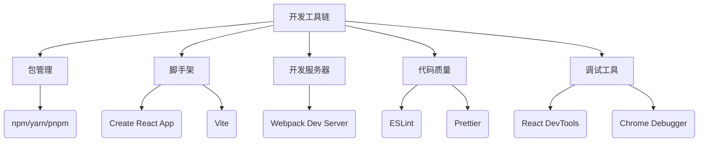
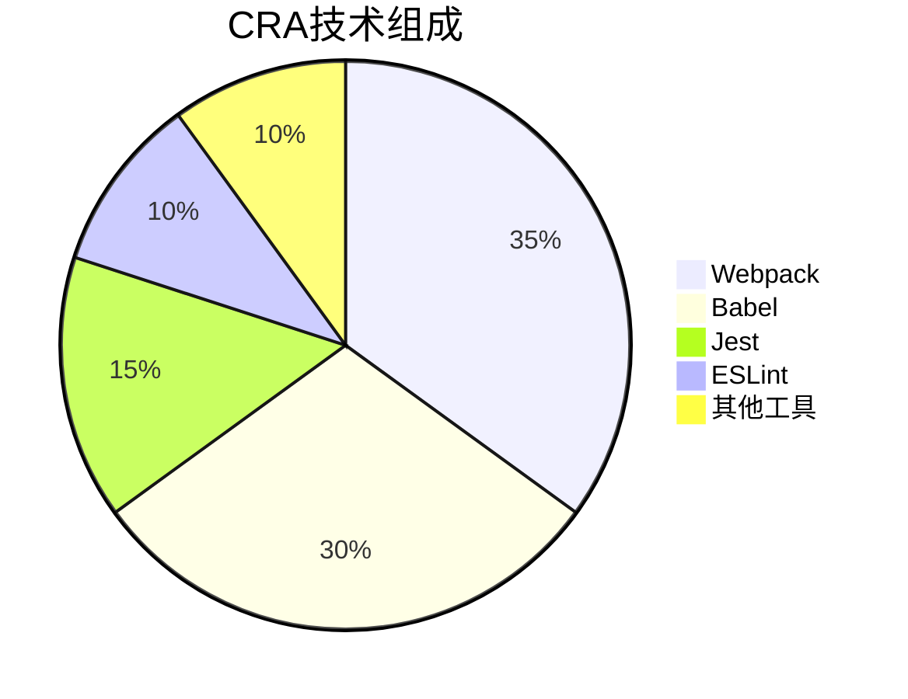
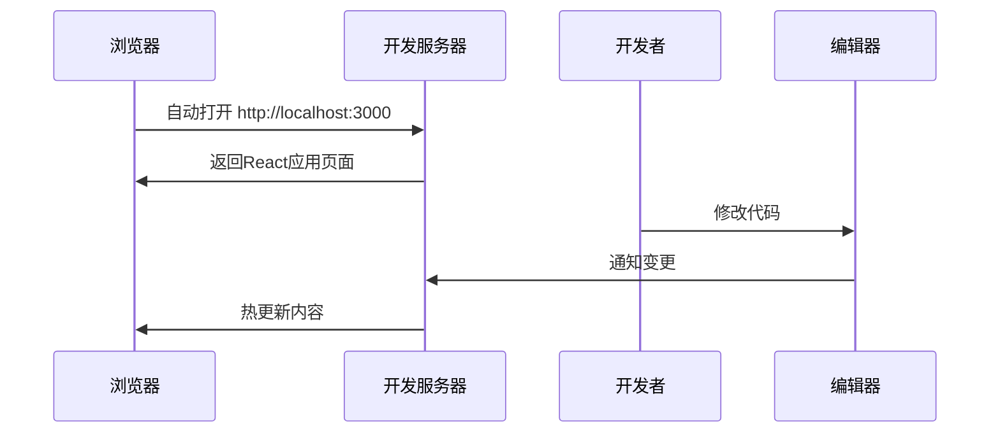
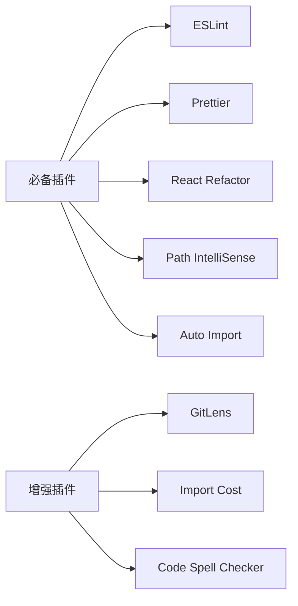
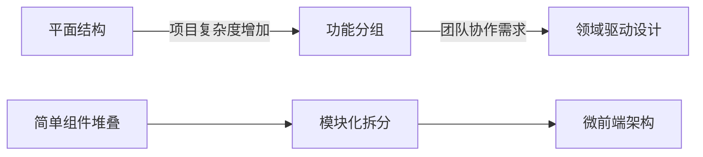
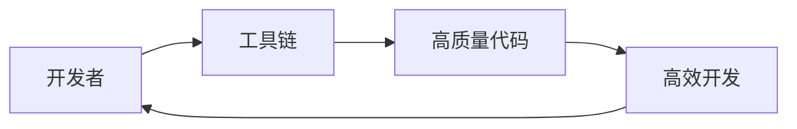

# 第二章：搭建React开发环境

## 工具全景介绍

在开始React开发前，我们需要了解现代React开发所依赖的工具链生态系统。这些工具共同构成了一个完整的开发工作流：




### 工具链各组件作用

1. 包管理器：管理项目依赖

- npm：Node.js自带

- yarn：Facebook开发，速度快

- pnpm：节省磁盘空间

1. 脚手架工具：快速生成项目结构

- Create React App：官方标准

- Vite：新兴替代方案

1. 开发服务器：本地开发环境

- 热重载(HMR)

- 自动刷新

- 错误覆盖层

1. 代码质量工具：

- ESLint：代码规范检查

- Prettier：代码自动格式化

1. 调试工具：

- React DevTools：组件树调试

- 浏览器开发者工具

## 一、使用Create React App快速搭建项目

### 1. Create React App解析

CRA是一个官方维护的零配置React项目生成器，它抽象了所有构建配置，开发者可以立即开始编写代码。

**核心技术栈**：



**核心优势**：

- 内置Webpack配置（支持代码分割、懒加载）

- 包含Babel转译（支持最新JS语法）

- 集成Jest测试框架

- 开发/生产环境优化

- 热模块替换(HMR)支持

### 2. 创建项目详细流程

#### 系统要求

- Node.js ≥14.0.0

- npm ≥5.6 或 yarn ≥1.0

#### 创建过程详解

```bash
# 使用npx避免全局安装
npx create-react-app my-app --template typescript # 如需TS支持

# 进入项目目录
cd my-app

# 启动开发服务器
npm start
```

**启动后你将看到**：



#### 项目模板选择

CRA提供多种官方模板：

- cra-template：默认模板

- cra-template-typescript：TypeScript模板

- cra-template-pwa：渐进式Web应用模板

## 二、项目目录结构解析

### 完整目录说明

```
my-app/
├── node_modules/    # 所有依赖模块
├── public/          # 静态资源
│   ├── index.html   # 应用外壳
│   ├── favicon.ico  # 网站图标
│   └── manifest.json # PWA配置
├── src/             # 源代码
│   ├── App.js       # 根组件
│   ├── index.js     # 入口文件
│   ├── styles/      # CSS文件
│   └── components/  # 公共组件
├── .gitignore       # Git忽略规则
├── package.json     # 项目配置
└── README.md        # 项目文档
```

### 关键文件深度解析

#### public/index.html

```html
<!DOCTYPE html>
<html lang="en">
  <head>
    <meta charset="utf-8" />
    <link rel="icon" href="%PUBLIC_URL%/favicon.ico" />
    <meta name="viewport" content="width=device-width, initial-scale=1" />
    <title>React App</title>
  </head>
  <body>
    <div id="root"></div>
  </body>
</html>
```

运行 HTML

- %PUBLIC_URL%：会被替换为public目录的绝对路径

- `<div id="root">`：React应用的挂载点

#### src/index.js

```javascript
import React from 'react'
import ReactDOM from 'react-dom'
import './index.css'
import App from './App'

ReactDOM.render(
  <React.StrictMode>
    <App />
  </React.StrictMode>,
  document.getElementById('root')
)
```

- React.StrictMode：开启严格模式检查潜在问题

- ReactDOM.render()：渲染入口

## 三、开发工具配置（完整指南）

### 1. 专业VS Code配置

#### 推荐插件组合



#### 高级配置（.vscode/settings.json）

```json
{
  "editor.codeActionsOnSave": {
    "source.fixAll.eslint": true
  },
  "emmet.includeLanguages": {
    "javascript": "javascriptreact"
  },
  "javascript.suggest.autoImports": true,
  "typescript.suggest.autoImports": true,
  "prettier.jsxSingleQuote": true,
  "files.exclude": {
    "**/.git": true,
    "**/.DS_Store": true,
    "**/node_modules": false
  }
}
```

### 2. 企业级ESLint配置

#### 扩展配置（.eslintrc.js）

```javascript
module.exports = {
  extends: [
    'react-app',
    'airbnb',
    'plugin:jsx-a11y/recommended',
    'prettier'
  ],
  plugins: ['jsx-a11y', 'prettier'],
  rules: {
    'react/jsx-filename-extension': [
      1, 
      { extensions: ['.js', '.jsx'] }
    ],
    'prettier/prettier': 'error',
    'react/prop-types': 'off',
    'import/prefer-default-export': 'off'
  }
}
```

#### 配套的Prettier配置（.prettierrc）

```json
{
  "arrowParens": "avoid",
  "bracketSpacing": true,
  "jsxBracketSameLine": false,
  "printWidth": 100,
  "proseWrap": "always",
  "semi": false,
  "singleQuote": true,
  "tabWidth": 2,
  "trailingComma": "all",
  "useTabs": false
}
```

### 3. 高级开发技巧

#### 调试配置（.vscode/launch.json）

```json
{
  "version": "0.2.0",
  "configurations": [
    {
      "type": "chrome",
      "request": "launch",
      "name": "Debug React App",
      "url": "http://localhost:3000",
      "webRoot": "${workspaceFolder}/src",
      "sourceMapPathOverrides": {
        "webpack:///src/*": "${webRoot}/*"
      }
    }
  ]
}
```

#### 性能优化配置

1. 在package.json中添加别名：

```json
{
  "scripts": {
    "analyze": "source-map-explorer 'build/static/js/*.js'"
  }
}
```

1. 运行npm run build后执行：

```bash
npm install -g source-map-explorer
npm run analyze
```

## 四、专业开发实践建议

### 1. 项目结构演进



###### 结构演进对比表

| 维度 | 平面结构 | 功能分组 | 领域驱动设计 | 
| -- | -- | -- | -- |
| 复杂度 | ★☆☆☆☆ | ★★★☆☆ | ★★★★★ | 
| 可维护性 | 低（<100个文件） | 中（100-500文件） | 高（500+文件） | 
| 团队规模 | 1人 | 2-5人 | 5+人 | 
| 典型工具 | 纯React | React+Context | Redux+TypeScript | 


### 2. 环境变量管理

```
# .env.development
REACT_APP_API_URL=http://localhost:4000
REACT_APP_DEBUG=true

# .env.production
REACT_APP_API_URL=https://api.example.com
```

使用方式：

```js
const apiUrl = process.env.REACT_APP_API_URL
```

## 五、故障排除专家指南

### 常见问题解决方案

| 问题现象 | 根本原因 | 解决方案 | 
| -- | -- | -- |
| 启动时报错 | 权限问题 | 以管理员运行终端 | 
| HMR不工作 | 代理配置问题 | 检查网络代理设置 | 
| 样式加载顺序错乱 | CSS Modules冲突 | 使用 | 
| 生产构建失败 | 内存不足 | 增加Node内存限制： | 


### 诊断命令

```bash
# 检查依赖冲突
npm ls react

# 清理缓存
npm cache clean --force

# 重新安装依赖
rm -rf node_modules package-lock.json
npm install
```

## 六、总结与最佳实践

1. 工具选择原则：

	- 新手：使用CRA官方套件

	- 进阶：考虑Vite等替代方案

	- 企业级：自定义Webpack配置

1. 目录结构黄金法则：

	- 保持src/目录整洁

	- 组件按功能/领域组织

	- 避免过深嵌套

1. 代码质量保障：

	- 提交前自动格式化（husky + lint-staged）

	- CI/CD中集成ESLint检查

	- 定期更新依赖版本

1. 性能优化起点：

	- 代码分割（React.lazy）

	- 按需加载第三方库

	- 定期运行分析工具

