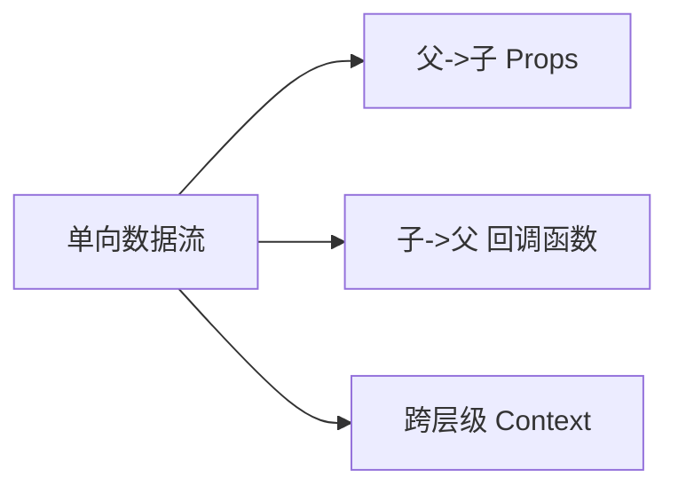
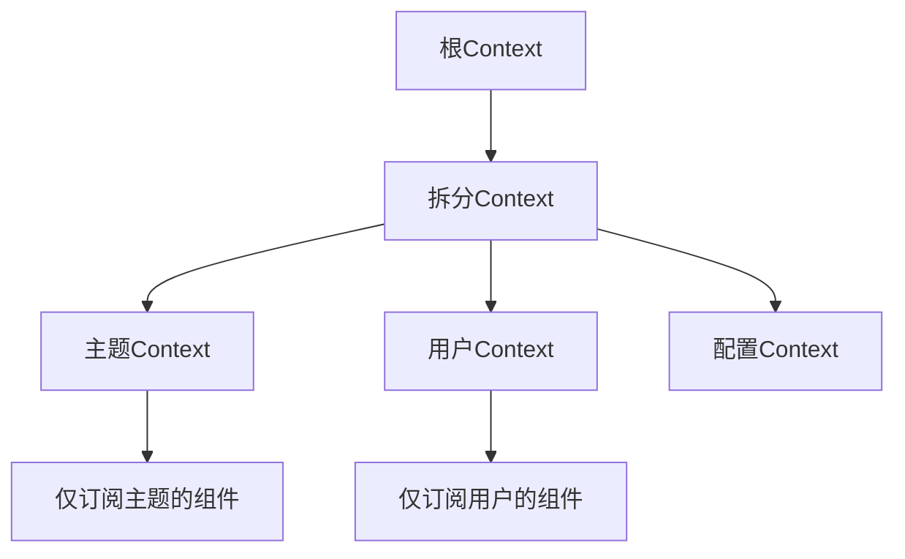
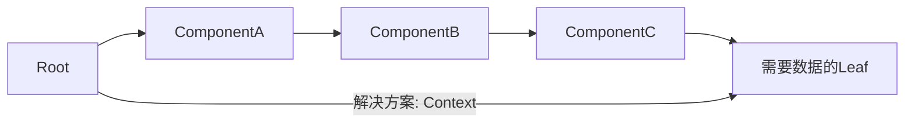

# 第七章：组件通信 —— 构建灵活的数据通道

## 一、组件通信设计哲学

1. 数据流原则



​**​核心原则​**​：

- ​**​单向性​**​：数据从父组件流向子组件

- ​**​可预测性​**​：明确的数据来源与更新路径

- ​**​隔离性​**​：组件内部状态不对外暴露

2. 通信模式对比矩阵

| 方式 | 适用场景 | 复杂度 | 维护成本 | 典型实现 | 
| -- | -- | -- | -- | -- |
| Props传递 | 父子直接通信 | 低 | 低 | 属性传递 | 
| 回调函数 | 子向父通信 | 中 | 中 | 函数属性 | 
| Context API | 跨层级通信 | 高 | 高 | Provider/Consumer | 
| 全局状态管理 | 复杂应用状态共享 | 极高 | 极高 | Redux/MobX | 
| 事件总线 | 非父子松散通信 | 中 | 中 | 自定义事件系统 | 


## 二、父子组件通信模式

1. Props 基础传递

```jsx
    // 父组件
function Parent() {
  const [count, setCount] = useState(0);
  
  return (
    <div>
      <Child count={count} />
      <button onClick={() => setCount(c => c+1)}>+</button>
    </div>
  );
}

// 子组件
function Child({ count }) {
  return <div>Current count: {count}</div>;
}
```

2. 回调函数通信

```jsx
// 父组件
function TodoList() {
  const handleComplete = (id) => {
    // 更新完成状态
  };

  return (
    <ul>
      {todos.map(todo => (
        <TodoItem 
          key={todo.id}
          todo={todo}
          onComplete={handleComplete}
        />
      ))}
    </ul>
  );
}

// 子组件
function TodoItem({ todo, onComplete }) {
  return (
    <li>
      {todo.text}
      <button onClick={() => onComplete(todo.id)}>✓</button>
    </li>
  );
}
```

3. 复杂对象传递

```jsx
// 类型化传递（TypeScript示例）
interface UserCardProps {
  user: {
    id: string;
    name: string;
    avatar: string;
  };
  renderFooter?: () => ReactNode;
}

function UserCard({ user, renderFooter }: UserCardProps) {
  return (
    <div className="card">
      
      <h3>{user.name}</h3>
      {renderFooter?.()}
    </div>
  );
}
```

## 三、兄弟组件通信方案

1. 状态提升模式

```jsx
function Calculator() {
  const [value, setValue] = useState('');

  return (
    <div>
      <InputA value={value} onChange={setValue} />
      <InputB value={value} onChange={setValue} />
      <Result value={value} />
    </div>
  );
}

function InputA({ value, onChange }) {
  return (
    <input
      value={value}
      onChange={(e) => onChange(e.target.value)}
    />
  );
}
```

2. 发布订阅模式

```jsx
// 创建事件总线
const eventBus = {
  events: new Map(),
  on(event, callback) {
    const handlers = this.events.get(event) || [];
    handlers.push(callback);
    this.events.set(event, handlers);
  },
  emit(event, ...args) {
    const handlers = this.events.get(event);
    handlers?.forEach(cb => cb(...args));
  }
};

// 组件A发布事件
function ComponentA() {
  const handleClick = () => {
    eventBus.emit('dataUpdate', { time: Date.now() });
  };

  return <button onClick={handleClick}>通知</button>;
}

// 组件B订阅事件
function ComponentB() {
  const [data, setData] = useState(null);

  useEffect(() => {
    eventBus.on('dataUpdate', setData);
    return () => eventBus.off('dataUpdate', setData);
  }, []);

  return <div>最新数据：{data?.time}</div>;
}
```

## 四、跨层级通信：Context API

1. 基础Context实现

```jsx
const ThemeContext = React.createContext('light');

function App() {
  return (
    <ThemeContext.Provider value="dark">
      <Header />
      <MainContent />
    </ThemeContext.Provider>
  );
}

function Header() {
  return (
    <ThemeContext.Consumer>
      {theme => (
        <header className={`header-${theme}`}>
          <Logo />
          <Nav />
        </header>
      )}
    </ThemeContext.Consumer>
  );
}
```

2. Hooks增强模式

```jsx
function UserPanel() {
  const user = useContext(UserContext);
  const theme = useContext(ThemeContext);

  return (
    <div className={`panel-${theme}`}>
      <Avatar user={user} />
      <Profile />
    </div>
  );
}
```

3. 高性能Context设计



```jsx
// 创建独立Context
const ThemeContext = createContext('light');
const UserContext = createContext(null);

// 组件按需订阅
function App() {
  return (
    <ThemeContext.Provider value="dark">
      <UserContext.Provider value={user}>
        <PageLayout />
      </UserContext.Provider>
    </ThemeContext.Provider>
  );
}
```

## 五、复杂场景通信方案

1. 组合组件模式

```jsx
function Tabs({ children }) {
  const [activeTab, setActiveTab] = useState(0);
  
  return (
    <div className="tabs">
      <div className="tab-list">
        {children.map((child, index) => (
          <button 
            key={index}
            className={index === activeTab ? 'active' : ''}
            onClick={() => setActiveTab(index)}
          >
            {child.props.title}
          </button>
        ))}
      </div>
      <div className="tab-content">
        {children[activeTab]}
      </div>
    </div>
  );
}

// 使用
<Tabs>
  <Tab title="首页">Content 1</Tab>
  <Tab title="关于">Content 2</Tab>
</Tabs>
```

2. 渲染属性模式

```jsx
class MouseTracker extends React.Component {
  state = { x: 0, y: 0 };

  handleMouseMove = (e) => {
    this.setState({ x: e.clientX, y: e.clientY });
  };

  render() {
    return (
      <div onMouseMove={this.handleMouseMove}>
        {this.props.render(this.state)}
      </div>
    );
  }
}

// 使用
<MouseTracker
  render={({ x, y }) => (
    <div>
      鼠标位置：{x}, {y}
    </div>
  )}
/>
```

## 六、性能优化策略

1. Memoization优化

```jsx
// 使用React.memo缓存组件
const MemoizedChild = React.memo(ChildComponent);

// 自定义比较函数
const areEqual = (prevProps, nextProps) => {
  return prevProps.id === nextProps.id;
};
React.memo(ExpensiveComponent, areEqual);
```

2. Context优化技巧

```jsx
// 拆分Context
const SettingsContext = React.createContext();
const UserContext = React.createContext();

// 使用useMemo缓存Provider值
function App() {
  const [user, setUser] = useState(null);
  const userValue = useMemo(() => ({ user, setUser }), [user]);

  return (
    <UserContext.Provider value={userValue}>
      <MainApp />
    </UserContext.Provider>
  );
}
```

#### 七、常见问题与解决方案

1. Prop Drilling问题



2. 循环依赖处理

```jsx
// 使用forwardRef + useImperativeHandle
const Child = forwardRef((props, ref) => {
  const [state, setState] = useState();
  
  useImperativeHandle(ref, () => ({
    getState: () => state,
    reset: () => setState(initialState)
  }));

  return <div>...</div>;
});

// 父组件使用
function Parent() {
  const childRef = useRef();
  
  const handleClick = () => {
    console.log(childRef.current.getState());
  };

  return (
    <>
      <Child ref={childRef} />
      <button onClick={handleClick}>获取状态</button>
    </>
  );
}
```

本章系统性地梳理了React组件间的各种通信模式，从基础到高级方案覆盖了实际开发中的典型场景。下一章将深入表单处理与复杂状态管理，构建完整的前端数据流体系！