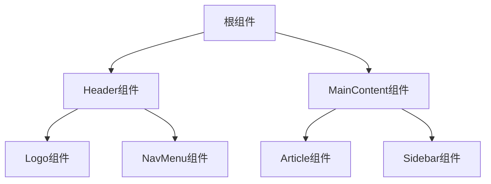
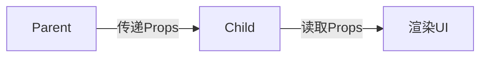
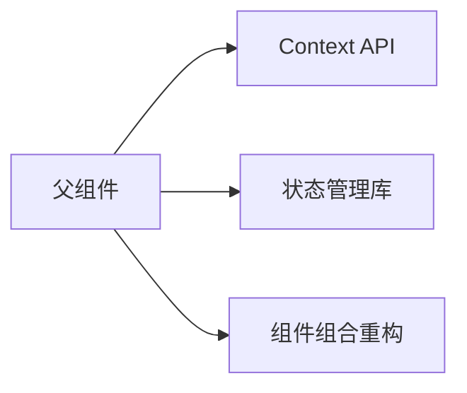
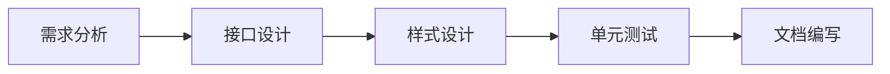
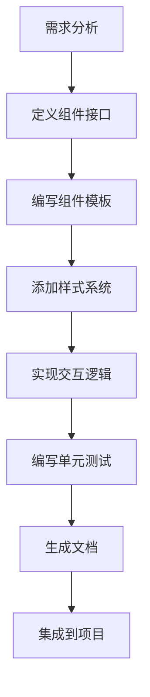

# 第四章：组件与 Props

## 一、组件化开发的本质

​**​组件（Component）​**​ 是 React 的核心抽象单元，它将 UI 拆分为独立、可复用的代码模块。组件化开发的核心价值在于：

1. ​**​关注点分离​**​：每个组件专注单一功能（如按钮、表单、导航栏）

1. ​**​可维护性​**​：修改局部组件不影响整体系统

1. ​**​复用性​**​：通过 Props 配置实现组件多样化使用

1. ​**​可视化开发​**​：通过组件树直观理解应用结构



## 二、组件类型详解

1. 函数组件（Function Component）

​**​现代 React 的推荐写法​**​，使用函数定义组件，通过返回值声明 UI：

```jsx
// 基础函数组件
function Welcome(props) {
  return <h1>Hello, {props.name}</h1>;
}

// 箭头函数写法（支持 TypeScript 泛型）
const Welcome: React.FC<{ name: string }> = ({ name }) => (
  <h1>Hello, {name}</h1>
);
```

2. 类组件（Class Component）

​**​传统写法​**​，适用于需要生命周期方法的场景：

```jsx
class Welcome extends React.Component {
  render() {
    return <h1>Hello, {this.props.name}</h1>;
  }
}
```

3. 对比与选择

| 特性 | 函数组件 | 类组件 | 
| -- | -- | -- |
| 代码量 | 简洁 | 冗长 | 
| 状态管理 | 使用 Hooks（useState） | this.state | 
| 生命周期 | useEffect 等 Hooks 模拟 | 原生生命周期方法 | 
| this 绑定问题 | 无 | 需要处理事件绑定 | 
| 未来兼容性 | React 官方推荐 | 逐步淘汰 | 


## 三、Props 深度解析

1. Props 的本质

- ​**​只读数据流​**​：组件不能修改自己的 Props

- ​**​组件通信桥梁​**​：父组件通过 Props 向子组件传递数据

- ​**​动态配置机制​**​：通过不同 Props 值复用组件逻辑



2. Props 传递方式

```jsx
// 基础传递
<UserCard 
  name="Alice" 
  age={28} 
  isAdmin={false}
/>

// 展开运算符传递对象
const userData = { name: 'Bob', age: 35 };
<UserCard {...userData} />

// 传递复杂数据类型
<Chart 
  config={{ 
    type: 'line', 
    data: [10, 20, 30]
  }}
/>
```

3. Props 接收与解构

```jsx
// 类组件接收
class UserCard extends React.Component {
  render() {
    const { name, age } = this.props;
    return <div>{name} - {age}岁</div>;
  }
}

// 函数组件解构
const UserCard = ({ name, age = 20, isAdmin }) => (
  <div>
    <h3>{name}</h3>
    <p>年龄：{age}</p>
    {isAdmin && <Badge>管理员</Badge>}
  </div>
);
```

4. Props 验证（TypeScript 示例）

```typescript
interface UserCardProps {
  name: string;
  age?: number;         // 可选属性
  isAdmin: boolean;
  onUpdate?: () => void; // 函数类型
}

const UserCard: React.FC<UserCardProps> = ({
  name,
  age = 18,            // 默认值
  isAdmin,
  onUpdate
}) => (
  <div onClick={onUpdate}>
    {/* ... */}
  </div>
);
```

## 四、组件组合模式

1. 容器组件 vs 展示组件

| 特性 | 容器组件 | 展示组件 | 
| -- | -- | -- |
| 职责 | 数据获取、业务逻辑 | UI 呈现 | 
| 复用性 | 低（与具体业务相关） | 高（纯样式/交互） | 
| 状态管理 | 维护复杂状态 | 无状态或局部状态 | 
| 示例 | UserListContainer | Button、Modal | 


2. 组合实现布局系统

```jsx
// 布局组件
const AppLayout = ({ header, sidebar, content }) => (
  <div className="app">
    <header>{header}</header>
    <div className="body">
      <aside>{sidebar}</aside>
      <main>{content}</main>
    </div>
  </div>
);

// 使用组合
<AppLayout
  header={<NavBar title="控制台" />}
  sidebar={<UserMenu />}
  content={<Dashboard />}
/>
```

3. Children 插槽模式

```jsx
const Card = ({ title, children }) => (
  <div className="card">
    {title && <h2 className="card-title">{title}</h2>}
    <div className="card-content">
      {children} {/* 内容插槽 */}
    </div>
  </div>
);

// 使用
<Card title="用户统计">
  <Chart type="bar" />
  <DataTable />
</Card>
```

## 五、高级组件模式

1. Render Props 模式

​**​组件间代码共享​**​的经典模式：

```jsx
// 数据提供组件
const MouseTracker = ({ render }) => {
  const [position, setPosition] = useState({ x: 0, y: 0 });

  const handleMove = (e) => {
    setPosition({ x: e.clientX, y: e.clientY });
  };

  return (
    <div onMouseMove={handleMove}>
      {render(position)}
    </div>
  );
};

// 使用
<MouseTracker
  render={({ x, y }) => (
    <div>
      鼠标位置：{x}, {y}
    </div>
  )}
/>
```

2. Props 代理模式

​**​高阶组件（HOC）​**​ 的底层实现原理：

```jsx
const withLogger = (WrappedComponent) => {
  return (props) => {
    useEffect(() => {
      console.log('组件已挂载:', props);
    }, []);

    return <WrappedComponent {...props} />;
  };
};

// 使用增强组件
const EnhancedButton = withLogger(Button);
```

3. 上下文传递模式

通过 Context 跨层级传递 Props：

```jsx
const ThemeContext = createContext('light');

// 父组件
<ThemeContext.Provider value="dark">
  <Toolbar />
</ThemeContext.Provider>

// 深层子组件
const Button = () => {
  const theme = useContext(ThemeContext);
  return <button className={`btn-${theme}`}>按钮</button>;
};
```

## 六、性能优化策略

1. 避免不必要的渲染

```jsx
// 使用 React.memo 缓存组件
const MemoizedUserCard = React.memo(UserCard);

// 自定义比较函数
const areEqual = (prevProps, nextProps) => {
  return prevProps.id === nextProps.id;
};
React.memo(UserCard, areEqual);
```

2. 优化 Props 传递

```jsx
// 错误：每次创建新对象
<UserProfile style={{ color: 'red' }} />

// 正确：提取常量
const profileStyle = { color: 'red' };
<UserProfile style={profileStyle} />

// 使用 useMemo 缓存
const memoizedStyle = useMemo(() => ({ color: 'red' }), []);
```

3. 组件分割策略

```jsx
// 臃肿组件（500行） => 拆分为：
// - UserListContainer（容器）
// - UserListItem（展示组件）
// - UserActionMenu（子功能组件）
// - UserStatsChart（可视化组件）
```

## 七、常见问题与解决方案

1. Props 传递过深（Prop Drilling）

​**​现象​**​：中间组件被迫传递不使用的 Props

​**​解决方案​**​：



2. Props 命名冲突

```jsx
// 错误：命名歧义
<Form onSubmit={handleSubmit}>
  <Button onSubmit={handleClick}>提交</Button>
</Form>

// 正确：语义化命名
<Form onSubmit={handleSubmit}>
  <Button onClick={handleClick}>提交</Button>
</Form>
```

3. 动态 Props 处理

```jsx
const DynamicPropsDemo = ({ config }) => {
  const buttonProps = {
    size: config.isLarge ? 'lg' : 'sm',
    disabled: !config.isActive,
    onClick: config.handleAction
  };

  return <PrimaryButton {...buttonProps} />;
};
```

## 八、最佳实践指南

1. ​**​组件设计原则​**​

	- ​**​单一职责原则​**​：每个组件只解决一个特定问题

	- ​**​开放封闭原则​**​：对扩展开放，对修改关闭

	- ​**​组合优于继承​**​：通过 Props 组合而非继承扩展功能

1. ​**​Props 命名规范​**​

```jsx
// 布尔类型以 is/has/can 开头
<Modal isOpen={true} hasBorder={false} />

// 事件处理以 on 开头
<Button onClick={handleClick} />

// 渲染内容使用 children
<Container>
  <ChildComponent />
</Container>
```

1. ​**​类型安全强化​**​

```typescript
typescript复制// 使用 TypeScript 严格校验
interface ComplexProps {
  id: string | number;
  coordinates: [number, number];
  metadata: {
    createdAt: Date;
    updatedAt?: Date;
  };
  renderFooter?: () => React.ReactNode;
}
```

## 九、组件开发工作流

1. ​**​组件设计流程**



1. ​**​组件文档示例​**​

**组件名称​**​：UserAvatar

​**​功能描述​**​：显示用户头像及在线状态指示器

Props 定义

| 属性名 | 类型 | 必填 | 默认值 | 说明 | 
| -- | -- | -- | -- | -- |
| src | string | 是 | 无 | 头像图片URL地址 | 
| size | number | 否 | 40 | 头像尺寸（像素单位） | 
| online | boolean | 否 | false | 显示在线状态绿点 | 


```jsx
// 基础用法
<UserAvatar src="/user.jpg" />

// 自定义尺寸与状态
<UserAvatar 
  src="/profile.png" 
  size={60}
  online={true}
/>
```

效果预览

```
[图片占位：显示圆形头像与右下角绿点]
```

## 十、组件开发完整流程示例



通过本章的系统学习，您已掌握 React 组件的核心设计思想与高级开发模式。下一章将深入探讨组件的状态管理与生命周期控制，完成从静态组件到动态交互的进阶！