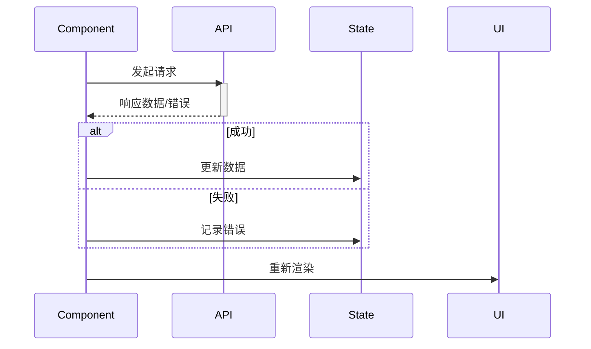
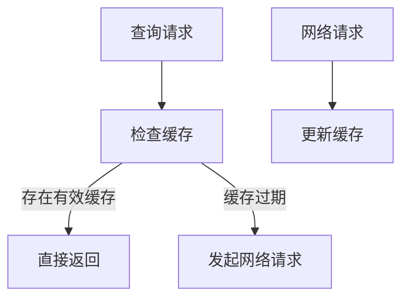
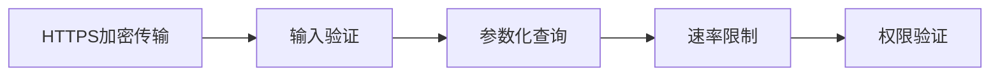

# 第十二章：数据获取与API集成 —— 构建稳健的前后端协作体系

## 一、数据获取核心方法论

1. Fetch API 与 Axios 对比

```jsx
// 使用Fetch
fetch('/api/data')
  .then(res => {
    if (!res.ok) throw new Error(res.statusText);
    return res.json();
  })
  .then(data => console.log(data))
  .catch(err => console.error(err));

// 使用Axios
axios.get('/api/data')
  .then(({ data }) => console.log(data))
  .catch(err => {
    if (err.response) {
      console.error(err.response.status);
    }
  });
```

​**​功能对比矩阵​**​：

| 特性 | Fetch | Axios | 
| -- | -- | -- |
| 浏览器兼容性 | 现代浏览器 | 广泛支持（包括旧版） | 
| 请求取消 | AbortController | CancelToken | 
| 超时设置 | 需手动实现 | 内置支持 | 
| 拦截器 | 无 | 请求/响应拦截器 | 
| 进度监控 | 部分支持 | 完整支持 | 


2. 数据获取生命周期



## 二、异步状态管理方案

1. Redux异步中间件

```jsx
// 使用redux-thunk
const fetchUser = (userId) => async dispatch => {
  dispatch({ type: 'USER_REQUEST' });
  try {
    const { data } = await axios.get(`/users/${userId}`);
    dispatch({ type: 'USER_SUCCESS', payload: data });
  } catch (err) {
    dispatch({ type: 'USER_FAILURE', error: err.message });
  }
};

// 使用redux-toolkit异步thunk
const fetchPosts = createAsyncThunk('posts/fetch', 
  async (page, { rejectWithValue }) => {
    try {
      const res = await api.getPosts(page);
      return res.data;
    } catch (err) {
      return rejectWithValue(err.response.data);
    }
  }
);
```

2. React Query实践

```jsx
import { useQuery } from 'react-query';

function UserProfile({ userId }) {
  const { data, error, isLoading } = useQuery(
    ['user', userId],
    () => fetchUser(userId),
    {
      staleTime: 5 * 60 * 1000, // 5分钟缓存
      retry: 3, // 失败重试3次
    }
  );

  if (isLoading) return <Spinner />;
  if (error) return <Error message={error.message} />;
  
  return <div>{data.name}</div>;
}
```

## 三、REST API最佳实践

1. API客户端封装

```jsx
// apiClient.js
const api = axios.create({
  baseURL: process.env.REACT_APP_API_URL,
  timeout: 10000,
  headers: { 'Content-Type': 'application/json' }
});

// 请求拦截器
api.interceptors.request.use(config => {
  const token = localStorage.getItem('token');
  if (token) {
    config.headers.Authorization = `Bearer ${token}`;
  }
  return config;
});

// 响应拦截器
api.interceptors.response.use(
  response => response.data,
  error => {
    if (error.response?.status === 401) {
      store.dispatch(logout());
    }
    return Promise.reject(error);
  }
);

export default api;
```

2. 分页与过滤实现

```jsx
function usePaginatedData(endpoint, params) {
  const [page, setPage] = useState(1);
  const { data, isLoading } = useQuery(
    [endpoint, { ...params, page }],
    () => api.get(endpoint, { params: { ...params, page } })
  );

  return {
    data: data?.results,
    total: data?.total,
    page,
    setPage,
    isLoading
  };
}

// 使用示例
const { data, page, setPage } = usePaginatedData('/products', {
  category: 'electronics'
});
```

## 四、GraphQL集成方案

1. Apollo Client配置

```jsx
import { ApolloClient, InMemoryCache, gql } from '@apollo/client';

const client = new ApolloClient({
  uri: 'https://api.example.com/graphql',
  cache: new InMemoryCache()
});

// 查询示例
const GET_USERS = gql`
  query GetUsers($limit: Int!) {
    users(limit: $limit) {
      id
      name
      email
    }
  }
`;

function UserList() {
  const { loading, error, data } = useQuery(GET_USERS, {
    variables: { limit: 10 }
  });
  
  // 渲染逻辑
}
```

2. 缓存策略优化



## 五、数据缓存与性能优化

1. SWR缓存策略

```jsx
import useSWR from 'swr';

const fetcher = url => api.get(url).then(res => res.data);

function Profile() {
  const { data, error } = useSWR('/api/user', fetcher, {
    revalidateOnFocus: false,
    refreshInterval: 60000
  });

  // 手动更新缓存
  const { mutate } = useSWRConfig();
  const handleRefresh = () => mutate('/api/user');
}
```

2. 无限滚动加载

```jsx
import { useInfiniteQuery } from 'react-query';

const fetchProjects = ({ pageParam = 1 }) => 
  api.get('/projects', { params: { page: pageParam } });

function ProjectsList() {
  const {
    data,
    fetchNextPage,
    hasNextPage,
  } = useInfiniteQuery('projects', fetchProjects, {
    getNextPageParam: (lastPage) => lastPage.nextPage,
  });

  return (
    <div>
      {data.pages.map((page, i) => (
        <Fragment key={i}>
          {page.items.map(project => (
            <ProjectItem key={project.id} data={project} />
          ))}
        </Fragment>
      ))}
      <button 
        onClick={() => fetchNextPage()}
        disabled={!hasNextPage}
      >
        加载更多
      </button>
    </div>
  );
}
```

## 六、错误处理与重试机制

1. 全局错误处理

```jsx
// 错误边界组件
class ErrorBoundary extends Component {
  state = { hasError: false };

  static getDerivedStateFromError(error) {
    return { hasError: true };
  }

  componentDidCatch(error, info) {
    logErrorToService(error, info.componentStack);
  }

  render() {
    if (this.state.hasError) {
      return <FallbackUI />;
    }
    return this.props.children;
  }
}

// 在根组件包裹
<ErrorBoundary>
  <App />
</ErrorBoundary>
```

2. 指数退避重试

```jsx
const fetchWithRetry = async (url, retries = 3) => {
  try {
    return await api.get(url);
  } catch (err) {
    if (retries > 0) {
      await new Promise(res => 
        setTimeout(res, 1000 * 2 ​**​ (4 - retries))
      );
      return fetchWithRetry(url, retries - 1);
    }
    throw err;
  }
};
```

## 七、安全最佳实践

1. 安全防护措施



2. JWT安全存储

```jsx
// 安全处理token
const setAuthToken = (token) => {
  if (token) {
    api.defaults.headers.common['Authorization'] = `Bearer ${token}`;
    SecureStore.setItem('jwt', token);
  } else {
    delete api.defaults.headers.common['Authorization'];
    SecureStore.removeItem('jwt');
  }
};
```

## 八、测试策略

1. Mock Service Worker

```jsx
import { setupServer } from 'msw/node';
import { rest } from 'msw';

const server = setupServer(
  rest.get('/api/user', (req, res, ctx) => {
    return res(
      ctx.json({ name: 'John Doe' })
    );
  })
);

// 测试用例中
beforeAll(() => server.listen());
afterEach(() => server.resetHandlers());
afterAll(() => server.close());

test('fetches user data', async () => {
  const { findByText } = render(<UserProfile />);
  await waitFor(() => {
    expect(screen.getByText('John Doe')).toBeInTheDocument();
  });
});
```

本章系统构建了React数据获取与API集成的完整知识体系，涵盖从基础请求到企业级解决方案的全链路实践。下一章将深入样式与UI库集成，打造视觉统一的前端界面！