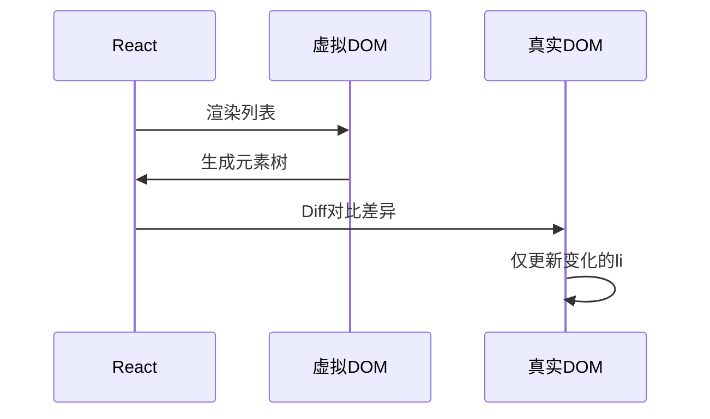
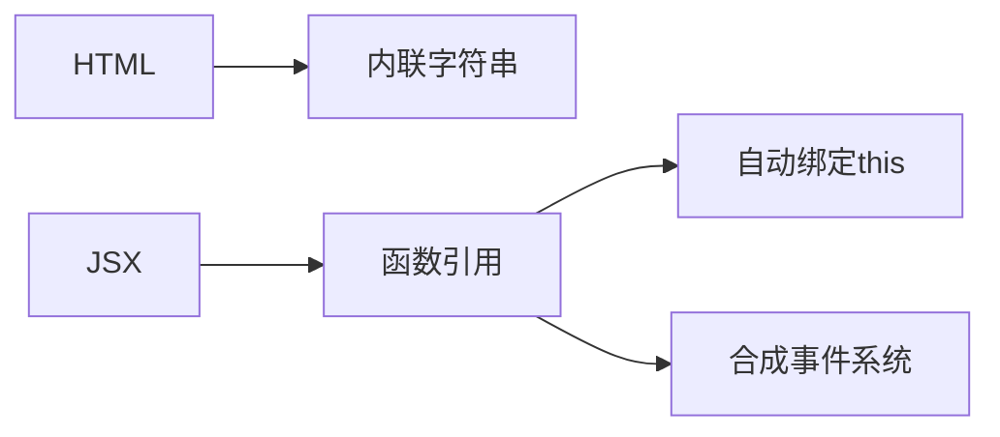
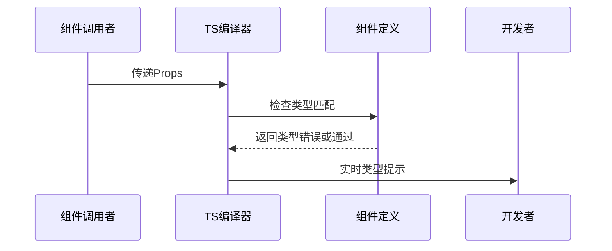
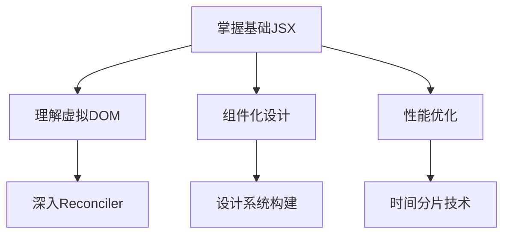

# 第三章：JSX语法深度解析

## 一、JSX本质与核心原理

1. JSX的本质

JSX是​**​JavaScript的语法扩展​**​，其核心目的是为React组件的声明式UI提供直观的模板语法。它通过以下机制实现：

- ​**​编译转换​**​：由Babel将JSX代码转换为React.createElement()调用

- ​**​虚拟DOM生成​**​：最终创建轻量级的虚拟DOM对象，用于高效更新真实DOM

```jsx
// JSX代码
const element = <div className="container">Hello</div>;

// 编译后的等效代码
const element = React.createElement(
  "div",
  { className: "container" },
  "Hello"
);

// 生成的虚拟DOM对象
{
  type: "div",
  props: { className: "container", children: "Hello" },
  key: null,
  ref: null
}
```

2. React选择JSX的设计哲学

- ​**​声明式编程​**​：开发者关注"UI应该是什么样"，而非"如何更新UI"

- ​**​组件化思维​**​：通过嵌套的XML语法直观表达组件结构

- ​**​类型安全​**​（结合TypeScript时）：编译时即可发现属性类型错误

## 二、JSX核心功能语法详解

1. 表达式嵌入机制

JSX通过{}实现动态内容注入，支持所有JavaScript表达式：

```jsx
// 变量引用
const count = 10;
<div>Total: {count}</div>

// 函数调用
function formatName(user) {
  return user.firstName + ' ' + user.lastName;
}
<h1>Hello, {formatName(user)}!</h1>

// 嵌套JSX
const list = (
  <ul>
    {[1, 2, 3].map(n => <li key={n}>Item {n}</li>)}
  </ul>
)
```

2. 条件渲染策略对比

| 方案 | 代码示例 | 适用场景 | 
| -- | -- | -- |
| 三元运算符 | {isValid ? <Success/> : <Error/>} | 简单二选一条件 | 
| 逻辑与运算符 | {isLoading && <Spinner/>} | 存在性检查 | 
| IIFE函数 | {( () => { if(...) return ... })()} | 复杂逻辑临时封装 | 
| 提取为组件 | <RenderContent type={type} /> | 可复用条件逻辑 | 


3. 列表渲染与Key机制

```jsx
const users = [
  { id: 1, name: 'Alice' },
  { id: 2, name: 'Bob' }
];

const userList = (
  <ul>
    {users.map(user => (
      <li key={user.id}>
        {user.name} - ID: {user.id}
      </li>
    ))}
  </ul>
)

```



​**​Key的作用​**​：

- 帮助React识别元素的变化（添加/删除/重排序）

- 必须具有唯一性（避免使用数组索引作为Key）

## 三、JSX与HTML的差异解析

1. 属性名差异对照

| HTML属性 | JSX属性 | 差异原因 | 
| -- | -- | -- |
| class | className | JavaScript保留字 | 
| for | htmlFor | JavaScript保留字 | 
| tabindex | tabIndex | 驼峰命名规范 | 
| onclick | onClick | 事件命名规范 | 


2. 样式系统对比

```jsx
// HTML方式
<div style="color: red; font-size: 20px"></div>

// JSX方式
<div style={{ 
  color: 'red', 
  fontSize: 20,  // 自动添加'px'单位
  padding: '10px 20px' 
}}></div>
```

3. 事件系统升级



React事件特性：

- ​**​合成事件​**​：跨浏览器的事件代理系统

- ​**​自动绑定​**​：类组件中需手动绑定this，函数组件无此问题

- ​**​事件池​**​：提升性能的事件对象复用机制

## 四、JSX高级模式

1. 片段(Fragments)语法

解决组件必须返回单根元素的问题：

```jsx
const Table = () => (
  <table>
    <tr>
      <Columns />  // 内部返回多个<td>
    </tr>
  </table>
);

const Columns = () => (
  <>
    <td>Column 1</td>
    <td>Column 2</td>
  </>
);
```

2. 插槽(Children)模式

实现组件内容分发：

```jsx
const Layout = ({ children }) => (
  <div className="layout">
    <header>App Header</header>
    <main>{children}</main>
    <footer>App Footer</footer>
  </div>
);

// 使用
<Layout>
  <h1>Main Content</h1>
  <p>Page body...</p>
</Layout>
```

3. 渲染函数模式

动态生成复杂结构：

```jsx
function Repeat({ times, children }) {
  return Array(times).fill().map((_, i) => children(i));
}

<Repeat times={3}>
  {index => <div key={index}>Item {index + 1}</div>}
</Repeat>
```

## 五、JSX编译全流程


​**​Babel转译示例​**​：

```jsx
// 输入
<div className="container">
  <h1>{title}</h1>
  {children}
</div>

// 输出
React.createElement(
  "div",
  { className: "container" },
  React.createElement("h1", null, title),
  children
)
```

​**​新版自动运行时​**​（React 17+）：

```js
js复制// 转换后的代码
import { jsx as _jsx } from "react/jsx-runtime";

_jsx("div", { 
  className: "container",
  children: [
    _jsx("h1", { children: title }),
    children
  ]
});
```

## 六、性能优化策略

1. 避免不必要的渲染

```jsx
// 错误示例：每次渲染都创建新函数
<button onClick={() => handleClick()} />

// 正确做法：使用useCallback缓存
const memoizedClick = useCallback(() => handleClick(), []);
<button onClick={memoizedClick} />
```

2. 代码分割优化

```jsx
const HeavyComponent = React.lazy(() => import('./HeavyComponent'));

function App() {
  return (
    <Suspense fallback={<Spinner />}>
      <HeavyComponent />
    </Suspense>
  )
}
```

## 七、TypeScript增强支持

1. 组件Props类型约束

```typescript
typescript复制interface ButtonProps {
  variant?: 'primary' | 'secondary';
  size?: 'sm' | 'md' | 'lg';
  onClick: () => void;
}

const Button: React.FC<ButtonProps> = ({ 
  variant = 'primary',
  size = 'md',
  onClick,
  children 
}) => (
  <button 
    className={`btn-${variant} size-${size}`}
    onClick={onClick}
  >
    {children}
  </button>
)
```

2. 类型推断流程



## 八、最佳实践指南

1. ​**​组件拆分原则​**​

	- 单个JSX文件不超过300行

	- 嵌套层级不超过5层

	- 每个组件专注单一职责

1. ​**​表达式简化策略​**​

```jsx
// 错误：复杂嵌套表达式
{data
  .filter(item => item.active)
  .map(item => <div>{item.name}</div>)
  .slice(0, 5)}

// 正确：分步处理
const filtered = data.filter(item => item.active);
const sliced = filtered.slice(0, 5);
{sliced.map(item => <div key={item.id}>{item.name}</div>)}
```

1. ​**​可访问性规范​**​

```jsx
// 添加ARIA属性
<button 
  aria-label="关闭对话框"
  onClick={handleClose}
  tabIndex={0}
>
  <CloseIcon />
</button>
```

## 九、深入理解方向



​**​推荐学习路径​**​：

1. 研究React.createElement源码实现

1. 分析虚拟DOM的diff算法原理

1. 探索React Fiber架构如何优化渲染流程

通过本章学习，您将全面掌握JSX的底层原理、功能语法和性能优化策略，为构建高质量React应用奠定坚实基础。