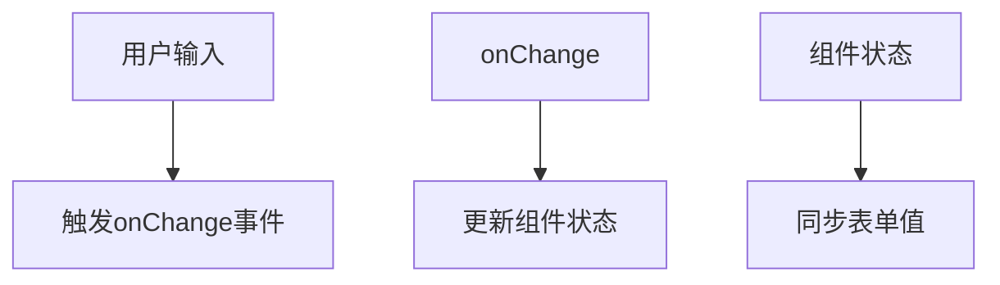
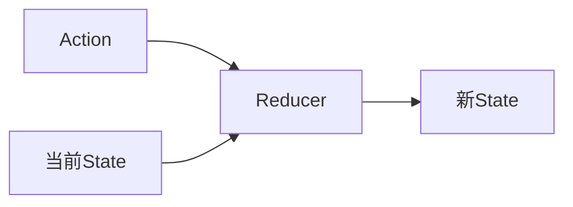
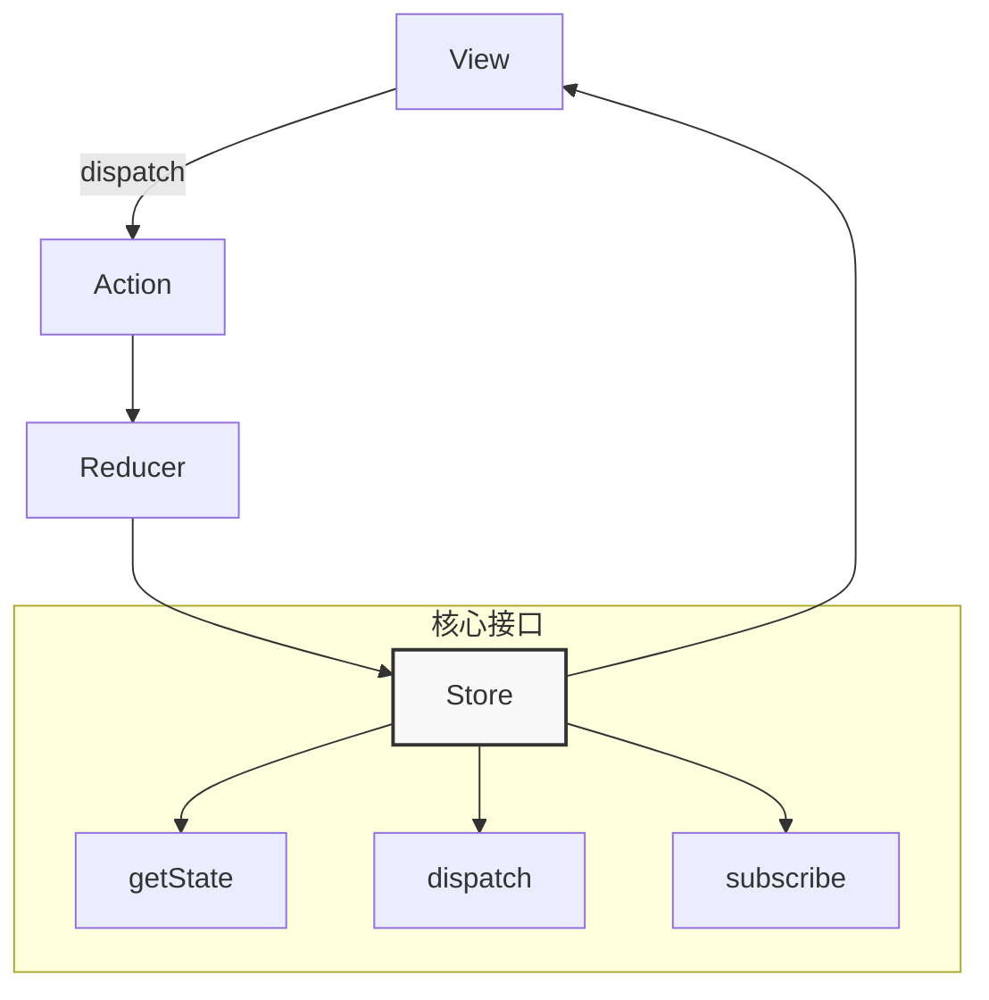
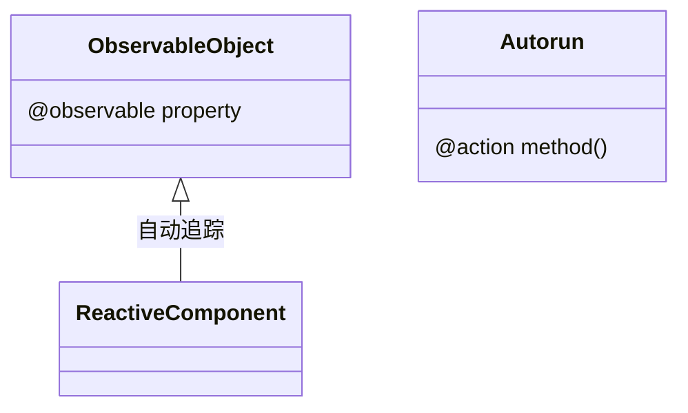
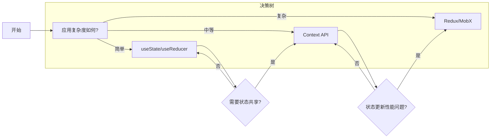

# 第八章：表单处理与复杂状态管理 —— 构建健壮的交互体系

## 一、深度解析受控组件

1. 核心原理与数据流



​**​核心特征​**​：

- ​**​可控性​**​：组件状态与表单元素值完全同步

- ​**​即时验证​**​：在每次输入时执行数据校验

- ​**​统一管理​**​：所有表单数据集中存储于React状态

2. 复杂表单实现示例

```jsx
function SignupForm() {
  const [formData, setFormData] = useState({
    username: '',
    password: '',
    newsletter: false,
  });

  const [errors, setErrors] = useState({});

  const validate = useCallback(() => {
    const newErrors = {};
    if (!formData.username) newErrors.username = '必填字段';
    if (formData.password.length < 6) 
      newErrors.password = '至少6个字符';
    return newErrors;
  }, [formData]);

  const handleSubmit = (e) => {
    e.preventDefault();
    const validationErrors = validate();
    if (Object.keys(validationErrors).length === 0) {
      // 提交逻辑
    } else {
      setErrors(validationErrors);
    }
  };

  const handleChange = (e) => {
    const { name, value, type, checked } = e.target;
    setFormData(prev => ({
      ...prev,
      [name]: type === 'checkbox' ? checked : value
    }));
  };

  return (
    <form onSubmit={handleSubmit}>
      <input
        name="username"
        value={formData.username}
        onChange={handleChange}
        className={errors.username && 'error'}
      />
      {errors.username && <span>{errors.username}</span>}

      <input
        type="password"
        name="password"
        value={formData.password}
        onChange={handleChange}
        className={errors.password && 'error'}
      />
      {errors.password && <span>{errors.password}</span>}

      <label>
        <input
          type="checkbox"
          name="newsletter"
          checked={formData.newsletter}
          onChange={handleChange}
        />
        订阅新闻
      </label>

      <button type="submit">注册</button>
    </form>
  );
}
```

3. 性能优化策略

```jsx
// 使用useMemo缓存复杂初始值
const initialValues = useMemo(() => ({
  /* 复杂对象初始化 */
}), []);

// 通过composition组合提高性能
const MemoizedInput = React.memo(({ label, ...props }) => (
  <div className="form-row">
    <label>{label}</label>
    <input {...props} />
  </div>
));
```

## 二、非受控组件进阶指南

1. 典型使用场景分析

- 文件上传处理

- 与第三方UI库集成

- 实时DOM元素操作

- 大型表单性能敏感场景

2. Refs与表单集成

```jsx
function UncontrolledForm() {
  const inputRef = useRef();
  const fileRef = useRef();

  const handleSubmit = (e) => {
    e.preventDefault();
    const data = {
      name: inputRef.current.value,
      file: fileRef.current.files[0]
    };
    // 处理数据...
  };

  return (
    <form onSubmit={handleSubmit}>
      <input 
        type="text"
        ref={inputRef} 
        defaultValue="初始值"
      />
      <input
        type="file"
        ref={fileRef}
      />
      <button>提交</button>
    </form>
  );
}
```

3. 混合模式（Hybrid Approach）

```jsx
function HybridForm() {
  const [value, setValue] = useState('');
  const inputRef = useRef();

  const handleBlur = () => {
    // 焦点丢失时同步状态
    setValue(inputRef.current.value);
  };

  return (
    <div>
      <input
        ref={inputRef}
        defaultValue={value}
        onBlur={handleBlur}
      />
      <p>当前值：{value}</p>
    </div>
  );
}
```

## 三、复杂状态管理：useReducer解析

1. Reducer设计模式



```jsx
const todoReducer = (state, action) => {
  switch(action.type) {
    case 'ADD':
      return [...state, {
        id: Date.now(),
        text: action.text,
        completed: false
      }];
    case 'TOGGLE':
      return state.map(todo => 
        todo.id === action.id ? 
        {...todo, completed: !todo.completed} : todo
      );
    case 'DELETE':
      return state.filter(todo => todo.id !== action.id);
    default:
      return state;
  }
};

function TodoList() {
  const [todos, dispatch] = useReducer(todoReducer, []);
  
  return (
    <div>
      <form
        onSubmit={e => {
          e.preventDefault();
          const text = e.target.text.value;
          dispatch({ type: 'ADD', text });
          e.target.reset();
        }}
      >
        <input name="text" />
      </form>
      {/* 渲染待办项 */}
    </div>
  );
}
```

2. 与useState对比分析

| 维度 | useState | useReducer | 
| -- | -- | -- |
| ​ | 简单基本类型/简单对象 | 复杂嵌套对象/数组状态 | 
| ​ | 直接在组件中处理 | 集中通过reducer函数管理 | 
| ​ | 需要跟踪组件状态变化 | 可追踪action历史进行调试 | 
| ​ | 分散在各事件处理函数中 | 逻辑集中在单个reducer函数 | 
| ​ | 需要模拟组件交互 | 可单独测试reducer函数 | 


3. 中间件模式扩展

```jsx
function useReducerWithMiddleware(reducer, initialState, middleware) {
  const [state, dispatch] = useReducer(reducer, initialState);

  const customDispatch = (action) => {
    middleware(action, state);
    dispatch(action);
  };

  return [state, customDispatch];
}

// 使用日志中间件
const logger = (action, state) => {
  console.group('Action:', action.type);
  console.log('Payload:', action);
  console.log('Prev State:', state);
  console.groupEnd();
};

const [todos, dispatch] = useReducerWithMiddleware(todoReducer, [], logger);
```

## 四、Redux状态管理概览

1. 核心概念体系



2. 现代Redux最佳实践

```jsx
// 使用Redux Toolkit简化
import { configureStore, createSlice } from '@reduxjs/toolkit';

const counterSlice = createSlice({
  name: 'counter',
  initialState: 0,
  reducers: {
    increment: state => state + 1,
    decrement: state => state - 1
  }
});

const store = configureStore({
  reducer: {
    counter: counterSlice.reducer
  }
});

// React组件中使用
import { useSelector, useDispatch } from 'react-redux';

function Counter() {
  const count = useSelector(state => state.counter);
  const dispatch = useDispatch();

  return (
    <div>
      <button onClick={() => dispatch(counterSlice.actions.decrement())}>-</button>
      <span>{count}</span>
      <button onClick={() => dispatch(counterSlice.actions.increment())}>+</button>
    </div>
  );
}
```

3. 开发调试工具链

```jsx
// 集成Redux DevTools
const store = configureStore({
  reducer,
  devTools: process.env.NODE_ENV !== 'production'
});

// Chrome DevTools效果示例：
[图片: 展示Redux DevTools界面]
```

## 五、MobX响应式状态管理

1. 核心实现原理



2. 基础使用模式

```jsx
import { makeAutoObservable } from 'mobx';
import { observer } from 'mobx-react-lite';

class TodoStore {
  todos = [];
  filter = 'all';

  constructor() {
    makeAutoObservable(this);
  }

  addTodo = (text) => {
    this.todos.push({ text, completed: false });
  }

  get filteredTodos() {
    return this.todos.filter(todo => {
      if (this.filter === 'completed') return todo.completed;
      if (this.filter === 'active') return !todo.completed;
      return true;
    });
  }
}

const todoStore = new TodoStore();

const TodoList = observer(() => (
  <div>
    {todoStore.filteredTodos.map(todo => (
      <div key={todo.text}>{todo.text}</div>
    ))}
  </div>
));
```

3. 响应式特性优势

- 细粒度自动更新

- 无需手动优化组件

- 更接近原生JavaScript开发体验

## 六、状态管理方案选型决策树



本章系统性地剖析了表单处理的多种模式与复杂状态管理方案，为构建企业级应用奠定了坚实基础。下一章将聚焦性能优化策略，打造高效流畅的React应用！