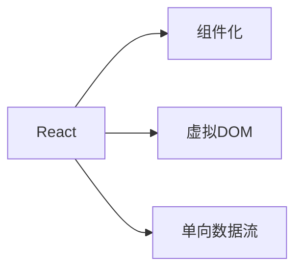
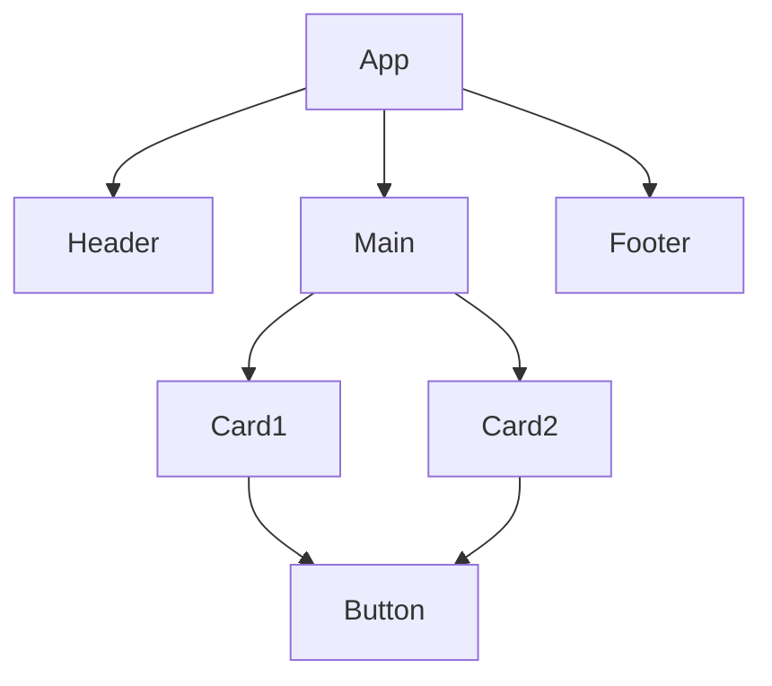
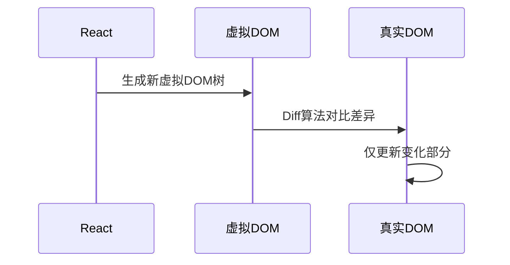
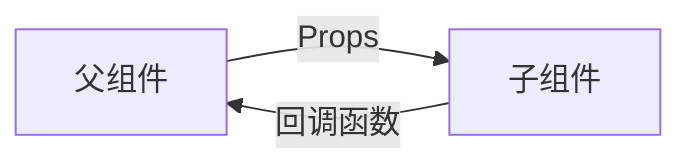
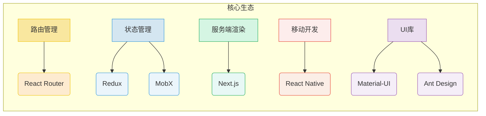

# 第一章：React简介

## 一、React是什么？为什么选择React？

### 1. React的定义

**React** 是由Facebook（现Meta）开发并开源的一款**JavaScript库**，专注于构建用户界面（UI）。它不是完整的框架（如Angular），而是专注于解决视图层的渲染和交互逻辑，通过与生态工具（如React Router、Redux）结合，能够构建复杂的单页应用（SPA）和跨平台应用。

### 2. 为什么选择React？

- 高效灵活：通过虚拟DOM和差异化渲染（Diffing算法）实现高性能更新，适合数据频繁变化的场景。

- 组件化开发：将UI拆分为独立、可复用的组件，提升代码复用性和维护性。

- 强大的生态：拥有丰富的第三方库（如React Router、Redux）和工具链（如Next.js、Create React App）。

- 跨平台能力：通过React Native可开发原生移动应用，实现“一次学习，多端开发”。

- 社区支持：背靠Meta和庞大的开发者社区，长期维护且技术迭代迅速。

## 二、React的核心特点

### 1. 组件化开发（Component-Based）

- 组件是React的核心单元：每个组件封装自身的UI和逻辑（如按钮、表单、页面），通过组合构建复杂应用。

- 复用性与维护性：组件可像积木一样复用，修改一个组件不会影响其他部分。

### 2. 虚拟DOM（Virtual DOM）

- 传统DOM的问题：直接操作DOM效率低（如频繁更新页面元素时）。

- 虚拟DOM的优化：React在内存中维护一个轻量级的虚拟DOM树，通过对比新旧虚拟DOM的差异（Diffing算法），仅更新实际变化的部分。

- 性能优势：减少不必要的DOM操作，提升渲染效率。

### 3. 单向数据流（Unidirectional Data Flow）

- 数据流动方向：数据从父组件通过**Props**向子组件传递，子组件通过**回调函数**通知父组件状态变化。

- 可预测性：数据流动清晰，便于调试和维护。

## 三、React生态圈

React的生态系统为其扩展了无限可能，以下是核心工具和库：

### 1. 路由管理：React Router

- 实现单页应用（SPA）的页面跳转和动态路由。

- 核心组件：`<BrowserRouter>, <Route>, <Link>`。

### 2. 状态管理：Redux

- 集中管理全局状态，解决复杂组件通信问题。

- 核心概念：Store、Action、Reducer。

### 3. 服务端渲染：Next.js

- 支持服务端渲染（SSR）和静态站点生成（SSG），提升SEO和首屏加载速度。

### 4. 移动开发：React Native

- 使用React语法开发iOS和Android原生应用。

### 5. 其他常用工具

- UI库：Material-UI、Ant Design（快速构建美观界面）。

- 数据请求：Axios、SWR（高效处理API调用）。

- 静态类型检查：TypeScript（增强代码健壮性）。

## 四、React适合哪些场景？

- 动态交互丰富的Web应用（如社交平台、仪表盘）。

- 需要高性能更新的应用（如实时数据监控）。

- 跨平台项目（Web + 移动端复用核心逻辑）。

- 复杂状态管理的应用（结合Redux或Context API）。

## 五、总结

React通过组件化、虚拟DOM和单向数据流三大核心特性，为现代Web开发提供了高效、灵活的解决方案。其强大的生态和跨平台能力，使其成为前端开发者的首选工具之一。在接下来的章节中，我们将逐步深入React的世界，从搭建环境到实战开发，助你掌握这一技术！