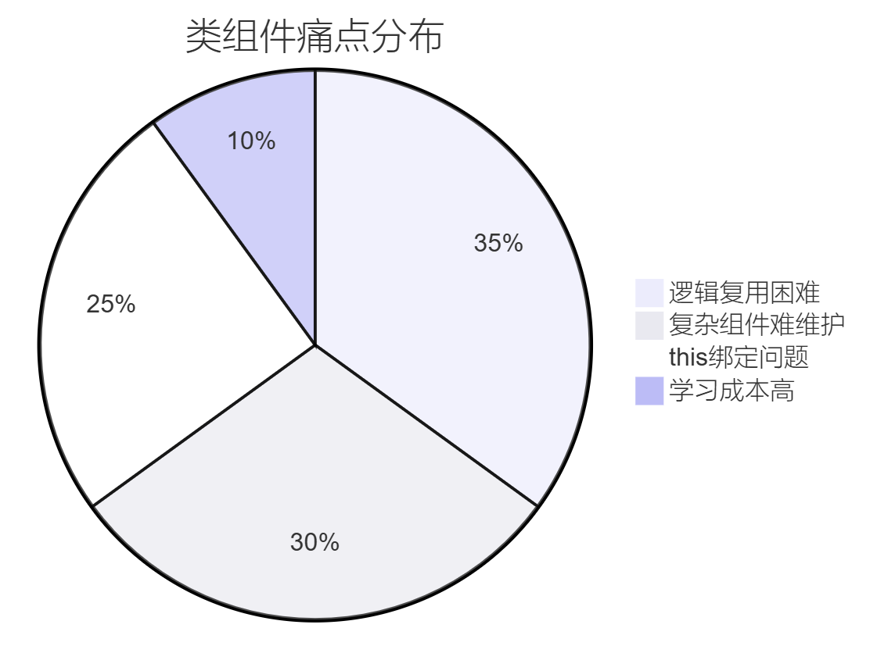

# 第六章：生命周期与 Hooks——从类组件到函数式演进

## 一、类组件生命周期原理全景解析

1. 生命周期的阶段划分


2. React 16.3+ 生命周期演进


​**​核心变化​**​：

- 废弃 componentWillMount, componentWillReceiveProps, componentWillUpdate

- 新增 getDerivedStateFromProps, getSnapshotBeforeUpdate

- ​**​Fiber架构​**​ 带来的​**​可中断渲染​**​机制

3. 生命周期方法分类详解

（1）挂载阶段

```jsx
class MountDemo extends React.Component {
  constructor(props) {
    super(props); // 必须首先调用
    this.state = { init: true };
    console.log('1. constructor执行');
  }

  static getDerivedStateFromProps(nextProps, prevState) {
    console.log('2. 派生状态计算');
    return null; // 需返回新状态或null
  }

  componentDidMount() {
    console.log('4. 挂载完成，可发起API请求');
  }

  render() {
    console.log('3. 渲染虚拟DOM');
    return <div>组件内容</div>;
  }
}
```

（2）更新阶段流程

```jsx
shouldComponentUpdate(nextProps, nextState) {
  // 必须返回布尔值
  return nextProps.id !== this.props.id;
}

getSnapshotBeforeUpdate(prevProps, prevState) {
  // 返回DOM更新前的快照数据
  return this.list.scrollHeight;
}

componentDidUpdate(prevProps, prevState, snapshot) {
  if (snapshot) {
    this.list.scrollTop += this.list.scrollHeight - snapshot;
  }
}
```

（3）卸载阶段

```jsx
componentWillUnmount() {
  // 清理定时器/取消订阅
  clearInterval(this.timer);
  this.socket.close();
}
```

## 二、Hooks 设计哲学与底层机制

1. Hooks 出现背景



2. Hooks 核心原理


​**​实现关键​**​：

- ​**​链表结构存储状态​**​：每个Hooks调用对应链表节点

- ​**​调用顺序一致性​**​：Hooks必须稳定在顶层调用

- ​**​闭包隔离机制​**​：函数组件每次渲染独立捕获状态

## 三、核心 Hooks 深度解析

1. useState 状态管理

```jsx
function Counter() {
  const [count, setCount] = useState(() => {
    // 惰性初始化
    const initial = Number(localStorage.getItem('count'));
    return initial || 0;
  });

  const increment = useCallback(() => {
    setCount(prev => {
      const newCount = prev + 1;
      localStorage.setItem('count', newCount);
      return newCount;
    });
  }, []);

  return <button onClick={increment}>{count}</button>;
}
```

​**​原理实现​**​：

```js
// 简化版伪代码
let hookStates = [];
let index = 0;

function useState(initialValue) {
  const currentIndex = index++;
  hookStates[currentIndex] = hookStates[currentIndex] ?? 
    (typeof initialValue === 'function' 
      ? initialValue() 
      : initialValue);
  
  const setState = (newValue) => {
    hookStates[currentIndex] = newValue;
    scheduleUpdate(); // 触发重新渲染
  };
  
  return [hookStates[currentIndex], setState];
}
```

2. useEffect 副作用管理

```jsx
function DataFetcher({ url }) {
  const [data, setData] = useState(null);

  useEffect(() => {
    let isMounted = true;
    const fetchData = async () => {
      const result = await axios.get(url);
      if (isMounted) setData(result.data);
    };

    fetchData();
    return () => {
      isMounted = false; // 清理操作
    };
  }, [url]); // 依赖项变化时重新执行

  return <div>{JSON.stringify(data)}</div>;
}
```

​**​依赖项控制策略​**​：


## 四、自定义 Hooks 开发模式

1. 通用数据请求Hook

```jsx
function useFetch(url, options) {
  const [data, setData] = useState(null);
  const [loading, setLoading] = useState(true);
  const [error, setError] = useState(null);

  useEffect(() => {
    const controller = new AbortController();
    const fetchData = async () => {
      try {
        const res = await fetch(url, {
          ...options，
          signal: controller.signal
        });
        const json = await res.json();
        setData(json);
      } catch (err) {
        if (!err.name === 'AbortError') {
          setError(err);
        }
      } finally {
        setLoading(false);
      }
    };

    fetchData();
    return () => controller.abort();
  }, [url, options]);

  return { data, loading, error };
}

// 使用示例
const { data } = useFetch('/api/user');
```

2. DOM 事件监听Hook

```jsx
function useEventListener(eventName, handler, element = window) {
  const savedHandler = useRef();

  useEffect(() => {
    savedHandler.current = handler;
  }, [handler]);

  useEffect(() => {
    const isSupported = element && element.addEventListener;
    if (!isSupported) return;

    const eventListener = (e) => savedHandler.current(e);
    element.addEventListener(eventName, eventListener);

    return () => element.removeEventListener(eventName, eventListener);
  }, [eventName, element]);
}
```

## 五、Hooks 性能优化模式

1. 依赖项优化矩阵

| 场景 | 依赖项写法 | 更新频率 | 
| -- | -- | -- |
| 初始运行一次 | [] | 一次 | 
| 依赖特定变量 | [count] | 随count变化 | 
| 状态依赖前值 | [state] | 和useEffect无差异 | 
| 动态回调 | 使用 | 依回调依赖变化 | 


2. 渲染性能优化

```jsx
const ExpensiveComponent = React.memo(({ list }) => {
  const sum = useMemo(() => 
    list.reduce((a, b) => a + b, 0), 
    [list]
  );

  const handleClick = useCallback(() => {
    console.log('Sum:', sum);
  }, [sum]);

  return <div onClick={handleClick}>{sum}</div>;
});
```

## 六、Hooks 限制与设计约束

1. Hooks 调用规则


2. ESLint规则配置

```json
{
  "plugins": ["react-hooks"],
  "rules": {
    "react-hooks/rules-of-hooks": "error",
    "react-hooks/exhaustive-deps": "warn"
  }
}
```

## 七、类组件与 Hooks 对比决策

| 考量维度 | 类组件 | 函数组件+Hooks | 
| -- | -- | -- |
| 代码简洁度 | 冗余 (this、生命周期模板) | 简洁直观 | 
| 逻辑复用 | HOC/Render Props | 自定义Hooks | 
| 学习曲线 | 较陡峭 (生命周期等概念) | 较平缓 (函数式思维) | 
| 性能优化 | shouldComponentUpdate | React.memo + useMemo | 
| TypeScript支持 | 类型声明复杂 | 类型推断方便 | 
| 未来发展 | 维护模式 | React官方主推方向 | 


## 八、未来趋势：并发模式下的Hooks

```jsx
function SuspenseDemo() {
  const [resource] = useState(() => {
    return wrapPromise(fetchData());
  });

  return (
    <Suspense fallback={<Spinner />}>
      <Profile resource={resource} />
    </Suspense>
  );
}

// 配合Transition使用
function App() {
  const [isPending, startTransition] = useTransition();
  const [tab, setTab] = useState('home');

  const switchTab = (nextTab) => {
    startTransition(() => {
      setTab(nextTab);
    });
  };

  return (
    <>
      {isPending && <Loading />}
      <TabButton onClick={() => switchTab('about')} />
      <Suspense>
        {tab === 'about' ? <About /> : <Home />}
      </Suspense>
    </>
  );
}
```

本章系统性地解构了React生命周期与Hooks的底层机制，揭示了函数式组件在现代React开发中的核心地位。下一章将深入组件间的通信机制，构建完整的React应用知识体系！