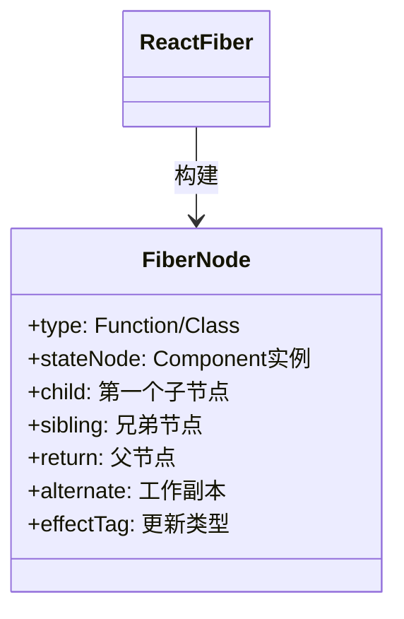
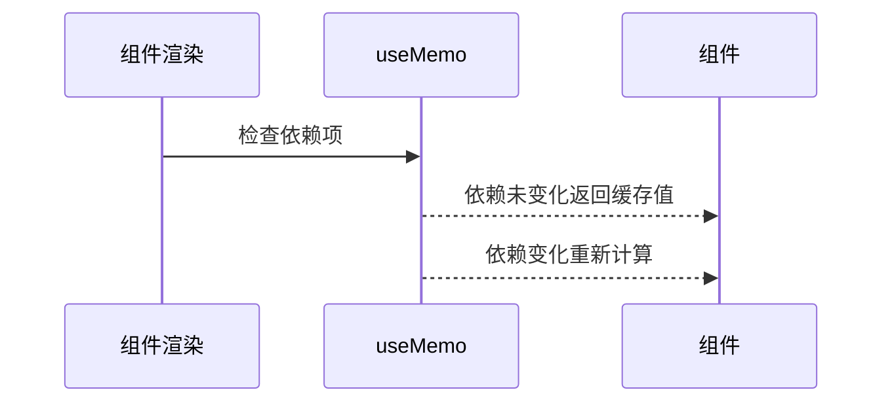
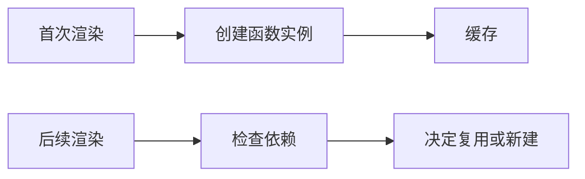
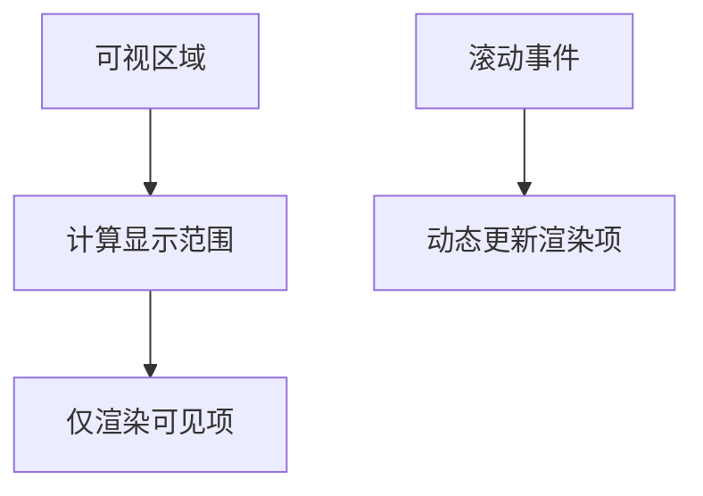
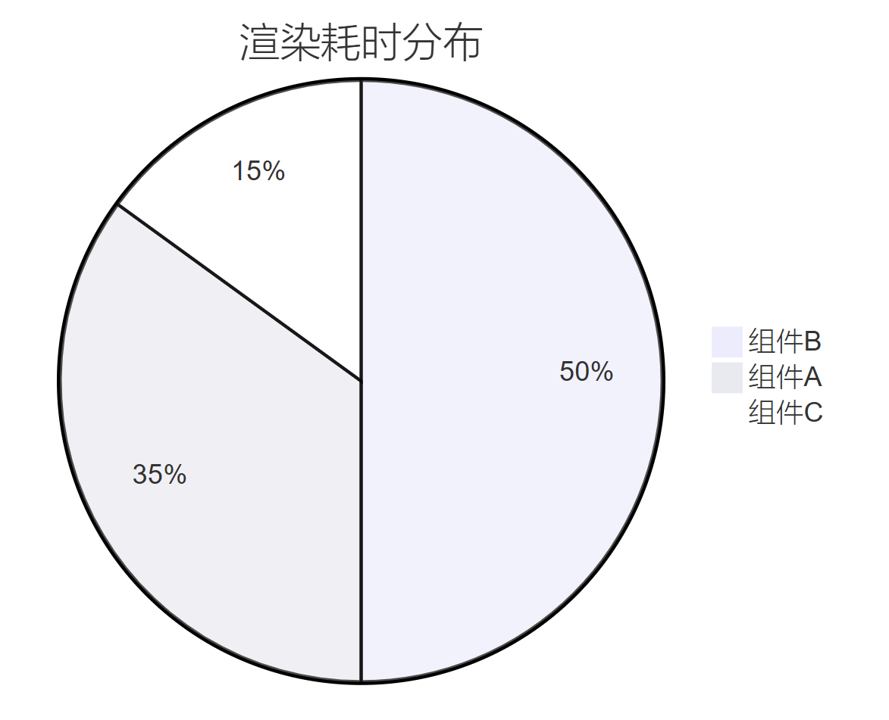
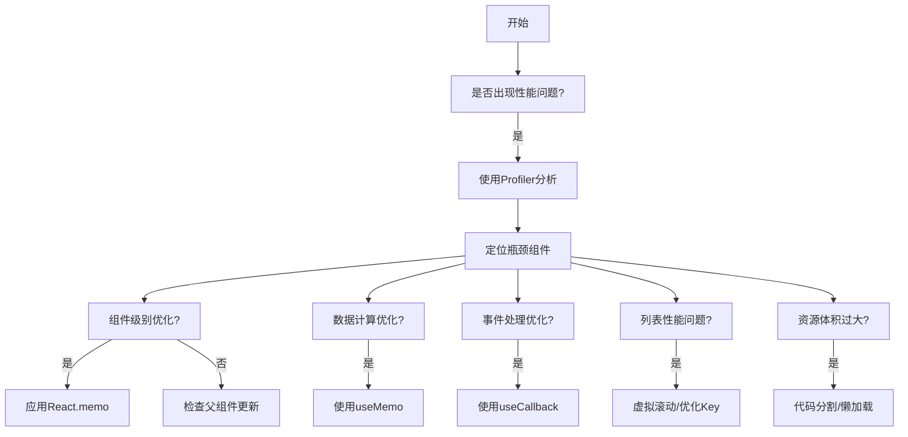

# 第九章：性能优化——打造高效React应用

## 一、React渲染机制深度解析

1. 虚拟DOM与协调（Reconciliation）原理


​**​核心过程​**​：

- ​**​虚拟DOM结构​**​：轻量级JS对象表示真实DOM

- ​**​Diff算法策略​**​：

	- 同层比较（O(n)复杂度）

	- Key值优化列表对比

	- 组件类型识别优化

- ​**​批量更新机制​**​：合并多个setState操作

2. Fiber架构与并发模式



​**​优化特性​**​：

- ​**​增量渲染​**​：将渲染工作拆分为多个小任务

- ​**​任务优先级​**​：区分用户交互与后台任务

- ​**​渲染可中断​**​：紧急任务可抢占执行

## 二、组件级优化策略

1. React.memo原理与使用

```jsx
const MemoComponent = React.memo(
  function MyComponent(props) {
    /* 渲染逻辑 */
  },
  (prevProps, nextProps) => {
    /* 自定义比较函数 */
    return prevProps.id === nextProps.id;
  }
);
```

​**​优化场景​**​：

- 纯展示型组件

- Props变化频率低

- 组件渲染成本高

​**​注意事项​**​：

- 避免滥用，比较函数本身有成本

- 确保所有相关Props都参与比较

- 搭配useCallback/useMemo使用

2. useMemo原理与性能优化

```jsx
const memoizedValue = useMemo(() => 
  computeExpensiveValue(a, b),
  [a, b] // 依赖项
);
```

​**​实现原理​**​：



​**​适用场景​**​：

- 高开销计算（如数据转换）

- 复杂对象创建

- 避免子组件不必要渲染

3. useCallback优化函数引用

```jsx
const memoizedCallback = useCallback(
  () => {
    doSomething(a, b);
  },
  [a, b] // 依赖项
);
```

​**​内存原理​**​：



​**​最佳实践​**​：

- 将回调函数传递给优化后的子组件

- 配合React.memo使用

- 避免在依赖项中遗漏关键变量

## 三、列表渲染优化方案

1. Key值选择策略

```jsx
// 错误示范
{items.map((item, index) => (
  <Item key={index} {...item} />
))}

// 正确做法
{items.map(item => (
  <Item key={item.id} {...item} />
))}
```

2. 虚拟滚动技术

```jsx
import { FixedSizeList } from 'react-window';

function VirtualList() {
  return (
    <FixedSizeList
      height={400}
      width={300}
      itemSize={50}
      itemCount={1000}
    >
      {({ index, style }) => (
        <div style={style}>Row {index}</div>
      )}
    </FixedSizeList>
  );
}
```

​**​实现原理​**​：



## 四、代码分割与懒加载

1. 动态import语法

```jsx
const OtherComponent = React.lazy(() => import('./OtherComponent'));

function MyComponent() {
  return (
    <Suspense fallback={<Spinner />}>
      <OtherComponent />
    </Suspense>
  );
}
```

2. 路由级代码分割

```jsx
const Home = React.lazy(() => import('./routes/Home'));
const About = React.lazy(() => import('./routes/About'));

function App() {
  return (
    <BrowserRouter>
      <Suspense fallback={<Loading />}>
        <Routes>
          <Route path="/" element={<Home />} />
          <Route path="/about" element={<About />} />
        </Routes>
      </Suspense>
    </BrowserRouter>
  );
}
```

## 五、高级优化技巧

1. 不可变数据优化

```jsx
// 错误：直接修改原数组
const newList = list.push(newItem);

// 正确：使用不可变更新
const newList = [...list, newItem];
```

2. 避免内联样式对象

```jsx
// 不佳实践
<div style={{ color: 'red', margin: 10 }} />

// 优化方案
const styles = useMemo(() => ({
  color: 'red',
  margin: 10
}), []);

<div style={styles} />
```

3. 事件节流与防抖

```jsx
import { throttle } from 'lodash';

function ScrollHandler() {
  const handleScroll = useMemo(
    () => throttle(() => {
      // 处理滚动逻辑
    }, 300),
    []
  );

  return <div onScroll={handleScroll} />;
}
```

## 六、性能分析工具链

1. React DevTools Profiler



2. Chrome Performance Tab

[https://example.com/performance-flamegraph.png](https://example.com/performance-flamegraph.png)

​**​关键指标​**​：

- 脚本执行时间

- 布局重排次数

- 内存占用曲线

## 七、优化策略决策树



本章系统性地拆解了React性能优化的核心策略与实现原理，从基础组件优化到架构级方案，构建了完整的性能优化知识体系。下一章将深入React生态工具链，探索大型项目的最佳实践！