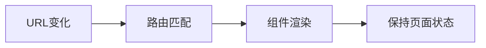

# 第十章：React Router —— 构建现代单页应用的路由体系

## 一、React Router 核心架构解析

1. 路由原理与设计哲学



​**​核心特性​**​：

- ​**​声明式路由​**​：路由即组件

- ​**​动态匹配​**​：嵌套路由与参数解析

- ​**​导航守卫​**​：路由拦截与权限控制

- ​**​历史管理​**​：支持BrowserRouter/HashRouter

2. 路由模式对比

| 模式 | 实现方式 | 适用场景 | 
| -- | -- | -- |
| BrowserRouter | HTML5 History API | 生产环境（需服务端支持） | 
| HashRouter | URL Hash | 静态服务器部署 | 
| MemoryRouter | 内存路由 | 测试/移动端集成 | 


## 二、路由配置全解析（React Router v6）

1. 基础路由配置

```jsx
import { BrowserRouter, Routes, Route } from 'react-router-dom';

function App() {
  return (
    <BrowserRouter>
      <Routes>
        <Route path="/" element={<Home />} />
        <Route path="about" element={<About />} />
        <Route path="users" element={<Users />}>
          <Route index element={<UserList />} />
          <Route path=":userId" element={<UserProfile />} />
        </Route>
        <Route path="*" element={<NotFound />} />
      </Routes>
    </BrowserRouter>
  );
}
```

2. 动态路由参数

```jsx
// 路由定义
<Route path="products/:id" element={<ProductDetail />} />

// 组件内获取参数
import { useParams } from 'react-router-dom';

function ProductDetail() {
  const { id } = useParams();
  const product = fetchProduct(id);
  return <div>{product.name}</div>;
}
```

3. 嵌套路由实现

```jsx
// 父路由组件中使用Outlet
import { Outlet } from 'react-router-dom';

function Dashboard() {
  return (
    <div>
      <h1>控制面板</h1>
      <nav>{/* 子路由导航 */}</nav>
      <Outlet /> {/* 子路由渲染位置 */}
    </div>
  );
}

// 路由配置
<Route path="dashboard" element={<Dashboard />}>
  <Route index element={<DashboardHome />} />
  <Route path="settings" element={<Settings />} />
</Route>
```

## 三、导航与路由控制

1. 声明式导航组件

```jsx
import { Link, NavLink } from 'react-router-dom';

// 基础导航
<Link to="/about">关于我们</Link>

// 激活状态样式
<NavLink 
  to="/users"
  className={({ isActive }) => 
    isActive ? 'active-link' : 'normal-link'
  }
>
  用户列表
</NavLink>
```

2. 编程式导航

```jsx
import { useNavigate } from 'react-router-dom';

function LoginButton() {
  const navigate = useNavigate();

  const handleLogin = async () => {
    await login();
    navigate('/dashboard', { 
      replace: true,
      state: { from: location }
    });
  };

  return <button onClick={handleLogin}>登录</button>;
}
```

3. 导航守卫实现

```jsx
// 高阶组件实现权限控制
function RequireAuth({ children }) {
  const { user } = useAuth();
  const location = useLocation();

  if (!user) {
    return <Navigate to="/login" state={{ from: location }} replace />;
  }

  return children;
}

// 路由配置中使用
<Route 
  path="/profile"
  element={
    <RequireAuth>
      <Profile />
    </RequireAuth>
  }
/>
```

## 四、高级路由模式

1. 路由懒加载优化

```jsx
const ProductList = lazy(() => import('./ProductList'));

<Route 
  path="products"
  element={
    <Suspense fallback={<Loading />}>
      <ProductList />
    </Suspense>
  }
/>
```

2. 路由数据预加载

```jsx
// 使用loader函数（React Router v6.4+）
export async function loader({ params }) {
  const product = await fetchProduct(params.id);
  return json(product);
}

// 路由配置
<Route 
  path="products/:id"
  element={<ProductDetail />}
  loader={loader}
/>

// 组件内获取数据
import { useLoaderData } from 'react-router-dom';

function ProductDetail() {
  const product = useLoaderData();
  return <div>{product.name}</div>;
}
```

3. 动态路由表配置

```jsx
// 集中式路由配置
const routes = [
  { path: '/', element: <Home /> },
  { 
    path: 'dashboard',
    element: <Dashboard />,
    children: [
      { index: true, element: <DashboardHome /> },
      { path: 'settings', element: <Settings /> }
    ]
  }
];

function App() {
  return (
    <BrowserRouter>
      <Routes>
        {routes.map((route, index) => (
          <Route key={index} {...route} />
        ))}
      </Routes>
    </BrowserRouter>
  );
}
```

## 五、路由性能优化

1. 路由代码分割

```jsx
const ProductList = lazy(() => import(
  /* webpackChunkName: "products" */
  './ProductList'
));

<Route 
  path="products"
  element={
    <Suspense fallback={<Loading />}>
      <ProductList />
    </Suspense>
  }
/>
```

2. 滚动恢复管理

```jsx
import { ScrollRestoration } from 'react-router-dom';

function App() {
  return (
    <>
      <ScrollRestoration 
        getKey={(location) => {
          return location.pathname;
        }}
      />
      {/* 其他路由内容 */}
    </>
  );
}
```

3. 路由缓存策略

```jsx
// 使用路由状态保持组件状态
<Route 
  path="projects/:id"
  element={
    <KeepAlive max={3}>
      <ProjectDetail />
    </KeepAlive>
  }
/>

// 自定义KeepAlive组件实现
function KeepAlive({ children, max }) {
  const [cache, setCache] = useState([]);
  const location = useLocation();

  useEffect(() => {
    setCache(prev => {
      const newCache = prev.filter(item => 
        item.key !== location.key
      );
      newCache.unshift({
        key: location.key,
        children: children
      });
      return newCache.slice(0, max);
    });
  }, [location.key]);

  return (
    <>
      {cache.map(item => (
        <div 
          key={item.key}
          hidden={item.key !== location.key}
        >
          {item.children}
        </div>
      ))}
    </>
  );
}
```

## 六、路由调试与测试

1. 开发工具集成

```jsx
// 安装路由开发工具
npm install @redux-devtools/extension -D

// 路由历史记录查看
import { unstable_HistoryRouter as HistoryRouter } from 'react-router-dom';
import { createBrowserHistory } from 'history';

const history = createBrowserHistory();

// 在开发者工具中查看路由状态
if (process.env.NODE_ENV === 'development') {
  window.__history = history;
}
```

2. 单元测试策略

```jsx
// 使用Testing Library测试路由
import { render, screen } from '@testing-library/react';
import { BrowserRouter } from 'react-router-dom';

test('navigates to about page', async () => {
  render(
    <BrowserRouter>
      <App />
    </BrowserRouter>
  );

  userEvent.click(screen.getByText(/about/i));
  expect(
    await screen.findByText('About Page Content')
  ).toBeInTheDocument();
});
```

## 七、企业级路由最佳实践

1. 权限路由配置方案

```jsx
// 动态生成路由表
function generateRoutes(userRole) {
  const baseRoutes = [
    { path: '/', element: <Home /> },
    { path: '/login', element: <Login /> }
  ];

  if (userRole === 'admin') {
    baseRoutes.push({
      path: '/admin',
      element: <AdminDashboard />
    });
  }

  return baseRoutes;
}

// 应用配置
function App() {
  const { role } = useAuth();
  return (
    <BrowserRouter>
      <Routes>
        {generateRoutes(role).map((route, i) => (
          <Route key={i} {...route} />
        ))}
      </Routes>
    </BrowserRouter>
  );
}
```

2. 微前端路由集成

```jsx
// 主应用路由配置
<Routes>
  <Route path="/*" element={<MainApp />} />
  <Route 
    path="/micro-frontend/*"
    element={<MicroFrontendRouter />}
  />
</Routes>

// 微前端路由处理
function MicroFrontendRouter() {
  return (
    <div id="micro-frontend-container">
      {/* 动态加载微前端应用 */}
    </div>
  );
}
```

本章系统性地构建了React Router的知识体系，从基础配置到企业级实践，覆盖了现代单页应用路由管理的核心场景。下一章将深入状态管理库Redux，完善大型应用的数据流架构！