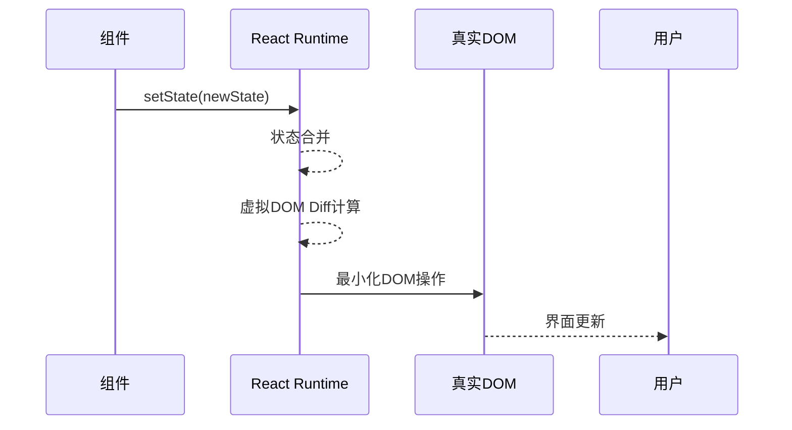
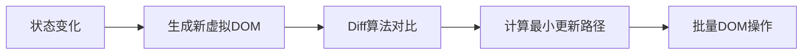
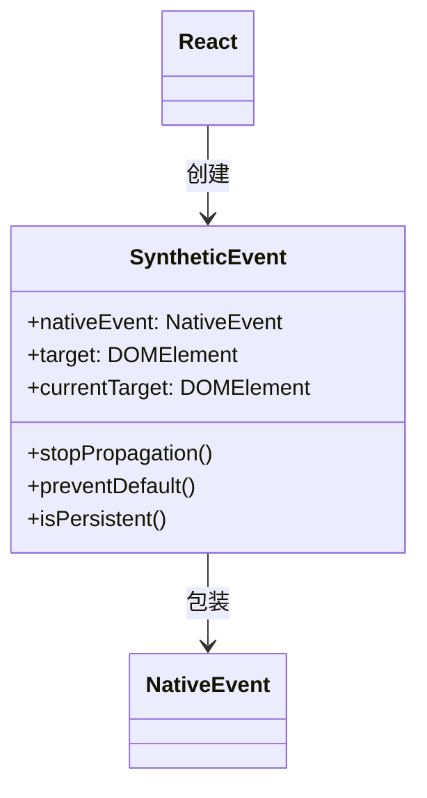
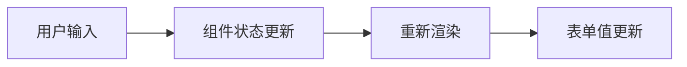
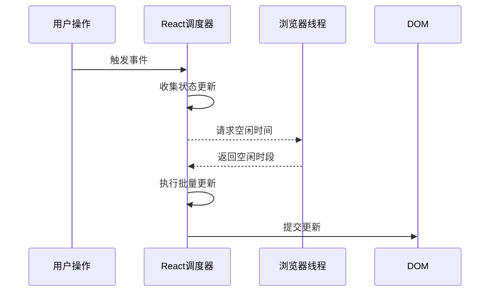
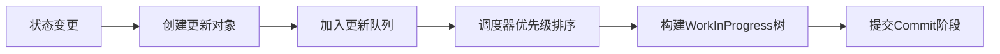

# 第五章：State与事件处理 —— React的动态核心

## 一、State机制原理剖析

1. React状态管理本质

React的状态管理基于​**​单向数据流​**​和​**​不可变数据​**​原则，通过状态变化驱动视图更新。其核心运作流程如下：



​**​关键机制​**​：

- ​**​异步更新​**​：多个setState调用会被批量处理

- ​**​不可变数据​**​：通过创建新状态对象保证可预测性

- ​**​渲染优化​**​：仅更新受状态变化影响的DOM节点

2. 虚拟DOM与状态更新



## 二、State使用全指南

1. 类组件状态管理

```jsx
class Counter extends React.Component {
  constructor(props) {
    super(props);
    this.state = { count: 0 };
  }

  increment = () => {
    // 正确：使用函数式更新
    this.setState(prevState => ({
      count: prevState.count + 1
    }));
  };

  render() {
    return (
      <div>
        <p>Count: {this.state.count}</p>
        <button onClick={this.increment}>+</button>
      </div>
    );
  }
}
```

2. 函数组件Hooks方案

```jsx
import { useState } from 'react';

function Counter() {
  const [count, setCount] = useState(0);
  const [history, setHistory] = useState([]);

  const increment = () => {
    setCount(prev => {
      const newCount = prev + 1;
      setHistory(h => [...h, newCount]);
      return newCount;
    });
  };

  return (
    <div>
      <p>Current: {count}</p>
      <button onClick={increment}>+</button>
    </div>
  );
}
```

3. 状态提升模式

```jsx
// 子组件
function TemperatureInput({ value, scale, onChange }) {
  return (
    <div>
      <input 
        value={value}
        onChange={(e) => onChange(e.target.value, scale)}
      />
      <span>°{scale}</span>
    </div>
  );
}

// 父组件
function Calculator() {
  const [celsius, setCelsius] = useState('');

  const handleCelsiusChange = (value) => {
    setCelsius(value);
  };

  const handleFahrenheitChange = (value) => {
    setCelsius(fToC(value));
  };

  return (
    <div>
      <TemperatureInput scale="C" value={celsius}
        onChange={handleCelsiusChange} />
      <TemperatureInput scale="F" value={cToF(celsius)}
        onChange={handleFahrenheitChange} />
    </div>
  );
}
```

## 三、事件系统深度解析

1. 合成事件（SyntheticEvent）原理

React实现的事件系统抽象层：



​**​核心特性​**​：

- 跨浏览器兼容

- 事件池机制（性能优化）

- 自动绑定组件实例

2. 事件处理最佳实践

```jsx
// 类组件绑定
class LoggingButton extends React.Component {
  handleClick = (e) => {
    console.log('Event type:', e.type);
  };

  render() {
    return <button onClick={this.handleClick}>Click</button>;
  }
}

// 函数组件处理
function SearchBar() {
  const handleSubmit = (e) => {
    e.preventDefault();
    console.log('Form submitted');
  };

  return (
    <form onSubmit={handleSubmit}>
      <input type="text" />
      <button type="submit">Search</button>
    </form>
  );
}
```

3. 高阶事件模式

```jsx
// 事件传参
function ListItem({ id, text }) {
  const handleDelete = (itemId, e) => {
    console.log('Deleting:', itemId);
    e.stopPropagation();
  };

  return (
    <li onClick={() => console.log('Item clicked')}>
      {text}
      <button onClick={(e) => handleDelete(id, e)}>Delete</button>
    </li>
  );
}
```

## 四、受控与非受控组件

1. 受控组件原理



```jsx
function ControlledForm() {
  const [value, setValue] = useState('');

  const handleChange = (e) => {
    setValue(e.target.value.toUpperCase());
  };

  return (
    <input 
      type="text"
      value={value}
      onChange={handleChange}
    />
  );
}
```

2. 非受控组件实现

```jsx
import { useRef } from 'react';

function FileUploader() {
  const fileInput = useRef(null);

  const handleSubmit = (e) => {
    e.preventDefault();
    console.log('Selected file:', fileInput.current.files[0]);
  };

  return (
    <form onSubmit={handleSubmit}>
      <input 
        type="file"
        ref={fileInput}
      />
      <button type="submit">Upload</button>
    </form>
  );
}
```

3. 混合模式实现

```jsx
function HybridInput() {
  const [value, setValue] = useState('');
  const inputRef = useRef(null);

  const handleBlur = () => {
    setValue(inputRef.current.value.trim());
  };

  return (
    <input
      ref={inputRef}
      defaultValue={value}
      onBlur={handleBlur}
    />
  );
}
```

## 五、性能优化策略

1. 状态更新优化

```jsx
// 使用函数式更新避免状态依赖
const [count, setCount] = useState(0);
const increment = () => setCount(prev => prev + 1);

// 状态合并示例
const [user, setUser] = useState({ 
  name: '',
  age: 0 
});

const updateName = (name) => {
  setUser(prev => ({ ...prev, name }));
};
```

2. 事件处理器优化

```jsx
// 使用useCallback缓存事件处理
const handleClick = useCallback(() => {
  console.log('Optimized click');
}, []);

// Memoized组件优化
const MemoButton = React.memo(({ onClick }) => (
  <button onClick={onClick}>Click</button>
));
```

## 六、深度原理扩展

1. React更新批处理机制



2. Fiber架构与状态更新



本章从底层原理到实践应用，系统性地解析了React的状态管理与事件处理机制。后续章节将深入生命周期与Hooks的高级用法，进一步释放React的开发潜力！