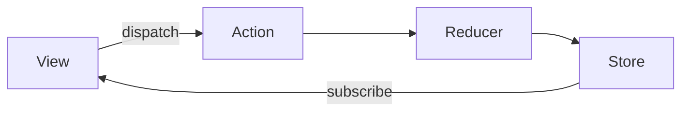

# 第十一章：状态管理 - Redux —— 构建可预测化数据流

## 一、Redux 核心概念体系

1. 单向数据流架构



​**​核心要素​**​：

- ​**​Store​**​：唯一数据源，存储全局状态

- ​**​Action​**​：描述状态变化的普通对象

- ​**​Reducer​**​：纯函数，接收旧状态和Action，返回新状态

2. 设计原则

- ​**​单一数据源​**​：整个应用状态存储在一个对象树中

- ​**​状态只读​**​：唯一改变状态的方式是触发Action

- ​**​纯函数修改​**​：Reducer必须是无副作用的纯函数

## 二、Redux 基础实现

1. 创建Store

```javascript
import { createStore } from 'redux';

const initialState = { count: 0 };

function counterReducer(state = initialState, action) {
  switch (action.type) {
    case 'INCREMENT':
      return { ...state, count: state.count + 1 };
    case 'DECREMENT':
      return { ...state, count: state.count - 1 };
    default:
      return state;
  }
}

const store = createStore(counterReducer);
```

2. Action与Action Creator

```javascript
// Action类型
const INCREMENT = 'INCREMENT';
const DECREMENT = 'DECREMENT';

// Action Creator
const increment = (payload) => ({
  type: INCREMENT,
  payload
});

// 触发Action
store.dispatch(increment(5));
```

3. Reducer组合拆分

```javascript
// 根Reducer
import { combineReducers } from 'redux';

const rootReducer = combineReducers({
  counter: counterReducer,
  user: userReducer
});

// 子Reducer
function userReducer(state = {}, action) {
  switch (action.type) {
    case 'SET_USER':
      return { ...action.payload };
    default:
      return state;
  }
}
```

## 三、React-Redux 集成

1. Provider 注入

```jsx
import { Provider } from 'react-redux';

ReactDOM.render(
  <Provider store={store}>
    <App />
  </Provider>,
  document.getElementById('root')
);
```

2. Hooks 连接组件

```jsx
import { useSelector, useDispatch } from 'react-redux';

function Counter() {
  const count = useSelector(state => state.counter);
  const dispatch = useDispatch();

  return (
    <div>
      <button onClick={() => dispatch({ type: 'DECREMENT' })}>-</button>
      <span>{count}</span>
      <button onClick={() => dispatch({ type: 'INCREMENT' })}>+</button>
    </div>
  );
}
```

3. 类组件连接

```jsx
import { connect } from 'react-redux';

class UserProfile extends React.Component {
  render() {
    return <div>{this.props.user.name}</div>;
  }
}

const mapStateToProps = state => ({
  user: state.user
});

export default connect(mapStateToProps)(UserProfile);
```

## 四、异步操作与中间件

1. redux-thunk 处理异步

```javascript
const fetchUser = (userId) => async (dispatch) => {
  dispatch({ type: 'USER_REQUEST' });
  try {
    const res = await api.getUser(userId);
    dispatch({ type: 'USER_SUCCESS', payload: res.data });
  } catch (err) {
    dispatch({ type: 'USER_FAILURE', error: err.message });
  }
};

// 配置Store
import thunk from 'redux-thunk';
const store = createStore(rootReducer, applyMiddleware(thunk));
```

2. redux-saga 处理复杂流程

```javascript
import { call, put, takeEvery } from 'redux-saga/effects';

function* fetchUserSaga(action) {
  try {
    const user = yield call(api.getUser, action.payload);
    yield put({ type: 'USER_SUCCESS', payload: user });
  } catch (err) {
    yield put({ type: 'USER_FAILURE', error: err });
  }
}

function* rootSaga() {
  yield takeEvery('USER_REQUEST', fetchUserSaga);
}

// 配置saga中间件
import createSagaMiddleware from 'redux-saga';
const sagaMiddleware = createSagaMiddleware();
const store = createStore(reducer, applyMiddleware(sagaMiddleware));
sagaMiddleware.run(rootSaga);
```

## 五、现代Redux实践（Redux Toolkit）

1. 创建Slice

```javascript
import { createSlice } from '@reduxjs/toolkit';

const counterSlice = createSlice({
  name: 'counter',
  initialState: 0,
  reducers: {
    increment: (state, action) => state + action.payload,
    decrement: (state, action) => state - action.payload
  }
});

export const { increment, decrement } = counterSlice.actions;
export default counterSlice.reducer;
```

2. 配置Store

```javascript
import { configureStore } from '@reduxjs/toolkit';

const store = configureStore({
  reducer: {
    counter: counterReducer,
    [api.reducerPath]: api.reducer
  },
  middleware: (getDefaultMiddleware) =>
    getDefaultMiddleware().concat(api.middleware)
});
```

3. 异步Thunk集成

```javascript
import { createAsyncThunk } from '@reduxjs/toolkit';

export const fetchUser = createAsyncThunk(
  'user/fetch',
  async (userId, thunkAPI) => {
    const response = await api.getUser(userId);
    return response.data;
  }
);
```

## 六、性能优化策略

1. 记忆化Selector

```javascript
import { createSelector } from '@reduxjs/toolkit';

const selectUser = state => state.user;

export const selectUserName = createSelector(
  [selectUser],
  (user) => user.name
);
```

2. 批量更新优化

```javascript
// 使用redux-batched-actions
import { batch } from 'react-redux';

batch(() => {
  dispatch({ type: 'UPDATE_FIELD_A', payload: 1 });
  dispatch({ type: 'UPDATE_FIELD_B', payload: 2 });
});
```

3. 不可变数据优化

```javascript
// 使用immer编写Reducer
const todosSlice = createSlice({
  name: 'todos',
  initialState: [],
  reducers: {
    addTodo: (state, action) => {
      state.push(action.payload); // 直接修改草案
    }
  }
});
```

## 七、企业级最佳实践

1. 项目结构组织

```
/src
  /store
    /slices
      counterSlice.js
      userSlice.js
    /services
      api.js
    rootReducer.js
    store.js
```

2. 类型安全实践（TypeScript）

```typescript
typescript复制// 定义RootState类型
export type RootState = ReturnType<typeof store.getState>;

// 类型化useSelector
export const useAppSelector: TypedUseSelectorHook<RootState> = useSelector;
```

3. 持久化方案

```javascript
// 使用redux-persist
import { persistStore, persistReducer } from 'redux-persist';
import storage from 'redux-persist/lib/storage';

const persistConfig = {
  key: 'root',
  storage
};

const persistedReducer = persistReducer(persistConfig, rootReducer);
const store = createStore(persistedReducer);
const persistor = persistStore(store);
```

## 八、调试与测试

1. Redux DevTools 集成

```javascript
const store = configureStore({
  reducer,
  devTools: process.env.NODE_ENV !== 'production'
});
```

2. 单元测试策略

```javascript
// 测试Reducer
test('should handle increment', () => {
  const newState = counterReducer(0, increment(5));
  expect(newState).toEqual(5);
});

// 测试Saga
test('fetchUser Saga', () => {
  const generator = fetchUserSaga();
  expect(generator.next().value).toEqual(call(api.getUser, 1));
});
```

本章从基础到进阶，系统构建了Redux知识体系，结合现代工具链实现高效状态管理。下一章将深入数据获取与API集成，完成前后端协作的完整闭环！