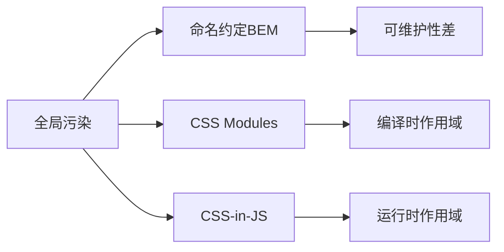
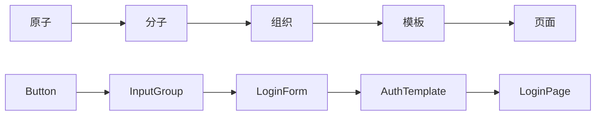

# 第十三章：样式与UI库 —— 构建统一的设计系统

## 一、CSS模块化演进之路

1. CSS作用域解决方案对比



​**​实现原理对比​**​：

- ​**​**BEM​​：通过命名规则隔离作用域（.block__element--modifier）

- ​​CSS Modules​​：编译时生成唯一类名（[filename]_[classname]_[hash]）

- ​​CSS-in-JS​​：运行时动态插入`<style>`标签

2. CSS Modules深度应用

```css
/* styles.module.css */
.primaryButton {
  padding: 12px 24px;
  background: var(--primary-color);
}

.error {
  composes: primaryButton;
  background: var(--error-color);
}
```

```jsx
import styles from './styles.module.css';

function Button({ isError }) {
  return (
    <button className={isError ? styles.error : styles.primaryButton}>
      Click Me
    </button>
  );
}
```

​**​构建配置​**​：

```javascript
// webpack.config.js
module.exports = {
  module: {
    rules: [
      {
        test: /\.module\.css$/,
        use: [
          'style-loader',
          {
            loader: 'css-loader',
            options: {
              modules: {
                localIdentName: '[name]__[local]--[hash:base64:5]'
              }
            }
          }
        ]
      }
    ]
  }
};
```

## 二、CSS-in-JS革命：Styled Components

1. 基础样式组件

```jsx
import styled from 'styled-components';

const StyledButton = styled.button`
  padding: ${props => props.size === 'large' ? '16px 32px' : '8px 16px'};
  background: ${({ theme }) => theme.primary};
  border-radius: 4px;
  &:hover {
    opacity: 0.9;
  }
`;

function App() {
  return (
    <StyledButton size="large">
      Submit
    </StyledButton>
  );
}
```

2. 主题管理方案

```jsx
// 定义主题
const theme = {
  colors: {
    primary: '#1890ff',
    secondary: '#52c41a'
  }
};

// 主题提供者
<ThemeProvider theme={theme}>
  <App />
</ThemeProvider>

// 组件中使用
const Header = styled.header`
  background: ${({ theme }) => theme.colors.primary};
`;
```

3. 动态样式扩展

```jsx
const rotating = keyframes`
  from { transform: rotate(0deg); }
  to { transform: rotate(360deg); }
`;

const RotatingLogo = styled(Logo)`
  animation: ${rotating} 2s linear infinite;
  color: ${props => props.color};
`;

// 使用动态属性
<RotatingLogo color="#1890ff" />
```

## 三、企业级UI库集成（Ant Design）

1. 基础组件使用

```jsx
import { Button, Table } from 'antd';

function UserList() {
  const columns = [
    { title: 'Name', dataIndex: 'name' },
    { title: 'Age', dataIndex: 'age' }
  ];

  return (
    <div>
      <Button type="primary">Add User</Button>
      <Table 
        dataSource={users}
        columns={columns}
        rowKey="id"
      />
    </div>
  );
}
```

2. 主题定制方案

```less
// 自定义主题变量
@primary-color: #1da57a;
@border-radius-base: 4px;

// webpack配置
module.exports = {
  rules: [{
    test: /\.less$/,
    use: [{
      loader: 'style-loader',
    }, {
      loader: 'css-loader',
    }, {
      loader: 'less-loader',
      options: {
        lessOptions: {
          modifyVars: {
            'primary-color': '#1da57a',
          },
          javascriptEnabled: true,
        },
      },
    }]
  }]
}
```

3. 组件样式覆盖

```jsx
// 使用CSS Modules
import styles from './CustomTable.module.less';

<Table
  className={styles.customTable}
  // ...
/>

// 自定义样式文件
.customTable {
  :global {
    .ant-table-thead > tr > th {
      background: var(--table-header-bg);
    }
  }
}
```

## 四、设计系统构建实践

1. 原子设计方法论



2. 样式变量管理

```scss
// variables.scss
$color-primary: #1890ff;
$color-secondary: #52c41a;
$spacing-unit: 8px;

:export {
  primaryColor: $color-primary;
  spacingUnit: $spacing-unit;
}
```

```jsx
// 在JS中访问
import variables from 'styles/variables.scss';

const Header = styled.div`
  padding: ${parseInt(variables.spacingUnit) * 4}px;
  color: ${variables.primaryColor};
`;
```

3. Storybook可视化开发

```jsx
// Button.stories.jsx
export default {
  title: 'Design System/Button',
  component: Button,
  argTypes: {
    variant: {
      control: {
        type: 'select',
        options: ['primary', 'secondary']
      }
    }
  }
};

const Template = (args) => <Button {...args} />;

export const Primary = Template.bind({});
Primary.args = {
  children: 'Primary Button',
  variant: 'primary'
};
```

## 五、性能优化策略

1. 关键CSS提取

```javascript
// 使用webpack插件
const MiniCssExtractPlugin = require('mini-css-extract-plugin');

module.exports = {
  plugins: [
    new MiniCssExtractPlugin({
      filename: '[name].[contenthash].css'
    })
  ],
  module: {
    rules: [
      {
        test: /\.css$/,
        use: [MiniCssExtractPlugin.loader, 'css-loader']
      }
    ]
  }
};
```

2. CSS压缩优化

```javascript
// 使用cssnano
const CssMinimizerPlugin = require('css-minimizer-webpack-plugin');

module.exports = {
  optimization: {
    minimizer: [
      new CssMinimizerPlugin({
        minimizerOptions: {
          preset: ['default', { discardComments: { removeAll: true } }]
        }
      })
    ]
  }
};
```

3. 字体与图标优化

```jsx
// 按需加载字体
import { loadFont } from 'font-loader';

useEffect(() => {
  loadFont({
    family: 'Roboto',
    url: '/fonts/roboto.woff2'
  });
}, []);

// SVG图标组件化
import { ReactComponent as Logo } from './logo.svg';

function Header() {
  return <Logo className="header-logo" />;
}
```

## 六、无障碍（A11Y）实践

1. ARIA属性规范

```jsx
<div
  role="dialog"
  aria-labelledby="dialog-title"
  aria-describedby="dialog-content"
>
  <h2 id="dialog-title">确认操作</h2>
  <p id="dialog-content">确定要删除此项吗？</p>
</div>
```

2. 键盘导航支持

```jsx
const handleKeyDown = (e) => {
  if (e.key === 'Enter') {
    onSubmit();
  }
};

<Button 
  onKeyDown={handleKeyDown}
  tabIndex="0"
>
  提交
</Button>
```

3. 颜色对比检测

```javascript
// 使用color库计算对比度
import Color from 'color';

const contrastRatio = Color('#fff').contrast(Color('#000'));
if (contrastRatio < 4.5) {
  console.warn('颜色对比度不足');
}
```

本章系统构建了React样式管理与UI库集成的完整知识体系，从原子设计到企业级设计系统，覆盖了现代前端开发的视觉层核心实践。下一章将深入测试与调试领域，打造高质量代码的保障体系！