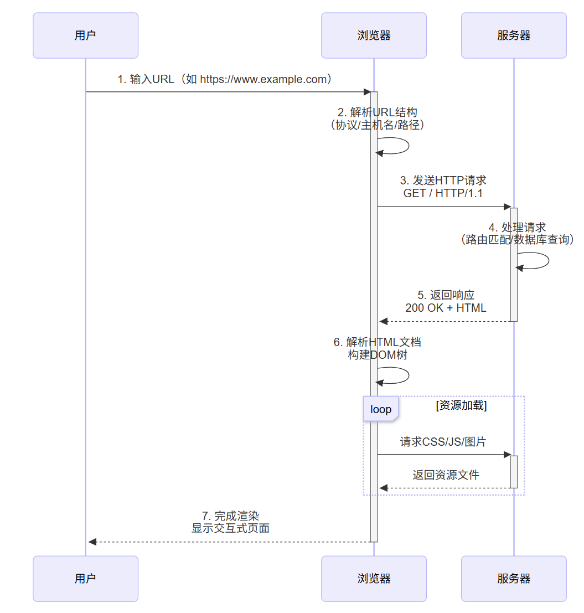

# **第四章：HTTP 与 Web 基础**

## **1. HTTP 简介（超文本传输协议）**

### **1.1 什么是 HTTP？**

HTTP（HyperText Transfer Protocol，超文本传输协议）是**客户端（浏览器）与服务器之间的通信协议**，用于请求和传输网页数据。

### **1.2 HTTP 的特点**

- 无状态：每次请求都是独立的，服务器不会记住上一次的请求状态。

- 基于请求-响应模式：浏览器（客户端）发送请求，服务器返回响应。

- 明文传输：默认情况下，HTTP 数据不加密，容易被窃听（可使用 HTTPS 解决）。

### **1.3 HTTP 的作用**

- 负责**网页数据的传输**，如 HTML、CSS、JavaScript、图片等资源。

- 允许**前端与后端通信**，实现动态网页交互。

## **2. HTTP 请求与响应的基本流程**



```
---
config:
  theme: default
---
sequenceDiagram
    participant 用户
    participant 浏览器
    participant 服务器

    用户 ->> 浏览器: 1. 输入URL（如 https://www.example.com）
    activate 浏览器
    浏览器 ->> 浏览器: 2. 解析URL结构<br/>（协议/主机名/路径）
    浏览器 ->> 服务器: 3. 发送HTTP请求<br/>GET / HTTP/1.1
    activate 服务器
    服务器 ->> 服务器: 4. 处理请求<br/>（路由匹配/数据库查询）
    服务器 -->> 浏览器: 5. 返回响应<br/>200 OK + HTML
    deactivate 服务器
    
    浏览器 ->> 浏览器: 6. 解析HTML文档<br/>构建DOM树
    loop 资源加载
        浏览器 ->> 服务器: 请求CSS/JS/图片
        activate 服务器
        服务器 -->> 浏览器: 返回资源文件
        deactivate 服务器
    end
    
    浏览器 -->> 用户: 7. 完成渲染<br/>显示交互式页面
    deactivate 浏览器
```

### **2.1 HTTP 工作流程**

1. 用户输入 URL（如 

1. 浏览器解析 URL，提取 **协议（http/https）**、**主机名**、**资源路径**。

1. 浏览器发送 HTTP 请求（请求方法 + 请求头）。

1. 服务器处理请求，返回响应（状态码 + 响应头 + 响应体）。

1. 浏览器解析 HTML，加载资源（CSS、JS、图片等）。

1. 页面展示给用户。

### **2.2 示例：HTTP 请求-响应**

#### **请求示例**

```http
GET /index.html HTTP/1.1
Host: www.example.com
User-Agent: Mozilla/5.0
Accept: text/html
```

#### **响应示例**

```http
HTTP/1.1 200 OK
Content-Type: text/html
Content-Length: 1024

<html>
  <body>
    <h1>欢迎访问我的网站</h1>
  </body>
</html>
```

## **3. HTTP 请求方法（GET、POST、PUT、DELETE）**

HTTP 定义了多种请求方法，常见的有：

| 方法 | 作用 | 适用场景 | 
| -- | -- | -- |
| GET | 请求数据 | 访问网页、查询数据 | 
| POST | 发送数据 | 提交表单、上传文件 | 
| PUT | 更新数据 | 修改资源（如更新用户信息） | 
| DELETE | 删除数据 | 删除资源 | 


### **3.1 GET 请求示例**

```http
GET /search?q=html HTTP/1.1
Host: www.example.com
```

- 参数放在 URL 中，如 ?q=html

- 适用于**无副作用的请求**（查询数据）

### **3.2 POST 请求示例**

```http
POST /login HTTP/1.1
Host: www.example.com
Content-Type: application/x-www-form-urlencoded
Content-Length: 32

username=admin&password=123456
```

- 参数放在请求体中

- 适用于**有副作用的请求**（提交数据）

## **4. HTTP 状态码（200、404、500 等）**

HTTP 响应包含 **状态码**，表示请求的处理情况。

| 状态码 | 分类 | 说明 | 
| -- | -- | -- |
| 1xx | 信息 | 请求已接收，继续处理 | 
| 2xx | 成功 | 请求成功（如 200 OK） | 
| 3xx | 重定向 | 资源已移动（如 301 Moved Permanently） | 
| 4xx | 客户端错误 | 请求错误（如 404 Not Found） | 
| 5xx | 服务器错误 | 服务器异常（如 500 Internal Server Error） | 


### **4.1 常见状态码**

| 状态码 | 说明 | 
| -- | -- |
| 200 OK | 请求成功 | 
| 301 Moved Permanently | 资源永久重定向 | 
| 302 Found | 资源临时重定向 | 
| 400 Bad Request | 错误请求 | 
| 401 Unauthorized | 未授权（需要身份验证） | 
| 403 Forbidden | 服务器拒绝访问 | 
| 404 Not Found | 资源未找到 | 
| 500 Internal Server Error | 服务器内部错误 | 


## **5. HTTP 头部（请求头与响应头）**

### **5.1 请求头**

请求头包含客户端发送给服务器的信息，如浏览器信息、接受数据类型等。

| 头部字段 | 说明 | 
| -- | -- |
| Host | 服务器主机名 | 
| User-Agent | 浏览器或客户端类型 | 
| Accept | 可接受的响应数据类型 | 
| Content-Type | 请求体的数据类型（如 application/json） | 
| Authorization | 认证信息（如 Bearer token） | 


#### **请求头示例**

```http
GET /index.html HTTP/1.1
Host: www.example.com
User-Agent: Mozilla/5.0
Accept: text/html
```

### **5.2 响应头**

服务器返回的头部信息，包括数据格式、缓存策略等。

| 头部字段 | 说明 | 
| -- | -- |
| Content-Type | 响应数据类型（如 text/html） | 
| Content-Length | 响应数据的字节大小 | 
| Set-Cookie | 设置 Cookie | 
| Cache-Control | 缓存控制（如 no-cache） | 
| Location | 重定向目标地址 | 


#### **响应头示例**

```http
HTTP/1.1 200 OK
Content-Type: text/html
Content-Length: 512
Cache-Control: no-cache

```

## **6. HTTPS 与安全性**

### **6.1 什么是 HTTPS？**

HTTPS（HyperText Transfer Protocol Secure）是**加密版的 HTTP**，通过 **SSL/TLS** 加密数据传输，提高安全性。

### **6.2 HTTPS 的优势**

- 数据加密：防止窃听，保证数据安全。

- 身份验证：防止中间人攻击（MITM）。

- 数据完整性：防止数据被篡改。

### **6.3 HTTP 与 HTTPS 的区别**

| 特性 | HTTP | HTTPS | 
| -- | -- | -- |
| 安全性 | 明文传输，易被窃听 | 数据加密，安全性高 | 
| 端口 | 80 | 443 | 
| 证书 | 不需要 | 需要 SSL 证书 | 
| 速度 | 较快 | 略慢（因加密过程） | 
| SEO 友好 | 一般 | 更有利于 SEO 排名 | 


## **7. 课后练习**

### **7.1 实践任务**

1. 分析以下 HTTP 请求和响应

	- 使用浏览器 **开发者工具（F12）** 观察 HTTP 请求和响应头。

	- 访问不同网站，查看 GET 和 POST 请求。

1. 使用 **curl 或 Postman 发送 HTTP 请求**

	- 使用 curl 发送 GET 请求：

```sh
curl -X GET "https://www.example.com"
```

	- 发送 POST 请求：

```sh
curl -X POST -d "username=admin&password=123" "https://www.example.com/login"
```

Postman 下载地址： [https://www.postman.com/downloads/](https://www.postman.com/downloads/)

1. 思考题

	- GET 和 POST 的主要区别？

	- 为什么 403 Forbidden 比 404 Not Found 更严重？

	- HTTPS 为什么比 HTTP 更安全？

## **8. 总结**

✅ **HTTP 是 Web 的核心通信协议**

✅ **请求-响应模式决定了浏览器如何获取网页数据**

✅ **GET、POST、PUT、DELETE 用于不同的场景**

✅ **HTTPS 通过加密保证数据安全**

📌 **下一步**：学习 **CSS 让网页焕发生机！**