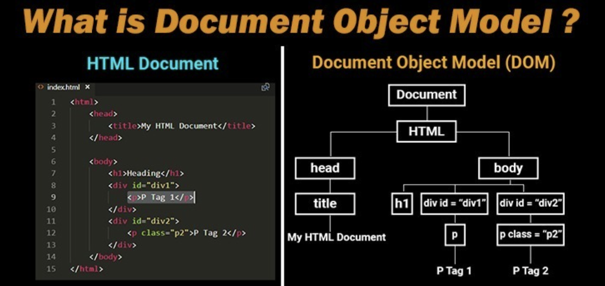
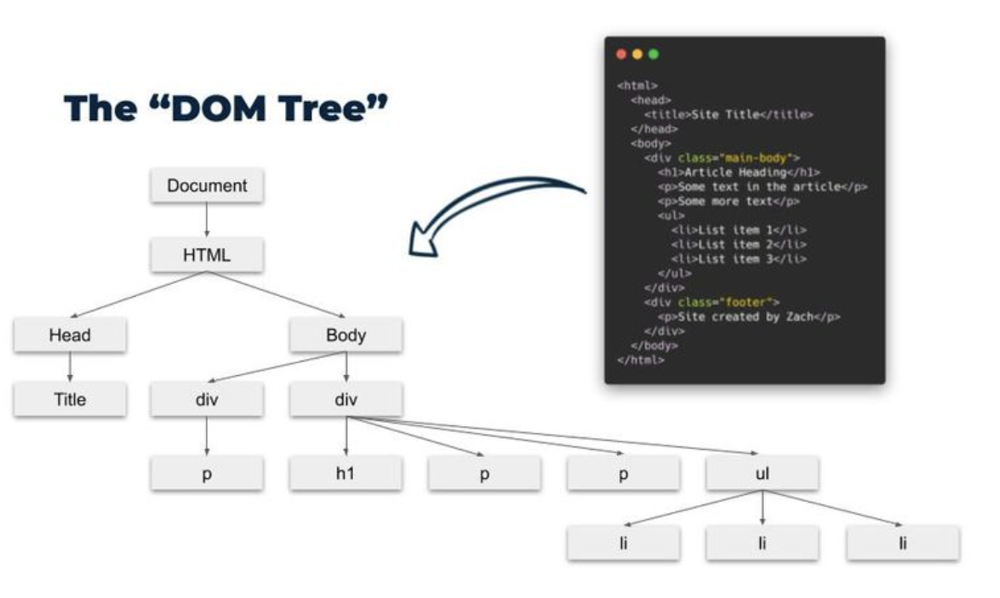

# **第十一章：DOM 操作**

## **1. DOM 简介与节点类型**

### **1.1 什么是 DOM？**

**DOM（Document Object Model，文档对象模型）** 是浏览器解析 HTML 生成的 **树状结构**，用于 **JavaScript 操作网页内容**。

✅ **作用**：

- 查找 HTML 元素

- 修改内容

- 更改样式

- 处理用户交互（事件监听）



### **1.2 DOM 结构**

HTML 文档在 JavaScript 中被解析为 **DOM 树**：



```html
<html>
  <head>
    <title>文档标题</title>
  </head>
  <body>
    <h1>标题</h1>
    <p>段落文本</p>
  </body>
</html>

```

➡️ 转换成 DOM 结构：

```xml
document
 ├── <html>
 │   ├── <head>
 │   │   ├── <title>文档标题</title>
 │   ├── <body>
 │       ├── <h1>标题</h1>
 │       ├── <p>段落文本</p>

```

### **1.3 常见节点类型**

| 节点类型 | 说明 | 示例 | 
| -- | -- | -- |
| 文档节点 | 整个 HTML 文档 | document | 
| 元素节点 | HTML 标签 | `<p>` | 
| 文本节点 | 标签内文本 | 文本内容 | 
| 属性节点 | 标签的属性 | class="box" | 


```js
console.log(document.body); // 获取 `<body>` 元素
console.log(document.title); // 获取 `<title>` 文本
```

## **2. 选择元素**

### **2.1 getElementById()**

按 id 选择**唯一**元素：

```html
<p id="text">Hello, JavaScript!</p>
<script>
    let p = document.getElementById("text");
    console.log(p.innerText); // 输出 Hello, JavaScript!
</script>

```

✅ **适用于唯一 ID 选择**

### **2.2 querySelector()**

按 **CSS 选择器** 选择**第一个**匹配的元素：

```js
let firstParagraph = document.querySelector("p");
let header = document.querySelector("#header"); // 选择 id="header"
let button = document.querySelector(".btn"); // 选择 class="btn"
```

✅ **适用于单个匹配**

### **2.3 querySelectorAll()**

获取**所有匹配的元素（NodeList）**：

```html
<p>第一段</p>
<p>第二段</p>
<script>
    let paragraphs = document.querySelectorAll("p");
    console.log(paragraphs.length); // 输出 2
</script>
```

✅ **适用于多个匹配（类数组结构）**

## **3. 操作元素**

### **3.1 修改内容**

| 方法 | 作用 | 
| -- | -- |
| innerText | 修改文本内容（不解析 HTML） | 
| innerHTML | 修改 HTML 内容（解析 HTML） | 
| textContent | 获取/修改文本（推荐使用） | 


```html
<p id="demo">原文本</p>
<script>
    let demo = document.getElementById("demo");
    demo.innerText = "新文本"; // 纯文本
    demo.innerHTML = "<strong>加粗文本</strong>"; // 解析 HTML
</script>
```

✅ **innerText 更安全，不解析 HTML**

### **3.2 修改样式**

| 方法 | 作用 | 
| -- | -- |
| element.style.property | 修改单个样式 | 
| classList.add() | 添加类 | 
| classList.remove() | 移除类 | 
| classList.toggle() | 切换类 | 


```html
<p id="styled-text">改变样式</p>
<script>
    let text = document.getElementById("styled-text");
    text.style.color = "red"; // 改变颜色
    text.classList.add("highlight"); // 添加类
</script>
```

✅ **推荐使用 classList，更易维护**

### **3.3 修改属性**

| 方法 | 作用 | 
| -- | -- |
| element.setAttribute(name, value) | 设置属性 | 
| element.getAttribute(name) | 获取属性值 | 
| element.removeAttribute(name) | 移除属性 | 


```html

<script>
    let img = document.getElementById("image");
    img.setAttribute("src", "new.jpg"); // 修改图片
</script>
```

✅ **适用于修改 href、src、alt 等属性**

## **4. 事件处理**

### **4.1 监听事件**

事件是用户在页面上的**交互操作**（点击、输入、悬停等）。

✅ **常见事件**

| 事件 | 说明 | 
| -- | -- |
| click | 点击 | 
| mouseover | 鼠标悬停 | 
| keydown | 按键按下 | 
| input | 输入框变化 | 


### **4.2 addEventListener()**

最推荐的事件绑定方式：

```html
<button id="btn">点击我</button>
<script>
    let btn = document.getElementById("btn");
    btn.addEventListener("click", function() {
        alert("按钮被点击了！");
    });
</script>

```

✅ **优点**

1. 可同时绑定多个事件

1. 可动态添加和移除事件

### **4.3 事件对象（event）**

事件处理函数**可接收 event 对象**，获取事件详细信息。

```html
<input id="input-box" type="text">
<script>
    let inputBox = document.getElementById("input-box");
    inputBox.addEventListener("input", function(event) {
        console.log("当前值：" + event.target.value);
    });
</script>

```

✅ **适用于表单输入监控**

### **4.4 事件冒泡与捕获**

事件传播有 **冒泡（默认）** 和 **捕获** 两种模式：

```html
<div id="parent">
    <button id="child">点击按钮</button>
</div>
<script>
    document.getElementById("parent").addEventListener("click", () => {
        console.log("父元素被点击");
    });

    document.getElementById("child").addEventListener("click", (event) => {
        console.log("子元素被点击");
        event.stopPropagation(); // 阻止冒泡
    });
</script>
```

✅ **stopPropagation() 阻止事件继续传播**

## **5. 课后练习**

### **5.1 实践任务**

1. 使用 **getElementById 选择一个 `<p>` 元素，并修改其文本**

1. 使用 **querySelector 选择 .btn 按钮，并改变背景色**

1. 使用 **setAttribute 修改 `` 图片地址**

1. 给 ** `<button>` 绑定 click 事件，点击后弹出提示**

1. 创建一个输入框，输入内容时实时显示在 ** `<p>` 中**

## **6. 总结**

✅ **DOM 是 HTML 的 JavaScript 表现形式**

✅ **getElementById、querySelector 选择元素**

✅ **innerText 修改文本，style 修改样式**

✅ **addEventListener 绑定事件，避免 onclick**

✅ **事件对象 event 提供更多信息**