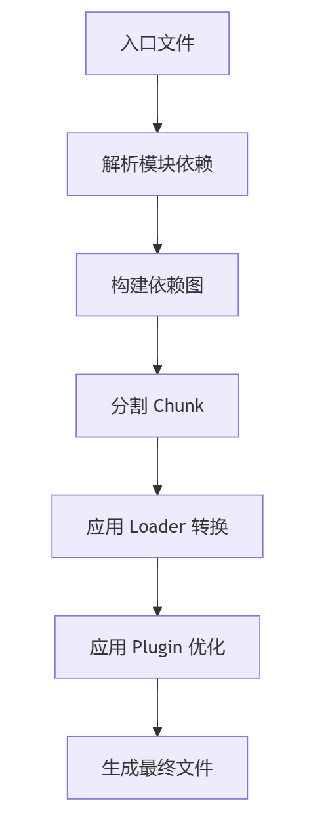

# 第十六章：Webpack 基础配置

## 一、为什么需要 Webpack？

### 1. 前端开发的痛点

- 模块化问题：浏览器原生不支持 import/export 等 ES6 模块语法

- 资源依赖管理：手动处理 CSS、图片、字体等非 JS 资源

- 性能优化需求：代码压缩、按需加载、Tree Shaking 等

- 开发效率：实时刷新、热更新（HMR）、Source Map

### 2. Webpack 的核心作用

将**所有资源（JS、CSS、图片等）视为模块**，通过依赖分析打包成浏览器可识别的静态文件。

## 二、快速上手 Webpack

### 1. 安装

```
npm init -y
npm install webpack webpack-cli --save-dev
```

这两行命令需要在**项目目录**下执行。

原因：

npm init -y：

- 该命令会在当前目录下初始化一个 npm 项目。

- 自动生成一个 package.json 文件，用于记录项目的依赖、版本等信息。

- 如果不在项目目录下执行，可能会在错误的位置生成 package.json，导致项目配置混乱。

npm install webpack webpack-cli --save-dev：

- 该命令会在当前目录下的 node_modules 文件夹中安装 webpack 和 webpack-cli。

- 同时，会将它们作为开发依赖（devDependencies）记录到 package.json 文件中。

- 如果不在项目目录下执行，安装的包不会被正确关联到你的项目，后续使用时可能会找不到依赖。

**正确操作步骤：**

1. 进入你的项目目录（包含 src 文件夹和其他项目文件的目录）。

1. 执行以下命令：

```bash
npm init -y
npm install webpack webpack-cli --save-dev
```

1. 确保在项目目录下创建 webpack.config.js 文件并进行配置。

这样可以确保项目的依赖管理和配置是正确的。

### 2. 基础配置

创建 webpack.config.js：

```javascript
const path = require('path');

module.exports = {
  entry: './src/index.js',       // 入口文件
  output: {
    filename: 'bundle.js',      // 输出文件名
    path: path.resolve(__dirname, 'dist') // 输出目录
  },
  mode: 'production' // 模式：development 或 production
};
```

### 3. 运行打包

```
npx webpack
```

## 三、核心概念

### 1. Entry（入口）

定义依赖分析的起点：

```
entry: {
  main: './src/index.js',
  vendor: './src/vendor.js'
}
```

### 2. Output（出口）

指定打包文件的位置和命名规则：

```
output: {
  filename: '[name].[contenthash].js', // 使用哈希避免缓存
  path: path.resolve(__dirname, 'dist')
}
```

### 3. Loader（加载器）

处理非 JS 文件（Webpack 默认只理解 JS）：

```
module: {
  rules: [
    {
      test: /\.css$/,       // 匹配 .css 文件
      use: ['style-loader', 'css-loader'] // 从右向左执行
    },
    {
      test: /\.(png|svg|jpg)$/,
      type: 'asset/resource' // Webpack 5 内置资源处理
    }
  ]
}
```

### 4. Plugin（插件）

扩展 Webpack 功能（如 HTML 模板生成）：

```javascript
const HtmlWebpackPlugin = require('html-webpack-plugin');

plugins: [
  new HtmlWebpackPlugin({
    template: './src/index.html'
  })
]
```

## 四、Webpack 工作原理

### 1. 整体流程



```markdown
graph TD
  A[入口文件] --> B[解析模块依赖]
  B --> C[构建依赖图]
  C --> D[分割 Chunk]
  D --> E[应用 Loader 转换]
  E --> F[应用 Plugin 优化]
  F --> G[生成最终文件]
```

### 2. 关键步骤详解

#### (1) 模块解析

- 从 entry 开始，递归分析 import/require 语句

- 生成 **AST（抽象语法树）** 分析依赖关系

#### (2) 依赖图构建

- 将所有模块及其依赖关系组合成 **依赖图（Dependency Graph）**

#### (3) Chunk 生成（详见附录：深入理解Chunk）

- 根据配置（如 splitChunks）将代码分割成多个 Chunk

- 常见的 Chunk 类型：

	- Initial Chunk（入口直接依赖）

	- Async Chunk（动态导入的模块）

	- Runtime Chunk（Webpack 运行时代码）

#### (4) 输出文件

- 将 Chunk 转换为最终文件

- 应用 Loader 转换（如 SCSS → CSS → JS 内联）

- 执行 Plugin 的优化逻辑（如压缩、添加 Hash）

## 五、配置实战

### 1. 开发服务器配置

```
devServer: {
  static: './dist',
  hot: true,       // 热更新
  port: 8080,
  open: true       // 自动打开浏览器
}
```

### 2. 处理样式

```
// 安装：npm install style-loader css-loader sass-loader sass --save-dev
{
  test: /\.scss$/,
  use: ['style-loader', 'css-loader', 'sass-loader']
}
```

### 3. Babel 转译

```
// 安装：npm install babel-loader @babel/core @babel/preset-env --save-dev
{
  test: /\.js$/,
  exclude: /node_modules/,
  use: {
    loader: 'babel-loader',
    options: {
      presets: ['@babel/preset-env']
    }
  }
}
```

## 六、高级特性

### 1. 代码分割（Code Splitting）

```
// 动态导入（自动生成 Async Chunk）
import(/* webpackChunkName: "lodash" */ 'lodash').then(...);
```

### 2. Tree Shaking

- 自动删除未使用的代码（需配合 ES6 模块语法）

- 在 package.json 中添加：

```
"sideEffects": false
```

## 七、常见问题

### 1. 路径配置错误

```
// 错误：找不到模块
import MyComponent from './components/MyComponent'; 
// 正确：明确文件扩展名
import MyComponent from './components/MyComponent.js';
```

### 2. Loader 执行顺序

```
// 从后向前执行（先执行 sass-loader，最后 style-loader）
use: ['style-loader', 'css-loader', 'sass-loader']
```

### 3. 旧浏览器兼容

使用 @babel/preset-env + core-js：

```
// .babelrc
{
  "presets": [
    ["@babel/preset-env", {
      "useBuiltIns": "usage",
      "corejs": 3
    }]
  ]
}
```

## 八、总结

✅ **Webpack 核心能力**：模块打包、资源转换、代码优化

✅ **关键配置**：entry/output/loader/plugin

✅ **工作流程**：依赖分析 → 构建依赖图 → 生成 Chunk → 输出文件

🔥 **进阶方向**：自定义 Loader/Plugin、性能优化、微前端集成