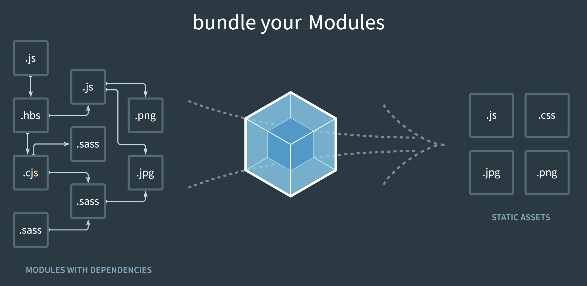
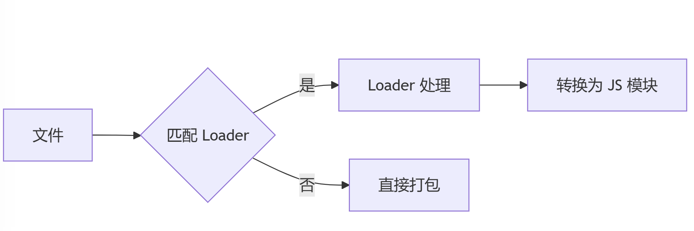
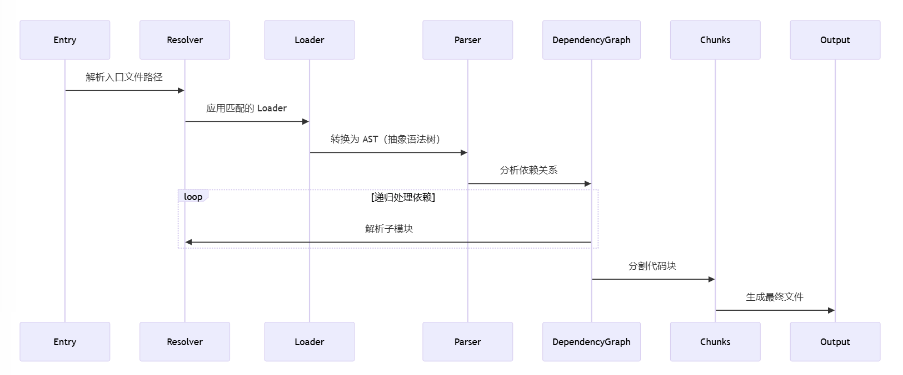

# 第十七章：**Webpack 深度教学指南**

*注意：学习本章前：请完成综合项目02：购物车功能开发*



## **一、为什么需要 Webpack？**

### 1. 前端开发的演变

- 原始开发模式：手动管理 HTML/CSS/JS 文件，缺乏模块化

- 模块化需求：ES6 的 import/export，但浏览器兼容性差

- 资源依赖管理：非 JS 资源（如图片、CSS）无法直接引入

- 性能优化瓶颈：代码压缩、按需加载、缓存策略难以手动实现

### 2. Webpack 的核心价值

- 模块化打包：将分散的模块整合为少数文件

- 资源统一处理：通过 Loader 处理 CSS/图片等非 JS 资源

- 开发效率提升：热更新（HMR）、Source Map、DevServer

- 生产优化能力：Tree Shaking、代码分割、压缩

## **二、核心概念**

### 1. 模块（Module）

- 定义：任何文件（JS、CSS、图片等）均可视为模块

- 特点：模块间通过 import/require 建立依赖关系

- 示例：

```
import styles from './styles.css'; // CSS 模块
import logo from './logo.png';     // 图片模块
```

### 2. 入口（Entry）

- 作用：指定依赖分析的起点

- 单入口：

```
entry: './src/index.js'
```

- 多入口（多页面应用）：

```
entry: {
  home: './src/home.js',
  about: './src/about.js'
}
```

### 3. 出口（Output）

- 作用：定义打包文件的输出规则

- 关键配置：

```
output: {
  filename: '[name].[contenthash].js', // 动态文件名（入口名 + 哈希）
  path: path.resolve(__dirname, 'dist'),
  publicPath: '/assets/',              // 资源公共路径（CDN 场景）
  clean: true                          // 自动清理旧文件
}
```

### 4. Loader

- 作用：处理非 JS 模块（Webpack 默认只能处理 JS）

- 工作流程：



```
graph LR
  A[文件] --> B{匹配 Loader}
  B -->|是| C[Loader 处理]
  B -->|否| D[直接打包]
  C --> E[转换为 JS 模块]
```

- 常用 Loader：

| Loader | 作用 | 示例配置 | 
| -- | -- | -- |
| css-loader | 解析 CSS 文件 | { test: /\.css$/, use: ['style-loader', 'css-loader'] } | 
| babel-loader | 转译 ES6+ 代码 | { test: /\.js$/, use: 'babel-loader' } | 
| file-loader | 处理文件（如图片） | { test: /\.png$/, type: 'asset/resource' } | 


### 5. 插件（Plugin）

- 作用：扩展 Webpack 功能（如生成 HTML、压缩代码）

- 常用插件：

| 插件 | 作用 | 示例配置 | 
| -- | -- | -- |
| HtmlWebpackPlugin | 生成 HTML 文件 | new HtmlWebpackPlugin({ template: './src/index.html' }) | 
| MiniCssExtractPlugin | 提取 CSS 为独立文件 | new MiniCssExtractPlugin({ filename: '[name].css' }) | 
| CleanWebpackPlugin | 清理输出目录 | new CleanWebpackPlugin() | 


### 6. 模式（Mode）

- 作用：内置优化策略（开发/生产环境）

```js
mode: 'development', // 或 'production'
// 等同于：
module.exports = {
  optimization: {
    minimize: mode === 'production',
    // 其他生产环境优化（如 Tree Shaking）
  },
  devtool: mode === 'development' ? 'eval-source-map' : 'hidden-source-map'
}
```

## **三、Webpack 工作原理**

### 1. 打包流程总览



```
sequenceDiagram
  participant Entry
  participant Resolver
  participant Loader
  participant Parser
  participant DependencyGraph
  participant Chunks
  participant Output

  Entry->>Resolver: 解析入口文件路径
  Resolver->>Loader: 应用匹配的 Loader
  Loader->>Parser: 转换为 AST（抽象语法树）
  Parser->>DependencyGraph: 分析依赖关系
  loop 递归处理依赖
    DependencyGraph->>Resolver: 解析子模块
  end
  DependencyGraph->>Chunks: 分割代码块
  Chunks->>Output: 生成最终文件
```

### 2. 关键步骤详解

- 模块解析（Resolution）：

	- 根据 resolve.alias、resolve.extensions 等配置解析文件路径

- 加载与转换（Loading & Transpiling）：

	- 按 module.rules 匹配 Loader，从右向左执行

	- 示例：SCSS → Sass-loader → CSS-loader → Style-loader

- 依赖图构建（Dependency Graph）：

	- 从入口开始，递归分析所有依赖关系

	- 形成包含所有模块及其依赖关系的图结构

- 代码分割（Code Splitting）：

	- 通过 optimization.splitChunks 或动态导入 (import()) 分割代码

	- 生成 Initial Chunk（入口代码）、Async Chunk（懒加载代码）、Runtime Chunk（Webpack 运行时）

- 资源生成（Asset Generation）：

	- 将 Chunk 转换为最终文件（JS、CSS、Source Map 等）

	- 应用 Plugin 的优化逻辑（如压缩、添加 Hash）

## **四、完整配置示例**

### 1. 开发环境配置 **(webpack.dev.js)**

```js
const path = require('path');
const HtmlWebpackPlugin = require('html-webpack-plugin');

module.exports = {
  mode: 'development',
  entry: './src/index.js',
  output: {
    filename: '[name].js',
    path: path.resolve(__dirname, 'dist'),
  },
  devtool: 'eval-source-map',
  devServer: {
    static: './dist',
    hot: true,
    port: 3000,
  },
  module: {
    rules: [
      {
        test: /\.js$/,
        exclude: /node_modules/,
        use: 'babel-loader',
      },
      {
        test: /\.css$/,
        use: ['style-loader', 'css-loader'],
      },
    ],
  },
  plugins: [
    new HtmlWebpackPlugin({
      template: './src/index.html',
    }),
  ],
};
```

### 2. 生产环境配置 (webpack.prod.js)

```js
const path = require('path');
const HtmlWebpackPlugin = require('html-webpack-plugin');
const MiniCssExtractPlugin = require('mini-css-extract-plugin');
const CssMinimizerPlugin = require('css-minimizer-webpack-plugin');

module.exports = {
  mode: 'production',
  entry: './src/index.js',
  output: {
    filename: '[name].[contenthash].js',
    path: path.resolve(__dirname, 'dist'),
    clean: true,
  },
  optimization: {
    minimizer: [
      new CssMinimizerPlugin(), // 压缩 CSS
    ],
    splitChunks: {
      chunks: 'all', // 提取公共依赖
    },
  },
  module: {
    rules: [
      {
        test: /\.css$/,
        use: [MiniCssExtractPlugin.loader, 'css-loader'], // 提取 CSS
      },
    ],
  },
  plugins: [
    new HtmlWebpackPlugin({
      template: './src/index.html',
    }),
    new MiniCssExtractPlugin({
      filename: '[name].[contenthash].css',
    }),
  ],
};
```

## **五、高级特性与优化**

### 1. Tree Shaking

- 条件：使用 ES6 模块语法 (import/export)，设置 mode: 'production'

- 验证：在 package.json 中标记无副作用文件：

```
{
  "sideEffects": ["*.css", "*.global.js"]
}
```

### 2. 持久化缓存

- 配置文件名哈希：

```
output: {
  filename: '[name].[contenthash].js'
}
```

- 优化模块 ID：

```
optimization: {
  moduleIds: 'deterministic' // 防止模块 ID 变化导致哈希变动
}
```

### 3. 懒加载（Lazy Loading）

- 动态导入语法：

```
button.addEventListener('click', () => {
  import('./lazy-module.js').then(module => {
    module.run();
  });
});
```

## **六、常见问题与调试**

### 1. 性能分析

- 生成统计文件：

```
npx webpack --profile --json > stats.json
```

- 可视化工具：

	- Webpack Bundle Analyzer

	- Webpack Visualizer

### 2. 调试配置

- 打印完整配置：

```
console.log(require('util').inspect(config, { depth: null }));
```

- 逐步排查 Loader/Plugin：禁用插件或简化 Loader 规则定位问题

## **七、延伸学习**

### 1. 自定义 Loader

- 编写一个简单的 Loader (src/loaders/uppercase-loader.js)：

```
module.exports = function(source) {
  return source.toUpperCase(); // 将文本转为大写
};
```

- 配置使用：

```
{
  test: /\.txt$/,
  use: path.resolve(__dirname, 'src/loaders/uppercase-loader.js')
}
```

### 2. 自定义 Plugin

- 基本结构：

```
class MyPlugin {
  apply(compiler) {
    compiler.hooks.done.tap('MyPlugin', stats => {
      console.log('编译完成！');
    });
  }
}
```

## **八、总结**

- ✅ **核心能力**：模块打包、资源处理、代码优化

- ✅ **关键配置**：entry、output、loader、plugin、mode

- ✅ **优化方向**：代码分割、缓存策略、Tree Shaking

- 🔧 **调试技巧**：分析工具、配置打印、逐步排查

- 🚀 **进阶路径**：自定义 Loader/Plugin、微前端集成、性能调优

通过理解 Webpack 的底层机制，你可以更高效地配置和优化前端构建流程！