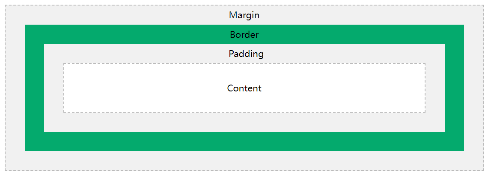

# **第六章：CSS 布局**

## **1. 盒模型（Box Model）**

### **1.1 什么是 CSS 盒模型？**

在 CSS 中，谈论设计和布局时会使用术语“盒子模型”。

CSS 盒子模型本质上是一个包裹每个 HTML 元素的盒子。它由以下部分组成：内容、填充、边框和边距。

盒模型（Box Model）是**HTML 元素的布局基础**，它定义了元素的 **内容（content）**、**内边距（padding）**、**边框（border）** 和 **外边距（margin）**。

### **1.2 盒模型结构**



不同部分的解释：

- Content（内容） - 框的内容，文本和图像出现的位置

- Padding（内边距） - 清除内容周围的区域。填充是透明的

- Border（边框） - 围绕填充和内容的边框

- Margin（外边距） - 清除边框外的区域。边距是透明的

框模型允许我们在元素周围添加边框，并定义元素之间的空间。

```css
div {  
    width: 300px;
    border: 15px solid green;  
    padding: 50px;  
    margin: 20px;
}
```

### **1.3 盒模型属性**

| 属性 | 作用 | 
| -- | -- |
| content | 盒子内容区域 | 
| padding | 内边距， | 
| border | 边框 | 
| margin | 外边距， | 


```css
.box {
    width: 200px;
    height: 100px;
    padding: 20px;
    border: 5px solid black;
    margin: 10px;
}

```

### **1.4 box-sizing 控制盒模型**

| box-sizing | 计算方式 | 
| -- | -- |
| content-box | 默认模式 | 
| border-box | width 包含 padding 和 border | 


```css
.box {
    box-sizing: border-box;
}

```

✅ **推荐使用 border-box 以避免计算宽度时的额外问题！**

## **2. 浮动（float）与清除浮动**

### **2.1 什么是浮动？**

float 让元素脱离文档流，**可以左对齐或右对齐**，通常用于**图片环绕文本、简易布局**。

| 属性值 | 作用 | 
| -- | -- |
| float: left | 元素向左浮动 | 
| float: right | 元素向右浮动 | 
| float: none | 默认，不浮动 | 


```css
.img {
    float: left;
    margin-right: 10px;
}

```

### **2.2 清除浮动**

浮动元素不会影响父元素高度，需要使用 clear 清除浮动。

```css
.clearfix::after {
    content: "";
    display: block;
    clear: both;
}
```

```html
<div class="clearfix">
    
    <p>这是一段文字，旁边有图片。</p>
</div>

```

✅ **推荐使用 clearfix 解决浮动问题！**

## **3. 定位（position）**

### **3.1 position 属性**

| 属性值 | 作用 | 
| -- | -- |
| static | 默认值， | 
| relative | 相对自身原位置 | 
| absolute | 相对最近的已定位父元素 | 
| fixed | 相对浏览器窗口 | 


### **3.2 relative 相对定位**

```css
.box {
    position: relative;
    top: 20px;
    left: 10px;
}

```

✅ **元素原本的位置仍占据空间，但偏移了一定距离！**

### **3.3 absolute 绝对定位**

```css
.box {
    position: absolute;
    top: 50px;
    left: 100px;
}

```

✅ **绝对定位的元素不会占据原位置，而是脱离文档流！**

### **3.4 fixed 固定定位**

```css
.fixed-box {
    position: fixed;
    bottom: 10px;
    right: 10px;
}

```

✅ **适用于固定导航栏、返回顶部按钮等！**

## **4. 弹性布局（Flexbox）**

### **4.1 什么是 Flexbox？**

Flexbox（弹性盒子模型）用于**灵活控制子元素排列、对齐和分布**，特别适用于**自适应布局**。

### **4.2 display: flex 启用弹性布局**

```css
.container {
    display: flex;
}

```

### **4.3 justify-content（主轴对齐）**

| 属性值 | 作用 | 
| -- | -- |
| flex-start | 默认 | 
| flex-end | 子元素靠右对齐 | 
| center | 子元素居中对齐 | 
| space-between | 两端对齐，间距均匀 | 
| space-around | 两侧保留间距，间距均匀 | 


```css
.container {
    display: flex;
    justify-content: space-between;
}

```

### **4.4 align-items（交叉轴对齐）**

| 属性值 | 作用 | 
| -- | -- |
| stretch | 默认值 | 
| flex-start | 顶部对齐 | 
| flex-end | 底部对齐 | 
| center | 垂直居中对齐 | 


```css
.container {
    display: flex;
    align-items: center;
}
```

✅ **常见的 Flexbox 布局**

```css
.container {
    display: flex;
    justify-content: center;
    align-items: center;
}
```

## **5. 网格布局（Grid）**

### **5.1 什么是 CSS Grid？**

Grid（网格布局）是一种**强大的二维布局方式**，适用于复杂网页布局。

### **5.2 display: grid 启用网格**

```css
.grid-container {
    display: grid;
    grid-template-columns: 100px 100px 100px;
    grid-template-rows: 50px 50px;
}

```

✅ **定义了 3 列，每列 100px 宽，2 行，每行 50px 高！**

### **5.3 grid-template-columns（列定义）**

| 语法 | 作用 | 
| -- | -- |
| 100px 200px auto | 设定固定列宽 | 
| repeat(3, 1fr) | 3 列，等比例分配 | 


### **5.4 grid-gap（网格间距）**

```css
.grid-container {
    grid-gap: 10px;
}

```

✅ **适用于设置网格间距，避免元素紧贴！**

### **5.5 grid-area（区域布局）**

```css
.grid-container {
    display: grid;
    grid-template-areas: 
        "header header"
        "sidebar main";
}
.header { grid-area: header; }
.sidebar { grid-area: sidebar; }
.main { grid-area: main; }

```

✅ **适用于复杂的网页布局设计！**

## **6. 课后练习**

### **6.1 实践任务**

1. 创建一个包含 **box-sizing: border-box 的盒模型**

1. 使用 **float 实现左右布局**

1. 使用 **position: absolute 定位一个按钮**

1. 使用 **Flexbox 实现水平居中**

1. 使用 **Grid 创建 3 列 2 行的网格**

## **7. 总结**

✅ **盒模型是网页布局的基础**

✅ **float 适用于简单布局，但要清除浮动**

✅ **position 提供灵活定位方式**

✅ **Flexbox 适用于一维布局，Grid 适用于二维布局**

📌 **下一步**：学习 **CSS 进阶（响应式设计、动画、CSS 变量）！**