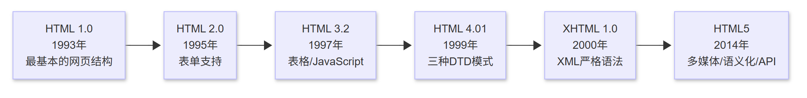

# **第一章：HTML基础**

## **1. HTML简介与历史**

### **1.1 什么是 HTML？**

HTML（HyperText Markup Language，超文本标记语言）是一种用于构建网页的标记语言，它通过 **标签（Tag）** 来定义网页的结构和内容，例如标题、段落、图片、链接等。

**HTML 的特点**：

- 采用 **标记语言**，不是编程语言。

- 主要用于 **描述网页结构**，而非逻辑控制。

- 结合 **CSS**（负责样式）和 **JavaScript**（负责交互）构建完整网页。

### **1.2 HTML 的发展历史**



| HTML 版本 | 发布年份 | 主要特性 | 
| -- | -- | -- |
| HTML 1.0 | 1993年 | 最基本的网页结构 | 
| HTML 2.0 | 1995年 | 增加表单支持 | 
| HTML 3.2 | 1997年 | 增加表格、JavaScript支持 | 
| HTML 4.01 | 1999年 | 三种DTD模式（Strict、Transitional、Frameset） | 
| XHTML 1.0 | 2000年 | 更严格的语法，基于XML | 
| HTML5 | 2014年 | 多媒体、语义化、API支持 | 


## **2. HTML 文档结构**

### **2.1 HTML 基本结构**

一个标准的 HTML 文档包含 <!DOCTYPE> 声明、`<html>` 结构以及 `<head>` 和 `<body>` 两部分。

```html
<!DOCTYPE html>
<html lang="zh">
<head>
    <meta charset="UTF-8">
    <meta name="viewport" content="width=device-width, initial-scale=1.0">
    <title>我的网页</title>
</head>
<body>
    <h1>欢迎来到我的网站</h1>
    <p>这是一个HTML基础教程。</p>
</body>
</html>

```

### **2.2 HTML 结构解析**

| 标签 | 作用 | 
| -- | -- |
| `<!DOCTYPE html>` | 声明 HTML5 文档类型 | 
| `<html>` | HTML 文档的根元素 | 
| `<head>` | 页面头部，包含元数据 | 
| `<meta charset="UTF-8">` | 设置字符编码 | 
| `<meta name="viewport">` | 适配移动端 | 
| `<title>` | 设置网页标题 | 
| `<body>` | 页面可见内容 | 


##### 一、基础声明层

1. ​​文档类型声明​​ `<!DOCTYPE html>`

- 唯一作用​​：声明文档遵循 HTML5 规范

- 位置要求​​：必须位于文件首行

- 历史版本​​：HTML4.01/XHTML 需要更复杂的声明，HTML5 简化为此形式

##### 二、根容器层 `<html>`

- ​​双标签结构​​：包裹整个文档内容

- ​​关键属性​​：

```html
<html lang="en"> <!-- 定义文档语言（影响SEO/语音阅读） -->
```

- ​**​**嵌套层次​​：包含 `<head>` 和 `<body>` 两大模块

##### 三、元数据层 `<head>`

- ​​不可见部分​​：存放浏览器和搜索引擎需要的关键信息

- ​​核心组件​​：

| 元素 | 作用 | 特殊属性 | 
| -- | -- | -- |
| `<meta charset="UTF-8">` | 定义字符编码 | 必须设置防止乱码 | 
| `<title>` | 浏览器标签页标题 | 影响搜索引擎排名 | 
| `<meta name="viewport">` | 移动端显示适配 | width=device-width是关键 | 
| `<link>` | 引入CSS/图标 | rel="stylesheet"或rel="icon" | 
| `<script>` | 加载JavaScript | 可设async/defer属性 | 


##### 四、内容呈现层 `<body>`

- ​​可见部分​​：展示给用户的所有内容

- ​​结构化元素​​：

```html
<!-- 基础内容元素 -->
<h1>~<h6>   <!-- 标题分级（影响SEO权重） -->
<p>         <!-- 段落文本 -->
       <!-- 图片（必须含 alt 属性） -->
<a>         <!-- 超链接（href 为必备属性） -->

<!-- 语义化容器（HTML5 新增） -->
<header>    <!-- 页眉 -->
<nav>       <!-- 导航栏 -->
<main>      <!-- 主要内容区 -->
<article>   <!-- 独立内容块 -->
<footer>    <!-- 页脚 -->
```

##### 五、完整骨架示例

```html
<!DOCTYPE html>
<html lang="zh-CN">
<head>
    <meta charset="UTF-8">
    <meta name="viewport" content="width=device-width, initial-scale=1.0">
    <title>页面标题</title>
    <link rel="stylesheet" href="style.css">
</head>
<body>
    <header>
        <h1>网站主标题</h1>
        <nav>...</nav>
    </header>
    <main>
        <article>
            <h2>文章标题</h2>
            <p>正文内容...</p>
        </article>
    </main>
    <footer>版权信息</footer>
    <script src="app.js"></script>
</body>
</html>
```

##### 六、关键技术特征

1. ​​树状结构​​：元素严格遵循父子嵌套关系

1. ​​标签分类​​：

	- 双标签：`<div></div>`（含内容容器）

	- 单标签：``（自闭合元素）

1. ​​属性规则​​：

```html
<input type="text" id="username" class="input-field">
<!-- 属性名=值 的键值对形式 -->
```

1. ​​注释语法​​：<!-- 注释内容 -->（不渲染到页面）

通过这种层次分明的结构设计，HTML 实现了内容与表现的分离，为 CSS 样式和 JavaScript 交互提供了清晰的接入点。

## **3. 常用HTML标签**

### **3.1 标题标签（`<h1> - <h6>`）**

```html
<h1>一级标题</h1>
<h2>二级标题</h2>
<h3>三级标题</h3>

```

> **注意**：h1 代表最高级标题，一个网页通常只使用一个 h1，用于SEO优化。


### **3.2 段落标签（`<p>`）**

```html
<p>这是一个段落。</p>

```

> **特点**：每个 `<p>` 自动换行，适用于正文文本。


### **3.3 超链接标签（`<a>`）**

```html
<a href="https://www.example.com" target="_blank">访问示例网站</a>
```

| 属性 | 作用 | 
| -- | -- |
| href | 设置链接地址 | 
| target="_blank" | _blank（在新窗口打开），_self（当前窗口打开） | 


### **3.4 图像标签（``）**

```html

```

| 属性 | 作用 | 
| -- | -- |
| src | 图片路径 | 
| alt | 备用文本（SEO友好） | 
| width | 宽度 | 


### **3.5 容器标签（`<div> 和 <span>`）**

```html
<div style="background-color: lightgray; padding: 10px;">
    这是一个 <div>，用于布局。
</div>
<span style="color: red;">这是一个 </span>，用于内联文本。</span>

```

| 标签 | 作用 | 
| -- | -- |
| `<div>` | 块级容器，适用于布局 | 
| `<span>` | 行内容器，适用于局部样式 | 


## **4. 注释与代码格式**

### **4.1 HTML 注释**

```html
<!-- 这是一个HTML注释 -->
<p>这是一段正常文本。</p>

```

> **作用**：注释不会显示在网页上，常用于代码说明和调试。


### **4.2 代码格式化规范**

- 统一缩进（2 或 4 个空格）。

- 合理嵌套标签，避免错误结构。

- 代码属性加引号，如 class="example"。

- 避免多余空格，保持整洁。

## **5. 课后练习**

### **5.1 实践任务**

1. 搭建一个基础HTML页面

，包含：

	- 一个标题（h1）

	- 一个段落（p）

	- 一个超链接（a）

	- 一张图片（img）

	- 一个 div 作为容器

1. 修正以下错误代码

```html
<html>
<head>
    <title>错误的HTML</title>
</head>
<body>
    <p>这里有一个段落
    <h1>标题</h1>
    
</body>
</html>
```

1. 思考题

	- 为什么 h1 只建议使用一次？

	- alt 属性的作用？

	- `<div>` 和 `<span>` 的主要区别？

## **6. 总结**

✅ **HTML 负责网页的结构和内容**

✅ **HTML5 提供了更丰富的标签与特性**

✅ **规范的代码格式提升可读性和可维护性**

📌 **下一步**：学习 **HTML表单与输入控件**！